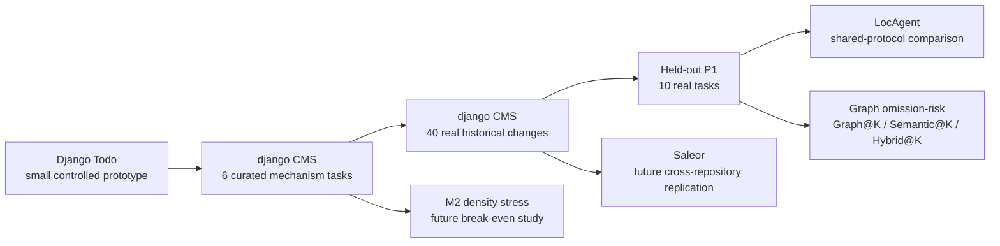
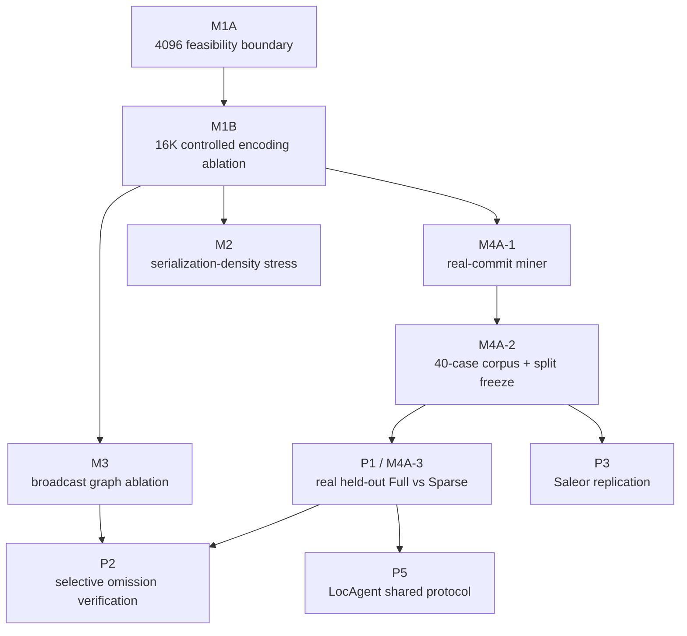
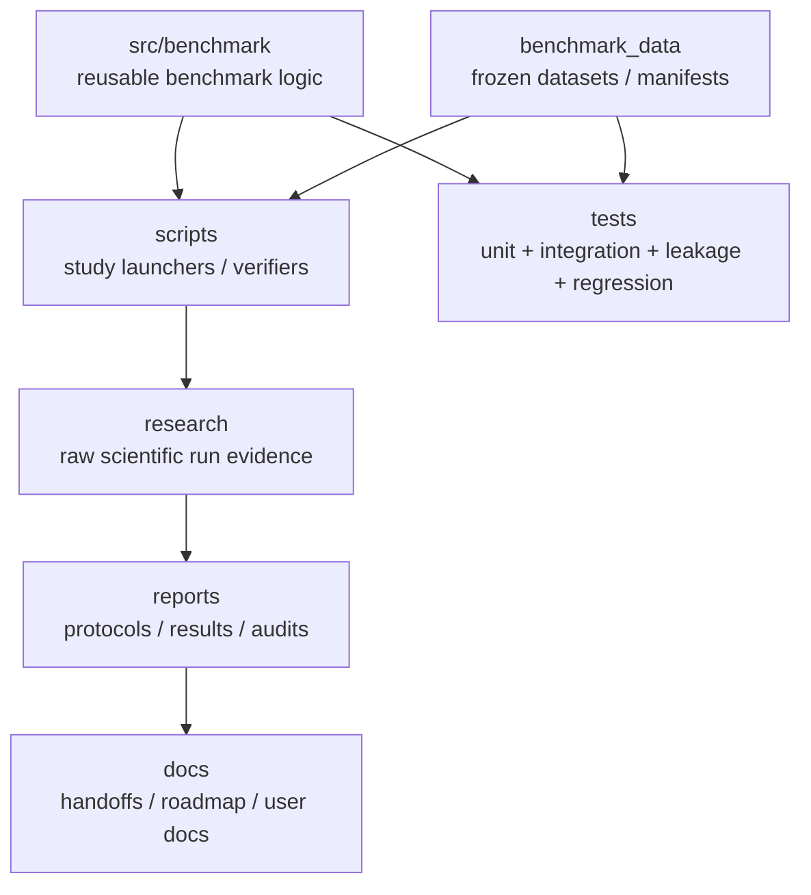

# Repository-Level LLM Impact Selection Benchmark

> **Current scientific state (2026-09-15):** the selection-stage benchmark is
> **complete and audited**. Controlled sparse-policy studies (M1A/M1B/M3) are
> complete; a 40-case real-history corpus (M4A-1/M4A-2) is frozen; the 10-task
> held-out **Full-v2 vs Sparse-v2 evaluation (M4A-3 / P1) is EXECUTED**
> (60/60 cells valid); the **LocAgent shared-protocol comparison (P5) is
> COMPLETE** (P5-B VALIDATION 6/6 + P5-C HELD_OUT_TEST 10/10 on WSL2 Ubuntu;
> Full-v2/Sparse-v2/LocAgent shared table + independent audit — see
> [P5 shared comparison](#p5-locagent-shared-protocol-comparison)). The
> serialized-record derived metric in the P1 result was corrected on 2026-09-14
> (see [P1 serialization correction](#p1-serialized-record-metric-correction)).

---

## 1. What problem does this repository study?

Before an LLM edits a repository, it must decide **which files are affected by a change**.

This project studies two separable problems:

1. **Impact inference:** did the model identify the right files?
2. **Impact-policy representation:** can a complete file-action policy be expressed without wasting output budget on hundreds of repeated `PRESERVE` decisions?

The core representation idea is **Preserve-by-Omission**:

- emit only non-`PRESERVE` decisions;
- reconstruct every omitted candidate deterministically as `PRESERVE`.

It reduces serialization cost. It does **not** claim to make semantic impact reasoning universally better.

---

## 2. Current headline results

### Controlled 16K representation study — M1B (2026-09-12, audited)

| Arm | Valid | Mean completion | Mean serialized records | Precision | Recall | F1 |
|---|---|---:|---:|---:|---:|---:|
| Full-v2 | 30/30 | 8,383 | 144.0 | 0.452 | 0.775 | 0.571 |
| Sparse-v2 | 30/30 | 809 | 5.9 | 0.721 | 0.883 | 0.794 |

Controlled descriptive reductions for Sparse-v2:
- completion output: ~90.35% lower;
- serialized records: ~95.9% lower;
- cost: ~82.54% lower;
- latency: ~63.29% lower.

> **Footnote on the M1B serialized-record figure.** The originally published
> Sparse-v2 figure (4.9) was the mean **REGENERATE write-set size**
> (`len(decoded_write_set_ids)`), not the serialized decision count. The
> corrected mean serialized decision count (recomputed from the persisted raw
> responses; frozen M1B evidence unchanged) is **5.9**. See
> [P1 serialized-record metric correction](#p1-serialized-record-metric-correction)
> and technical-debt items TD-011/TD-012.

**Important:** semantic effects were heterogeneous across the six independent
task units. Do not interpret the table as proof that sparse encoding
universally improves impact accuracy.

### Real historical changes — M4A-3 / P1 (2026-09-14, executed)

Frozen external-validity corpus:
- 40 clean djangoCMS historical changes;
- TRAIN 24 / VALIDATION 6 / HELD_OUT_TEST 10;
- split frozen before scientific model output;
- the historical changed-file set is an **OBSERVED CHANGE-SET PROXY**, not perfect semantic ground truth.

Held-out experiment:
`10 tasks × 2 arms × 3 nested repetitions = 60 cells`

| Arm | Valid | Trunc. | Precision | Recall | F1 | Mean completion | Total cost |
|---|---|---:|---:|---:|---:|---:|---:|
| Full-v2 | 30/30 | 0 | 0.339 | 0.369 | 0.353 | 8,445.8 | $0.297623 |
| Sparse-v2 | 30/30 | 0 | 0.387 | 0.261 | 0.312 | 599.0 | $0.062341 |

Paired task-level result:
- ΔF1 (Sparse − Full): −0.009, 95% bootstrap CI [−0.130, +0.119];
- Δcompletion tokens: −7,848, CI excludes zero;
- Δserialized records (corrected): −139.9, CI [−143.3, −137.0];
- Δcost/task: −$0.0235, CI excludes zero.

**Interpretation:** the representation/output-cost advantage transfers to
independent real historical changes. Semantic superiority does not.

#### P1 serialized-record metric correction

On 2026-09-14 a code audit found that the P1 `serialized_records` metric was
computed from `len(decoded_write_set_ids)` — the **predicted REGENERATE
write-set size** — not the number of serialized decision records. The corrected
value is recomputed from the persisted raw responses (ZERO API calls; raw bytes
unchanged):

| Quantity | Former (write-set size) | Corrected (serialized decisions) |
|---|---:|---:|
| Full-v2 mean | 4.03 | **144.0** |
| Sparse-v2 mean | 2.50 | **4.07** |
| Paired delta | −1.540 [−2.833, −0.367] | **−139.9 [−143.3, −137.0]** |

Artifacts: `research/real-commit-p1-01/final_metrics_serialization_corrected.json`,
`research/real-commit-p1-01/serialization_metric_corrected.json`,
[`reports/REAL_COMMIT_M4A3_P1_SERIALIZATION_METRIC_CORRECTION.md`](reports/REAL_COMMIT_M4A3_P1_SERIALIZATION_METRIC_CORRECTION.md).
P/R/F1/FNR, validity, truncation, tokens, cost, and latency are unchanged.

### Exploratory graph study — M3 (2026-09-13, audited)

| Condition | Precision | Recall | F1 | FN | FP | Interpretation |
|---|---|---:|---:|---:|---:|---|
| Graph OFF | 0.721 | 0.883 | 0.794 | 14 | 41 | baseline |
| Graph Hints | 0.814 | 0.800 | 0.807 | 24 | 22 | more conservative; precision ↑, recall ↓ |
| Graph-gated disclosure | — | — | — | — | — | not promising as implemented |

The graph result is exploratory and does **not** support the general claim
"graphs improve impact selection."

### P5 — LocAgent shared-protocol comparison (2026-09-15, executed + audited)

The pinned upstream LocAgent (`4935b557…`) was run on the SAME 10 P1
held-out real djangoCMS changes via a POSIX (WSL2 Ubuntu) host, using the same
`qwen/qwen3-coder` → OpenRouter → DeepInfra route, and scored with the SAME
common evaluator against the SAME observed change-set proxy. This is a
**system-level shared-task comparison** (P1 temperature 0 vs LocAgent upstream
temperature 1), not an algorithm ablation.

| System | Valid | Precision | Recall | F1 | FNR | Comp. tokens | Model calls | Cost | Latency |
|---|---:|---:|---:|---:|---:|---:|---:|---:|---:|
| Full-v2 | 30/30 | 0.339 | 0.369 | 0.353 | 0.631 | 8,445.8 | 30 | $0.2976 | 1,715.7 s |
| Sparse-v2 | 30/30 | 0.387 | 0.261 | 0.312 | 0.739 | 599.0 | 30 | $0.0623 | 200.4 s |
| LocAgent | 5/10 | 0.435 | 0.270 | 0.333 | 0.730 | 11,325.6 | 402 | $9.9288 | 4,025.9 s |

- LocAgent produced real localization on 5/10 held-out tasks; the other 5 hit
  the frozen 900 s per-attempt budget and were persisted fail-closed (timeout
  rate 50%).
- Authoritative LocAgent accounting: 402 LLM calls, 32,718,518 prompt +
  113,256 completion tokens, estimated cost $9.9288 (frozen $0.30/$1.00 per 1M).
- Paired task-level ΔF1 (bootstrap over the 10 independent tasks): LocAgent −
  Full −0.068 [−0.250, +0.170]; LocAgent − Sparse −0.061 [−0.306, +0.241];
  both CIs cross zero.
- LocAgent-native Acc@K (reported separately; not comparable to F1): Acc@1
  4/10, Acc@3 8/10, Acc@5 9/10.

**Interpretation:** the accuracy–cost trade-off on these real tasks does not
favor LocAgent — comparable-or-lower F1 at ~33× the token budget and ~160× the
cost of Full-v2, with a 50% timeout attrition rate. The representation-cost
advantage of our method (RQ1/RQ3) persists; no semantic superiority is claimed
in either direction. Details:
[`reports/LOCAGENT_P5C_SHARED_COMPARISON.md`](reports/LOCAGENT_P5C_SHARED_COMPARISON.md),
[`reports/LOCAGENT_P5C_AUDIT.md`](reports/LOCAGENT_P5C_AUDIT.md).

---

## 3. Project map



---

## 4. Repository / dataset scope

| Repository | Role | Approximate scale / status | Evidence type | Current status |
|---|---|---|---|---|
| Django Todo | Small controlled prototype | small bespoke repository | controlled component studies | complete / historical |
| django CMS 5.0.0 | Main mechanism repository | 144 production Python candidates in frozen universe | curated scenarios + real historical commits | primary completed evidence |
| Saleor Core 3.23.0 | Large cross-repository extension | defined, not scientifically executed | planned real-commit replication | future |
| LocAgent upstream | External baseline system | graph-guided localization system | shared-protocol comparison | adapter ready; real pilot pending (Windows `fork` blocker) |

---

## 5. Test-case / dataset taxonomy

| Family | Count | How created | What it is for | Can it be used as final held-out evidence? |
|---|---:|---|---|---:|
| Todo cases | historical small set | bespoke controlled tasks | early pipeline/component validation | no |
| djangoCMS curated mechanism scenarios | 6 retained | source-audited designed requirement changes | M1/M3 mechanism studies | no; development/mechanism evidence |
| `MINER_DEV` real commits | 6 | real djangoCMS history | miner/schema/leakage development | no |
| RealCommit scientific corpus | 40 | deterministic mining + frozen filters/dedup | external-validity dataset | yes, by split |
| TRAIN | 24 | metadata-only frozen split | development/probes | no |
| VALIDATION | 6 | metadata-only frozen split | protocol/capability validation | no |
| HELD_OUT_TEST | 10 | metadata-only frozen split | one-shot P1 scientific evaluation | yes; P1 executed |

Historical changed files are always described as an **OBSERVED CHANGE-SET PROXY**.

---

## 6. Experiment registry

| ID | Question | Data | Arms / conditions | Calls/cells | Status | Main takeaway |
|---|---|---|---|---:|---|---|
| M1A | Can a full policy fit a 4096 cap? | 6 curated djangoCMS tasks / capability boundary | Full-v2 vs Sparse-v2 | capability probes | complete | explicit full serialization hits the cap; sparse can complete |
| M1B | What is the representation cost when both arms can complete? | 6 curated tasks | Full-v2 vs Sparse-v2 @16K | 60 | complete/audited | ~90% lower completion output for sparse |
| M3 | Does broadcast graph evidence help? | same mechanism set | Graph OFF / hints / gated disclosure | 90 new cells | complete/exploratory | precision ↑ but recall ↓; gating failed operationally |
| M4A-1 | Can real commits be mined without leakage? | djangoCMS history | infrastructure only | 0 scientific calls | complete/audited | parent-only public/hidden corpus machinery |
| M4A-2 | Can a scientific real-history corpus be frozen? | djangoCMS history | dataset construction | 0 scientific calls | complete/audited | 40 cases, 24/6/10 split |
| M4A-3 / P1 | Does M1B's representation effect generalize? | 10 real held-out changes | Full-v2 vs Sparse-v2 @16K | 60 | complete/audited | cost/output effect replicates; semantic superiority does not |
| P5-A | Can LocAgent be compared under our public/hidden boundary? | non-held-out only | adapter/common evaluator | 0 scientific calls | complete | leakage-safe adapter ready |
| P5-B | Does real LocAgent execute under shared protocol? | VALIDATION (6) | LocAgent pilot on WSL2 Ubuntu | 6/6 executed | complete/audited | 3 valid + 3 fail-closed timeouts; POSIX `fork` + deadlock/BadRequest patch solved |
| P5-C | Full-v2 / Sparse-v2 / LocAgent on the same held-out tasks? | 10 HELD_OUT_TEST | shared-protocol comparison | 10/10 executed | complete/audited | LocAgent F1 .333 (valid 5/10) vs Full .353 / Sparse .312; CIs cross zero; native Acc@3 8/10 |
| P2 | Can structure target likely omissions efficiently? | future TRAIN/VALIDATION | Random@K / Semantic@K / Graph@K / Hybrid@K | TBD | future | thesis-level hypothesis |
| P3 | Does the result transfer to another large repository? | Saleor real commits | frozen method | TBD | future | cross-repository validity |
| P4 / M2 | At what impact density does sparse serialization stop helping? | controlled density grid | Full vs Sparse | TBD | future | break-even/scaling boundary |

---

## 7. Experiment map



---

## 8. Repository map



---

## 9. The six Pre-Benchmark Validation gates

The "six gates" are **six categories of pre-run checks**, not six model runs.

| Gate | What it verifies | P1 example |
|---|---|---|
| 1. Dataset Validation | data identity and split correctness | exact 10 held-out IDs, corpus/split hashes, public/hidden boundary |
| 2. Prompt Validation | prompt parity and leakage | same semantic contract; only serialization differs; no hidden proxy in prompt |
| 3. Pipeline Smoke Test | code path works end-to-end on fixtures | render → decode → reconstruct policy |
| 4. Dry Run | exact run plan without API calls | generate/freeze the 60-cell manifest with 0 calls |
| 5. Integration Test | components interoperate correctly | fixture → decoder → predicted write set → evaluator |
| 6. Metric Verification | scoring is mathematically correct | independently recompute TP/FP/FN/P/R/F1/FNR |

After these six gates, an **independent Audit** checks persisted evidence and
protocol invariants again.

---

## 10. Running the benchmark

### 10.1 Install

```powershell
git clone https://github.com/AhmedEhabH/dependency-aware-selective-regeneration-benchmark.git
cd dependency-aware-selective-regeneration-benchmark

python -m venv .venv
.venv\Scripts\Activate.ps1
python -m pip install -U pip
pip install -e .[dev]
```

Use the repository's exact dependency instructions if they differ from the
generic commands above.

### 10.2 API credentials

Keys are referenced by environment-variable name in configuration, never stored
as literal secrets.

#### OpenRouter

```powershell
$env:OPENROUTER_API_KEY = Read-Host "OpenRouter API key" -AsSecureString
```

#### DeepSeek direct — planned provider profile

```powershell
$env:DEEPSEEK_API_KEY = "<your key>"
```

#### Hugging Face Inference Providers — planned provider profile

```powershell
$env:HF_TOKEN = "<your fine-grained inference token>"
```

---

## 11. Dry run vs probe vs live

### Dry run

Purpose:
- validates dataset;
- resolves model/provider configuration;
- renders prompts;
- validates schemas;
- freezes the manifest;
- makes **ZERO external model calls**.

```powershell
python scripts/benchmark_cli.py dry-run --study real-commit-p1
```

### Capability probe

Purpose:
- a few non-held-out real API calls;
- verifies endpoint availability, cap, response format and decoding;
- never consumes held-out scientific cases.

```powershell
python scripts/benchmark_cli.py probe `
  --study real-commit-p1 `
  --model-profile qwen3-coder-openrouter-deepinfra
```

### Live scientific run

Only after protocol freeze + six gates + audit:

```powershell
python scripts/benchmark_cli.py live `
  --study real-commit-p1 `
  --model-profile qwen3-coder-openrouter-deepinfra
```

### Verify (ZERO API)

```powershell
python scripts/benchmark_cli.py verify --study real-commit-p1
```

The unified CLI is a thin wrapper; study-specific launchers remain the
reproducible source of truth (documented in `docs/BENCHMARK_RUNBOOK.md`).

---

## 12. Model/provider architecture — target design

Model choice must be dynamic **for future studies**, while every scientific run
remains frozen and reproducible. Profiles live in
[`config/model_profiles.yaml`](config/model_profiles.yaml) and are immutable
once resolved. A live run refuses to continue if the resolved profile differs
from the frozen manifest.

Example profile:

```yaml
id: deepseek-v4-flash-openrouter
gateway: openrouter
base_url: https://openrouter.ai/api/v1
model: deepseek/deepseek-v4-flash-0731
provider_pin: null
api_key_env: OPENROUTER_API_KEY
temperature: 0
max_completion_tokens: 16384
structured_output: json_schema
fallbacks: false
```

Recommended future profiles:
- Qwen3-Coder-480B-A35B-Instruct / OpenRouter / pinned DeepInfra — historical primary profile;
- DeepSeek V4 Flash 0731 / OpenRouter — low-cost cross-model candidate;
- DeepSeek V4 Pro 0813 / OpenRouter or direct API — stronger-costlier robustness candidate;
- Hugging Face Inference Providers profile(s), only when the selected model/provider supports the required structured-output contract.

Never silently switch providers/models inside one frozen scientific arm. Full
guide: [`docs/MODEL_PROVIDER_GUIDE.md`](docs/MODEL_PROVIDER_GUIDE.md).

---

## 13. Using Hugging Face

Hugging Face Inference Providers support an OpenAI-compatible chat endpoint and
structured outputs for supported model/provider combinations.

Target profile:

```yaml
id: hf-example
gateway: huggingface
base_url: https://router.huggingface.co/v1
model: <repo-id>:<provider>
api_key_env: HF_TOKEN
structured_output: json_schema
temperature: 0
```

Before admitting an HF profile into a scientific matrix:
1. capability probe the exact model/provider;
2. confirm JSON-schema support;
3. confirm completion cap;
4. freeze provider selection (`:provider` or explicit policy);
5. disable silent failover when provider identity is part of the experimental control.

---

## 14. Benchmark-user vs research-author workflows

### I only want to use the idea on my repository

Use the inference pipeline:
1. provide a repository snapshot/base commit;
2. generate the candidate universe;
3. provide the natural-language requirement;
4. run the Sparse policy;
5. decode omitted candidates as `PRESERVE`;
6. consume selected files in your editor/agent workflow.

You do not need hidden proxies or scientific scoring.

### I want to benchmark a model

You need:
1. frozen tasks;
2. hidden observed targets/proxies;
3. public/hidden leakage boundary;
4. model profile;
5. dry run;
6. capability probe;
7. six gates + audit;
8. live run;
9. scoring only after inference;
10. immutable result manifest and raw-response hashes.

---

## 15. Scientific cost controls

Three different quantities must not be confused:

| Name | Meaning |
|---|---|
| `budget_abort_ceiling_usd` | pre-run safety threshold; aborts a run before uncontrolled spending |
| `estimated_api_cost_usd` | token usage × frozen endpoint prices |
| `provider_billed_cost_usd` | actual provider/account billing, if an authoritative value is exposed |

A budget ceiling is **not a scientific result**.

For P1:
- ceiling frozen before execution: $1.50;
- estimated cost from persisted token usage and frozen prices: $0.359964.

---

## 16. Current scope and limitations

The project currently measures:
- file-level impact selection;
- operational validity/truncation;
- representation size/tokens;
- cost/latency/calls.

It does not yet establish:
- downstream patch correctness;
- universal semantic superiority of Sparse-v2;
- universal graph benefit;
- cross-repository generalization to Saleor;
- a shared-protocol numeric LocAgent result.

Additional known limitations are tracked in
[`docs/TECHNICAL_DEBT_REGISTER.md`](docs/TECHNICAL_DEBT_REGISTER.md) and the
historical `## Known Limitations` section in
[`docs/HISTORICAL_EXPERIMENT_LEDGER.md`](docs/HISTORICAL_EXPERIMENT_LEDGER.md).

---

## 17. Next scientific priorities

1. Paper V20 final submission using M1 + real-commit P1 + P5 shared comparison.
2. ~~LocAgent P5-B/P5-C~~ — **COMPLETE** (2026-09-15) on WSL2 Ubuntu; see
   [P5 shared comparison](#p5-locagent-shared-protocol-comparison).
3. Graph/semantic omission-risk study (post-submission MSc roadmap):
   - Random@K;
   - Semantic@K;
   - Graph@K;
   - Hybrid@K.
4. Saleor real-commit replication (post-submission).
5. M2 serialization-density stress (post-submission).
6. downstream functional correctness (post-submission).
7. MSc proposal package (target 2026-10-07/08) — see
   [`docs/MSC_RESEARCH_ROADMAP_2026_2027.md`](docs/MSC_RESEARCH_ROADMAP_2026_2027.md)
   and the post-submission roadmap in `TODO.md`.

See [`docs/MSC_RESEARCH_ROADMAP_2026_2027.md`](docs/MSC_RESEARCH_ROADMAP_2026_2027.md),
[`docs/PAPER_WRITING_HANDOFF.md`](docs/PAPER_WRITING_HANDOFF.md), and
[`docs/PROJECT_HANDOFF.md`](docs/PROJECT_HANDOFF.md) for the frozen execution
state.

---

## 18. Quickstart (no API key required)

Reproduce the deterministic smoke-profile dry run (mock backend — zero model
calls, zero tokens):

```bash
python seven_arm_benchmark.py --dry-run --profile smoke
```

Recompute every headline manuscript metric from the frozen evidence:

```bash
python scripts/verify_paper_claims.py
```

List available model profiles:

```bash
python scripts/benchmark_cli.py models
```

---

## 19. Deep historical documentation

The detailed chronological record, the historical headline tables, the original
Known Limitations list, and the full reproducibility index were moved to
[`docs/HISTORICAL_EXPERIMENT_LEDGER.md`](docs/HISTORICAL_EXPERIMENT_LEDGER.md)
to keep this README reader-first. Nothing was deleted — historical evidence and
reports remain in `reports/` and Git history.

Key entry points:
- Model/provider guide: [`docs/MODEL_PROVIDER_GUIDE.md`](docs/MODEL_PROVIDER_GUIDE.md)
- Benchmark runbook: [`docs/BENCHMARK_RUNBOOK.md`](docs/BENCHMARK_RUNBOOK.md)
- Technical-debt register: [`docs/TECHNICAL_DEBT_REGISTER.md`](docs/TECHNICAL_DEBT_REGISTER.md)
- Paper-writing handoff: [`docs/PAPER_WRITING_HANDOFF.md`](docs/PAPER_WRITING_HANDOFF.md)
- Research roadmap: [`docs/MSC_RESEARCH_ROADMAP_2026_2027.md`](docs/MSC_RESEARCH_ROADMAP_2026_2027.md)
- Claim → evidence map: [`reports/PAPER_CLAIM_EVIDENCE_MAP.md`](reports/PAPER_CLAIM_EVIDENCE_MAP.md)

---

## License

Original benchmark source code is licensed under the [MIT License](LICENSE).
Third-party repositories, dependencies, model assets, and derived materials
remain governed by their original licenses.

## Citation

See [`CITATION.cff`](CITATION.cff) (benchmark version 0.11.0).

## Author

**Ahmed Ehab** — GitHub: [AhmedEhabH](https://github.com/AhmedEhabH)