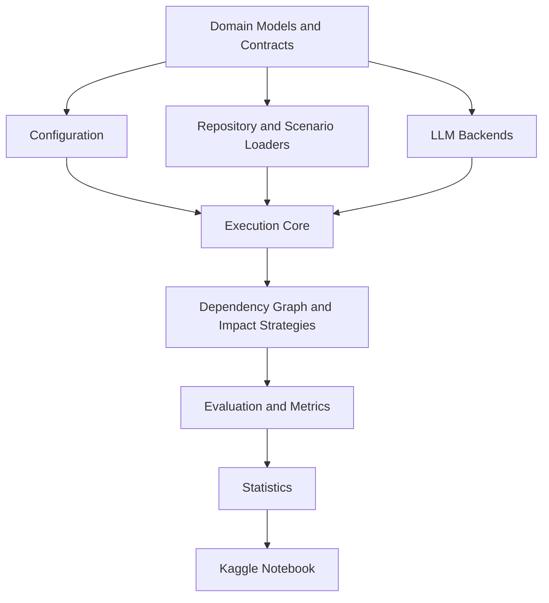

# Dependency-Aware Selective Regeneration Benchmark

> Research infrastructure for the working paper  
> **“Don't Regenerate What Hasn't Changed: Selective Regeneration for Token-Efficient LLM-Driven Software Evolution.”**

[](https://www.python.org/)
[](LICENSE)
[](PROTOCOL_VERSION.md)
[](reports/PROJECT_HEALTH_REPORT.md)
[](https://github.com/AhmedEhabH/dependency-aware-selective-regeneration-benchmark/releases)

> **Current v0.9.22 candidate (2026-08-29, D9):** D9 closes the real-run
> 20+ minute silent-generation defect with decode-step workflow-deadline
> enforcement (`_WorkflowDeadlineHeartbeatStoppingCriteria` stops in-flight
> generation with `finish_reason="timeout"` the moment the run budget elapses,
> 30 s liveness heartbeats), adds the mandatory real-Qwen generation-deadline
> canary, eager one-time model init outside run timing/token budget, per-run
> cooperative guard reinstall, a no-shell bounded remote annotated-tag-peel
> launch gate, and interruption-safe process-group cleanup/resume. The dry-run
> gate stays canonical (bundled `dryrun-cell` calls
> `validate_pilot_dryrun_evidence`, strict nested token schema).
> Full acceptance is 2532 passed / 33 skipped; exact-artifact dry-run is 48/48.
> Upload only `dist/pilot-kaggle-upload.zip` SHA-256
> `913e8065a384effa2cf6b6a69f11e5840506644873fa54764c3cbe8ee5406d48`,
> source/future tag target `9ea02b35d58a3e4ef2d0d5d980e44fa53d8c079d`.
> `02d16ca2…` (D8), `e0a64937…` (D7), `ce40b330…` / `f72ecda…` are superseded.
> No v0.9.22 stable tag exists; the exact-D9-artifact real 2x T4 Kaggle model
> preflight (GQA microprobe + generation-deadline canary + short + 12k/64)
> remains mandatory before tagging, and no 48-cell Pilot launch is allowed
> while untagged.

## Overview

This repository provides a research-grade benchmark for studying **selective regeneration in LLM-driven software evolution**.

The central idea is simple:

> When a requirement changes, regenerate only the software artifacts that are truly affected—while preserving unchanged behavior and architecture.

The benchmark prioritizes **impact correctness** before efficiency. Token savings are not considered successful if the approach misses affected artifacts, breaks regression behavior, or violates architectural constraints.

The project is designed for:

- repository-level software evolution;
- natural-language requirement changes;
- dependency-aware impact analysis;
- selective artifact regeneration;
- controlled comparison with baseline strategies;
- reproducible execution using open-weight code LLMs;
- Kaggle-based real-model experiments.

## Working Paper

**Title:**  
*Don't Regenerate What Hasn't Changed: Selective Regeneration for Token-Efficient LLM-Driven Software Evolution*

**Status:** Research in progress. The title is frozen as the working title for the current research cycle.

## Research Questions

The frozen protocol studies five dimensions:

1. **Impact identification:** How accurately are affected artifacts identified?
2. **Evolution correctness:** Can changed requirements be implemented while preserving unchanged behavior?
3. **Architecture consistency:** Can architectural constraints be preserved?
4. **Efficiency:** Can regeneration reduce artifacts, tokens, calls, and time under equivalent correctness?
5. **Sensitivity:** How do results vary by repository, change type, and blast radius?

The authoritative protocol is available in [`docs/FINAL_RESEARCH_PROTOCOL.md`](docs/FINAL_RESEARCH_PROTOCOL.md).

## Three-Arm Core Experiment

The confirmatory benchmark compares three strategies:

| Strategy | How Scope Is Determined | Model Calls |
|----------|------------------------|-------------|
| `full_scope_reference` (monolithic) | All eligible source artifacts | 1 per artifact |
| `dependency_aware_selective` (selective) | Repository graph + anchors + BFS | 1 per selected artifact |
| `repository_agent` (iterative) | Bounded LLM loop (list/read/search) | ≤8 total iterations |

All arms share the same LLM, temperature (0.0), per-call max_tokens (4096), code-writing executor, validation pipeline, and isolated workspace.

See [`selective_updates/records/THREE-ARM-CORE-EXPERIMENT.md`](selective_updates/records/THREE-ARM-CORE-EXPERIMENT.md) for the full amendment.

## Core Principles

- **Correctness before efficiency**
- **Frozen experimental protocol**
- **No post-hoc scenario or metric changes**
- **Ground-truth is evaluator-only and post-hoc**
- **Failed runs remain visible**
- **Equivalent-model and equivalent-budget comparisons**
- **Local engineering validation without local LLM inference**
- **Real Qwen execution only on Kaggle**
- **Complete provenance for publication results**

## Benchmark Scope

### Language and ecosystem

The confirmatory benchmark focuses on **Python**, primarily the **Django ecosystem**, to reduce language and framework confounding.

### Repositories

| Scale | Repository | Role |
|---|---|---|
| Small | Controlled Django Todo | Fully controlled reference repository |
| Medium | django CMS 5.0.0 | Modular CMS with plugin architecture |
| Large | Saleor Core 3.23.0 | Django/GraphQL modular monolith |

The study treats these repositories as examples of increasing scale and architectural complexity. It does not claim that source-code size is the only changing variable.

### Scenarios

The frozen design contains **24 scenarios**:

| Repository | Localized | Moderate | Cross-cutting | Total |
|---|---:|---:|---:|---:|
| Controlled Django Todo | 3 | 3 | 2 | 8 |
| django CMS | 3 | 3 | 2 | 8 |
| Saleor Core | 3 | 3 | 2 | 8 |
| **Total** | **9** | **9** | **6** | **24** |

The scenario taxonomy covers:

- schema and field changes;
- API changes;
- validation and business rules;
- permissions and authorization;
- cross-entity relationships;
- workflow changes;
- architecture-sensitive changes;
- broad cross-cutting changes.

## Architecture



The architecture uses:

- immutable typed domain models;
- `typing.Protocol` interfaces;
- explicit dependency injection;
- instantiated registries rather than global singletons;
- lazy Kaggle-only model imports;
- isolated run workspaces;
- typed failure classification;
- deterministic local mock and dry-run backends.

See [`docs/SOFTWARE_ARCHITECTURE.md`](docs/SOFTWARE_ARCHITECTURE.md) and [`docs/DEPENDENCY_RULES.md`](docs/DEPENDENCY_RULES.md).

## Comparison Arms

### Monolithic / Full-Scope Regeneration
Condition identifier: `monolithic`, `full_scope_reference`
Purpose: Baseline full-scope regeneration — every artifact is regenerated.
Budget semantics: Selection + regeneration tokens count toward `max_tokens`.

### Agent (Single-Shot LLM)
Condition identifier: `agent`
Purpose: Single LLM call for impact analysis; no regeneration.
Budget semantics: Not budget-constrained (no regeneration enabled).

### Selective / Hybrid Selective Regeneration
Condition identifier: `selective`, `hybrid_selective`
Purpose: Selective regeneration using dependency graph and semantic analysis.
Budget semantics: Selection + regeneration tokens count toward `max_tokens`.

### Compiled AI (Static Analysis)
Condition identifier: `compiled_ai`
Purpose: Dependency graph only — no LLM calls.
Budget semantics: Not budget-constrained (no LLM calls).

### Delta MCP (Semantic Analysis)
Condition identifier: `delta_mcp`
Purpose: Repository diff and semantic trace analysis.
Budget semantics: Not budget-constrained (no LLM calls).

### Incremental RTL (Traceability)
Condition identifier: `incr_rtl`
Purpose: Lightweight traceability analysis.
Budget semantics: Not budget-constrained (no LLM calls).

### Code Plan (Full Context)
Condition identifier: `code_plan`
Purpose: Full-repository-context LLM analysis.
Budget semantics: Not budget-constrained (no regeneration enabled).

### Iterative Repository Agent
Condition identifier: `iterative_repository_agent`
Purpose: Plan → regenerate → validate → revise. The agent iteratively analyzes
the repository, selects artifacts for regeneration, regenerates them, validates
the result, and revises its plan based on validation feedback.
Stop conditions: Validation passes, token budget exhausted (`max_tokens`),
attempt budget exhausted (`max_attempts`), timeout, `requires_iteration=false`,
backend error.
Budget semantics: Agent reasoning tokens + regeneration tokens count toward
`max_tokens`. Shared meaning across all regeneration-enabled arms.
Scientific Smoke V2: complete and accepted (see Current Status). Pilot: not
yet authorized for this arm.

## Current Status

> **CURRENT TRUTH (2026-08-29, v0.9.22 D9 — IN-FLIGHT WORKFLOW-DEADLINE HEARTBEAT +
> EAGER MODEL INIT + REMOTE TAG-PEEL PRE-LAUNCH GATE + FREEZE RECOVERY CLOSURE; REAL
> T4 PROOF PENDING):** branch
> `fix/pilot-v0922-t4-gqa-sdpa-preflight-observability-closure`; D1–D9 complete
> locally. D9.1 `_WorkflowDeadlineHeartbeatStoppingCriteria`
> (`kaggle_qwen_backend.py`) polls EVERY decode step and stops generation with
> `finish_reason="timeout"` the instant the injected run guard
> (`lambda: not budget.timed_out`) first returns false — an in-flight
> generation can never cross the 600 s deadline; bounded 30 s liveness
> heartbeats (`GENERATION_RUNNING` / `GENERATION_STOPPED reason=workflow_deadline`)
> prove a long synchronous decode alive (cooperative step-boundary stop, never a
> thread kill). D9.2 mandatory real-Qwen generation-deadline canary
> (`run_generation_deadline_probe`): deterministic counter guard fails closed
> after 3 criterion checks, proving the deadline (NOT EOS/length) target-side with
> `completion_tokens` in `[1, 8]`; preflight + launch authorization require it. D9.3
> eager shared-model init outside the first run's timing/token budget (failure =
> engineering blocker, 0 RunRecords, exit 1). D9.4 per-run cooperative guard
> reinstall on strategy AND shared backend. D9.5 no-shell bounded remote
> annotated-tag-peel launch gate (`verify_remote_annotated_tag_peel`, launch+resume)
> + interrupt-safe process-group terminate→kill→reap. **D9_SOURCE_COMMIT
> `9ea02b35d58a3e4ef2d0d5d980e44fa53d8c079d`** (freeze recovery: 3 orphan D8 scratch
> copies deleted after authorized read-only checks; anchors refreshed; finalizer
> FROZEN 0 mismatches, idempotent). Exact artifact `dist/pilot-kaggle-upload.zip`
> SHA-256 **`913e8065a384effa2cf6b6a69f11e5840506644873fa54764c3cbe8ee5406d48`**
> (+ sidecar verified). Full suite **2532 passed / 33 skipped / 0 failed**; focused
> notebook/finalizer/provenance **165/165**; canonical+bundled compile 16/16; exact
> fresh-extraction bundled dry-run **48/48** (48 unique IDs, repos 16/16/16,
> strategies 24/24, reps 24/24, 0 calls/tokens), canonical
> `validate_pilot_dryrun_evidence` PASS, every record + `source_identity.json` ==
> `9ea02b3…`. Frozen scientific contract UNCHANGED. REQUIRED TRUTHFUL STATUS: D8's
> exact 2x T4 preflight passed but D8 is REJECTED for Pilot launch (the real Pilot
> exposed the in-flight timeout/heartbeat defect D9 closes); `exp-20260828-151335`
> has 0 accepted RunRecords, never resume it; D9 remains v0.9.22 (never v0.9.23).
> NO stable tag yet: run the exact-D9-artifact real 2x T4 model preflight ONLY —
> repository preflight/heartbeat, Qwen 14B BNB-NF4 load, GQA microprobe,
> generation-deadline canary, short probe, 12k/64 probe — then create
> `v0.9.22-pilot-exec-ready` at `9ea02b3…` ONLY after PASS; no 48-cell launch while
> untagged. On FAIL return to the SAME v0.9.22 task. Report:
> [`reports/V0922_D9_INFLIGHT_DEADLINE_HEARTBEAT_EAGER_INIT_TAG_PEEL_FREEZE_CLOSURE_REPORT.md`](reports/V0922_D9_INFLIGHT_DEADLINE_HEARTBEAT_EAGER_INIT_TAG_PEEL_FREEZE_CLOSURE_REPORT.md).
>
> **PRIOR TRUTH (2026-08-28, SUPERSEDED by D9 — D8 DRY-RUN TOKEN-SCHEMA + LAUNCH-AUTH
> EVIDENCE CLOSURE):** the dry-run gate became canonical — bundled `dryrun-cell`
> calls `validate_pilot_dryrun_evidence` (strict nested `token_usage` +
> workflow/phase totals, never top-level `total_tokens`; fail-closed
> `_expect_zero_int`; launch-auth single-source collector), and the GQA per-device
> display reads real probe evidence. Genuine RED 39 unit + 1 false-green proof;
> focused 40/40 + 136/136; full suite 2492/33/0; exact dry-run 48/48; artifact
> `02d16ca2…` from `8f0b119…`, FROZEN. **D8 REJECTED for Pilot launch (in-flight
> timeout/heartbeat defect D9 closes); do not upload `02d16ca2…`.**
>
> **PRIOR TRUTH (2026-08-27, SUPERSEDED by D9 — GQA MICROPROBE + NOTEBOOK + EXPORT
> INTEGRITY CLOSURE; REAL T4 PROOF PENDING):** branch
> `fix/pilot-v0922-t4-gqa-sdpa-preflight-observability-closure` (built on `ba083925…` + the
> T4 GQA SDPA/preflight-observability closure) carries the D1–D6 bounded correction:
> D1 `_gqa_microprobe_expand_kv` uses local `repeat_interleave` on the head axis (no fabricated
> `torch.nn.functional.repeat_kv`); D2 the microprobe allocates Q/K/V on each `cuda:<index>`,
> synchronizes the device after SDPA, records/verifies per-device evidence (exact geometry
> 40/8/8 → 40/40/40, FP16, {FLASH,EFFICIENT} only, MATH excluded), and `all_passed` only when
> every visible device passes finite+shape+device; D3 `pilot-repo-preflight-cell` restored to a
> 210-element newline-preserving executable source (was an all-comment no-op) whose AST carries
> microprobe + fail-closed `raise` + `_run_tee`; D4 `_run_tee` enforces its deadline WHILE the
> child runs (terminate→kill→reap, bounded tail); D5 em-dash mojibake restored (0 mojibake
> canonical + bundled); D6 export rebuilt only after final commit/push + fresh-extraction
> verified. Frozen scientific contract UNCHANGED (model Qwen2.5-Coder-14B-Instruct, BNB-NF4,
> sdpa, kernel policy `flash_or_efficient_no_math`, GQA compat `repeat_kv_sm75`, 48-cell
> matrix, prompts, Ground Truth, metrics, timeouts, gates). Full suite **2441 passed / 33
> skipped / 0 failed**; exact final-artifact dry-run **48/48**; exact artifact
> `dist/pilot-kaggle-upload.zip` SHA-256
> `ce40b33019feba58d8cabeef2244a765e157cdba4288a9d9ea2eb186de46a24d` from source commit
> `f72ecda0e7dac10e81dae34daa6bb1610c94b9ee` (trust/provenance 0 mismatches, FROZEN; supersedes
> `de0c5bd…`/`bfbc935f…`). **NO stable tag yet:** run the fresh Kaggle model preflight ONLY
> (GQA microprobe + 12k probe must PASS), then create `v0.9.22-pilot-exec-ready`; if the
> Kaggle proof fails, return to the SAME v0.9.22 task. Report:
> [`reports/V0922_GQA_MICROPROBE_NOTEBOOK_EXPORT_INTEGRITY_CLOSURE_REPORT.md`](reports/V0922_GQA_MICROPROBE_NOTEBOOK_EXPORT_INTEGRITY_CLOSURE_REPORT.md).
>
> **PRIOR TRUTH (2026-08-24, HISTORICAL): v0.9.22 long-context attention memory closure — branch
> `fix/pilot-v0922-long-context-attention-memory-closure` on clean main
> `58d1be533c98ca9bafc9a344f2a73f8a140b9540` (v0.9.21 reconciled), superseded by the candidate
> above:** the real Kaggle v0.9.21 model preflight PASSED repository preflight / dependencies /
> Qwen 14B BNB-NF4 load / GPU-only device map / 2x Tesla T4 / per-GPU headroom (min free
> 7.764 GiB) / short generation probe, then FAILED at the long-context probe with CUDA OOM:
> 12,044 prompt tokens / 64-token output budget / **failed allocation 21.62 GiB == exactly
> `12044*12044*40*4 bytes = 21.6153 GiB`, the full float32 40-head quadratic attention score
> matrix** — the effective runtime attention path had materialized the math/eager fallback
> during prompt prefill. v0.9.21 Real Pilot REJECTED BEFORE LAUNCH; no Experiment ID / no
> RunRecord created. That candidate closed it WITHOUT touching any scientific input: Task A
> explicit `attn_implementation="sdpa"` at from_pretrained; Task B fail-closed CUDA generation
> inside `sdpa_kernel([FLASH_ATTENTION, EFFICIENT_ATTENTION])`; Task C canonical attention
> evidence persisted/rendered/enforced (`requested/effective_attn_implementation`,
> `sdpa_kernel_policy=flash_or_efficient_no_math`); Task D corrected OOM diagnosis;
> Tasks E/F regression-guard prior memory fixes and the unchanged 12000/64 gate.
> RED/GREEN proven (12 backend + 18 preflight contract tests failed against v0.9.21);
> full suite **2407 passed / 33 skipped / 0 failed**; dry-run pilot 48/48. Report:
> [`reports/V0922_LONG_CONTEXT_ATTENTION_MEMORY_CLOSURE_REPORT.md`](reports/V0922_LONG_CONTEXT_ATTENTION_MEMORY_CLOSURE_REPORT.md).
>
> **PRIOR TRUTH (2026-08-24, HISTORICAL): accepted release = **`v0.9.21-pilot-exec-ready`**
> @ annotated tag peel == artifact source commit == merge `e308047c9c05f38316d80ce565bac1b51d105bfa`;
> archive `dist/pilot-kaggle-upload.zip` SHA-256
> `62e377467e225d336cbcaa70a2c610b5080e329e1a4e6578fbcbdc1af7dbee40` (+ sidecar);
> trust/provenance 0 mismatches; exact-artifact dry-run 48/48; full suite 2370 passed /
> 33 skipped / 0 failed; target-shaped Gates 1-3 + complete no-model preflight GREEN on
> the released source state (CI runs 32692489617 / 32694137255; Saleor full primary
> exit 0 in 941.42s < the explicit 1800s per-cell validation budget). v0.9.21 closed
> the per-cell validation runtime seam found by an independent audit of v0.9.20 (B1
> sys.executable routing for every repository / B2 frozen validation env discarded /
> B3 hardcoded 180s timeout below measured runtime) with `--validation-python` mappings,
> frozen-env propagation through PipelineConfig/RunnerConfig into FunctionalValidator,
> and explicit `--validation-timeout 1800` on launch+resume; the repository/per-cell
> fixes remain VALID and are carried forward. The Real Pilot was rejected before launch
> only at the fresh real 12k attention-prefill OOM now closed by the v0.9.22 candidate.
> See [`reports/V0921_PER_CELL_VALIDATION_RUNTIME_CLOSURE_REPORT.md`](reports/V0921_PER_CELL_VALIDATION_RUNTIME_CLOSURE_REPORT.md).
>
> **PRIOR TRUTH (2026-08-24 earlier in the day, HISTORICAL): accepted release = **`v0.9.20-pilot-exec-ready`**
> @ annotated tag peel == artifact source commit == merge `febda7938db1284da4090d35e980db472149c3ad`;
> archive `dist/pilot-kaggle-upload.zip` SHA-256
> `56b1c2a9019a03892ce627321b9a415795ac95836ac415694bbc0995263c8024` (+ sidecar);
> trust/provenance 0 mismatches; exact-artifact dry-run 48/48; full suite 2346 passed /
> 33 skipped / 0 failed; target-shaped no-model preflight GREEN on the released source
> state (CI run 32676588800; pristine Saleor primary exit 0 in 775.71 s in run
> 32672656326). The real Kaggle v0.9.19 run FAILED at the Saleor fast capability gate
> (Pytest exit 5) — v0.9.19 REJECTED FOR PILOT LAUNCH; root cause (second `-m pytest`
> vector parsed as a marker expression) and the substring-based false-green mock were
> closed in v0.9.20 together with an armed-if-evidenced baseline-flake policy and a
> target-shaped Linux CI preflight gate.
> **Real Pilot = NOT STARTED.** Exact next action = fresh Kaggle v0.9.20 target
> preflight with this artifact; if all target gates pass, launch the accepted 48-cell
> Pilot in the same session.
> **PRIOR TRUTH (2026-08-24 earlier in the day, superseded by RELEASED above):** the
> real Kaggle v0.9.19 session FAILED at the Saleor fast capability gate
> (Pytest exit 5 = no tests collected) after every earlier stage passed —
> **`v0.9.19-pilot-exec-ready` is REJECTED FOR PILOT LAUNCH** despite its
> artifact being internally trust/provenance-GREEN. Root cause: the gate argv
> concatenated a second `-m pytest` onto the already-resolved frozen primary
> command (Pytest read it as a marker expression); local tests were false-green
> via a substring-based fake runner. The closure on branch
> `fix/pilot-v0920-saleor-preflight-root-closure` ships the exact standalone
> gate argv + fail-fast invariant + exact-argv regression tests (RED/GREEN
> proven; target-proven on Linux CI run 32650273641), the evidence-backed Saleor
> baseline-flake policy (`pilot_saleor_baseline_flaky_profile.v1`), and a
> target-shaped no-model Linux preflight workflow. **v0.9.20 tag NOT created
> yet** — gated on committed-profile CI overall=PASS, merge, re-freeze,
> dry-run 48/48, trust/provenance 0 mismatches. Report:
> [`reports/V0920_ROOT_CAUSE_CLOSURE_REPORT.md`](reports/V0920_ROOT_CAUSE_CLOSURE_REPORT.md).
>
> **HISTORICAL TRUTH (2026-08-22):** accepted-at-the-time release = **`v0.9.19-pilot-exec-ready`**
> @ tag peel == artifact source commit `2305991442a4f965d44bb066bb00c0a459fc395a`
> (PostgreSQL admin/application bootstrap + partial recovery closure, real
> Kaggle defect fix). `main` is a post-tag docs/evidence child of that merge.
> v0.9.19 artifact trust/provenance is **GREEN** (exact upload artifact
> `dist/pilot-kaggle-upload.zip` SHA-256 `f7a16858…` + `.sha256` sidecar).
> OpenCode full-suite evidence at that state = **2330 passed / 34 skipped / 0 failed**.
> Scientific Smoke V2 remains COMPLETE AND ACCEPTED (non-publication evidence).
> **Real Pilot = NOT STARTED.** Authoritative
> snapshot: [`docs/AI_ACCOUNT_TRANSFER_HANDOFF.md`](docs/AI_ACCOUNT_TRANSFER_HANDOFF.md).
>
> **HISTORICAL STATUS TRAIL — everything below is superseded context** (each
> blockquote was "current" when written and is retained for traceability):

> **PILOT-READY-01 = CLOSED (2026-08-10)** on branch `feat/pilot-ready-01` —
> Scientific Smoke V2 stays CLOSED. The local multi-repo production patch for
> the selective arm's repository-level input contracts is committed and pushed
> (`34ecf78`, 7 files, +867/−42): `build_dependency_graph` now fails closed on
> mixed repositories, `build_repository_dependency_graphs` builds one graph per
> repository, `expand_editable_paths` is applied per repository profile, and the
> Pilot run loop selects each repository's own graph/descriptors. The stale
> real-smoke expectation was corrected (`STRATEGIES_WITH_MISSING_PREREQS =
> {"agent"}` — selective is now fully provisioned). A focused multi-repo
> production-path integration contract was added
> (`tests/integration/test_pilot_multi_repo_production_path.py`, 12 tests)
> proving per-repository graphs, editable universes, descriptors, and
> deterministic selections for all 12 Pilot scenarios (Todo / django CMS /
> Saleor) with zero cross-repository contamination. Full executable suite =
> **2,026 passed / 33 skipped / 0 failed**. Gate 6 isolation/evidence/export
> gates = 142 passed. Exact fresh 48-cell Pilot dry-run
> (`runs/pilot_dryrun_48cell_20260810_012744`, `--profile pilot`) = 48 planned /
> 48 terminal / 48 succeeded / 0 failed / 0 pending; all 48 run IDs unique and
> deterministic (`config_hash 7ef6ffc7a2c0d369`, protocol 1.0,
> `source_commit 34ecf78`); per-repository counts todo/djangocms/saleor
> 16/16/16; per-strategy iterative_repository_agent/selective 24/24;
> per-repetition 24/24; checkpoint `completion_status: completed`, model identity
> `dry-run:mock`; no stale state, no cross-scenario/cross-repository residue.
> Frozen Pilot matrix: model **Qwen2.5-Coder-14B-Instruct**, quantization
> **bnb-nf4**, timeout **600s**, **12 scenarios**, **2 strategies**,
> **2 repetitions** = **48 cells**. **Pilot = NOT STARTED** (execution not
> authorized); **next task = `PILOT-EXEC-01`**; stable tag `v0.9.0-pilot-ready`
> after main merge. No further Kaggle Full-9 authorized; no accepted Smoke
> evidence or frozen source history changed.
>
> **Legacy Seven-Arm V1 vs current Three-Arm V2:** The legacy Seven-Arm V1
> benchmark (`seven_arm_benchmark.py`, arms `monolithic`, `agent`, `selective`,
> `compiled_ai`, `delta_mcp`, `incr_rtl`, `code_plan`) is **historical** and
> superseded. The **current** experiment is the **Three-Arm Scientific Smoke
> V2** (`scientific-smoke-v2` profile): 3 frozen scenarios
> (todo-smoke-001/002/003) × 3 arms (monolithic, selective,
> iterative_repository_agent) × 1 repetition = 9 runs. Smoke evidence is
> **non-publication**. Real 14B engineering preflight = PASS; accepted real
> 14B selective canary = 1 succeeded / 0 failed (`exp-20260807-131819`,
> todo-smoke-001/selective); milestone tag = `v0.8.0-canary.1`
> (annotated, created/pushed, non-stable, targets `31a6198` — first accepted
> real Qwen 14B NF4 selective-canary milestone); first Full-9
> (`exp-20260807-205422`, runtime source/build `f7b1ebb`) = RUN BUT REJECTED
> (workspace contamination; raw 2 succeeded / 7 failed / 62 calls /
> 76,858 tokens); workspace isolation fixed by `7f2a450`, deployment re-pinned
> by `e29c017`; **Scientific Smoke V2 = COMPLETE AND ACCEPTED**: accepted
> clean 300-second Full-9 baseline (runtime source/build `7f2a450`,
> `--timeout 300`) = 9/9 terminal / 2 successes / 7 scientific failures / 0
> engineering blockers, plus accepted 600-second confirmatory Full-9
> `exp-20260808-222843` (`--timeout 600` uniformly) = 9/9 terminal / 2
> successes / 7 scientific failures / 0 engineering blockers / 0
> budget-exhausted / 63 model calls / 77,929 tokens / max run ≈373 s /
> Full-9 verification PASS / HF synchronization PASS. **The 600-second run did
> NOT change the result (still 2 successes) — timeout sensitivity is confirmed
> not to censor the accepted signal; it is NOT an improvement claim.**
> main merge = COMPLETE (docs closure SMOKE-V2-CLOSE-01 closed; post-merge
> regression hotfix MAIN-GREEN-01 closed; docs reconciliation HANDOFF-CONSISTENCY-01
> closed and merged to main `403977b`); stable Smoke tag =
> `v0.8.0-smoke-v2-complete` (at `193d889`, immutable provenance); preferred
> recovery tag = `v0.8.2-smoke-v2-complete` (at current main `403977b`); Pilot
> = NOT STARTED (execution not authorized); next = `PILOT-READY-01`; local
> scripted evidence = 9/9; bundled CLI
> dry-run = 9/9. The legacy `v0.7.0-smoke-passed`
> tag and the 7/7-arm Kaggle smoke are **historical orchestration evidence
> only** — not V2 evidence.
>
> **FULL9-T600-01 — 600s confirmatory timeout-sensitivity Full-9 contract
> PUBLISHED (2026-08-08), status `COMPLETE — EXECUTED AND ACCEPTED (2026-08-09);
> closure SMOKE-V2-CLOSE-01 CLOSED and merged to main`** (executable commit `e6dbd3e`
> `chore(smoke): raise confirmatory Full-9 timeout to 600s`, pushed, local =
> remote; branch `fix/kaggle-smoke-v2-model-output-closure`). The accepted
> clean 300-second Full-9 baseline (runtime source/build `7f2a450`,
> `--timeout 300`) showed **three runs at or beyond the scientific per-run
> workflow ceiling (~307–337 s)**, so the uniform scientific per-run workflow
> timeout is raised **300 → 600** for **one confirmatory Full-9** (T600) to
> reduce timeout censoring while preserving equal computational opportunity.
> The 300-second baseline remains valid and preserved (9/9 terminal /
> 2 successes / 7 scientific failures / 0 engineering blockers); **T600 was
> EXECUTED and ACCEPTED** (`exp-20260808-222843`): uniform `--timeout 600`
> applied to monolithic, selective, and
> iterative_repository_agent (one shared Full-9 command; no strategy gets extra
> time) = 9/9 terminal / 2 successes / 7 scientific failures / 0 engineering
> blockers / 0 budget-exhausted / 63 model calls / 77,929 tokens / max run
> ≈373 s / Full-9 verification PASS / HF synchronization PASS. **The 600-second
> run did NOT change the result (still 2 successes) — it confirms timeout
> censoring is not suppressing the accepted signal; it is NOT an improvement
> claim and must not be read as capability growth.** The timeout freeze stays
> at 600 seconds uniformly; **do NOT raise the timeout above 600** — for the
> Pilot, pre-register the budget instead. Fail-closed output namespace:
> `/kaggle/working/runs/qwen14b_bnb_nf4_full9_scientific_smoke_wsfix_7f2a450_t600`;
> evidence archive prefix:
> `corrected-full9-t600-wsfix-7f2a450-`. Audit status: executable implementation
> PASS (one protocol value, one isolated namespace, contract tests only; no
> framework/refactor/dependency expansion); over-engineering PASS; scientific
> identity PASS (runtime source/build remains the frozen `7f2a450` deployment
> identity — runtime source did not change); full executable suite
> **1947 passed / 33 skipped / 0 failed** (not rerun after docs). Non-destructive
> RED proof: the committed HEAD notebook (`--timeout 300`) fails the new
> 600-second contract; the working notebook satisfies it. **HISTORICAL
> (contract-time next action — SUPERSEDED): the closure (SMOKE-V2-CLOSE-01)
> was audited, merged to main, and tagged; preferred recovery is now
> `v0.8.1-smoke-v2-complete` at main `d875c72`; next task = `PILOT-READY-01`
> (Pilot execution NOT STARTED).** No
> further Kaggle Full-9 is authorized in this task; the accepted T600 run is
> final Smoke evidence.
>
> **FULL9-EXEC-01 — Canonical Corrected Full-9 Notebook Execution Closure
> (2026-08-08), status `COMPLETE — HISTORICAL; superseded by the executed and
> accepted T600 confirmatory Full-9`** (Commit A `c4aee03` `feat(kaggle): make corrected Full-9
> notebook executable`, pushed, local = remote, tree clean). The canonical
> Kaggle notebook is now the single, tested, fail-closed execution artifact
> for exactly one fresh corrected Full-9. Latest Kaggle attempt truth:
> source/build `7f2a450`; runtime install/preflight PASS; a redundant
> corrected-source selective canary ran and succeeded — **that attempt is NOT
> a Full-9**; corrected Full-9 evidence remained **0/9** at that time (later
> executed and accepted as `exp-20260808-222843` — see FULL9-T600-01); the
> evidence ZIP
> downloaded from that session must NOT be labeled accepted Full-9 evidence.
> The canonical notebook removed all stale execution routes: setup order is now
> setup-cell → install-lock-cell → preflight-cell → secrets-cell →
> full9-execution-cell → full9-verification-cell → export-evidence-cell, and
> the setup-cell bootstrap is restored fail-closed (`src/` validated and
> inserted on `sys.path`; `MODEL_CANDIDATES` initialized from `KNOWN_MODEL`
> with `MODEL_PATH` derived from them — the deleted `MODEL_DIR` NameError
> regression is fixed; `SCRIPT_PATH` existence guard). Validation: full suite
> **1,947 passed / 33 skipped / 0 failed**; targeted notebook/CLI/bundle 137
> passed; related production-path/isolation regression 45 + 33 passed /
> 1 skipped; notebook JSON parse OK; all canonical code cells compile;
> bundle rebuilt and verified (code/data/notebook parity, no forbidden
> artifacts); canonical/bundled notebook parity proven; zero data/prompt/
> metric/runtime drift. **This closure's planned next action (one fresh
> corrected Full-9) was superseded by the T600 confirmatory Full-9, which was
> executed and accepted (see FULL9-T600-01 above).** Main merge / stable tag /
> Pilot / fine-tune remain unauthorized. No Kaggle run was performed in this
> task.

| Phase | Status |
|---|---|
| Bootstrap and environment | Complete |
| Input audit | Complete |
| Research protocol and freeze | Complete |
| Repository and scenario preparation | Complete |
| Architecture audit and path remediation | Complete |
| Phase 4A — Domain models and contracts | Complete |
| Phase 4B — Loaders and validation | Complete |
| Phase 4C — Model backends | Complete |
| Phase 4D — Execution core | Complete |
| Phase 4E — Impact strategies and dependency graph | Complete |
| Phase 4F — Evaluation, metrics, and statistics | Complete |
| Phase 4F.1 — Scientific remediation | Complete |
| R3B/R3C/R3D closures | Complete |
| R4 token/metric contract | Accepted and frozen (`f5ae826`) |
| R5 nine scripted production records | Accepted and frozen (`7761c48`) |
| R6 deployment closure | Accepted and frozen (`949e9c2`) |
| R6 milestone-branch publication | Published (upstream set, local/remote equal) |
| Kaggle attempts (2) | Failed pre-model — preserved (`exp-20260801-024041`, `exp-20260801-024624`) |
| Kaggle runtime fix | Committed (`de3163f`) and pinned (`fb60972`) — core accepted by independent audit |
| R7A pre-rerun hardening | Complete (`d50e89e` + `4c73db6`) — four audit findings closed |
| R7B Smoke Finish | Complete (`bff0a82` + `17207bf`) — observable Qwen Smoke; independent audit required |
| R7C real-run root closure | Complete + corrected twice (`7a80e53` + `f01b8f0`; first correction `ffa179a` + `6d6aa36`; independent post-gate correction `6f88823` + `5797fc0`, HEAD `5797fc0`) — repair eligibility + preflight bootstrap corrected; final independent full-gate audit required |
| Deterministic interpreter closure | Complete (`aac9914` + `311e084`) — bare interpreter tokens bound to the active runtime at the post-generation execution boundary |
| Pre-benchmark reproducibility closure | Complete and green (`769d84e` + `e5d9430` declarations; deployment-only correction `f8d00d7`, HEAD `f8d00d7`, pushed) — dependencies fully declared in `pyproject.toml [dev]` + `requirements-dev.txt`; clean env recreated from declarations only; the previous `76a6b16` gate had 1 failure (structural notebook-pin identity test, reported truthfully, not forced green — root cause: declaration change to `pyproject.toml` after the `aac9914`/`311e084` pin; no runtime/prompt/metric/scenario/evaluator/data change needed); `f8d00d7` re-pins the deployment (SOURCE_COMMIT=`e5d9430`, DEPLOYED_BUILD_ID=`e5d9430`, bundled pyproject.toml byte-identical to canonical); complete clean suite now green: 1,834 passed / 32 skipped / 0 failed |
| Qwen 14B BNB-NF4 canary preparation | Complete (`0ece665` Commit A + `0a596b8` Commit B, pushed, local = remote, tree clean) — model-aware identity `qwen:<checkpoint-basename>:<quantization>:cfg-<12hex>` replaces the frozen `qwen:1:int8` (blocking auto-resume cross-model contamination); explicit `bnb-nf4` profile (`load_in_4bit=True, bnb_4bit_quant_type="nf4", bnb_4bit_compute_dtype=torch.float16, bnb_4bit_use_double_quant=True` on T4); canonical modes `bnb-int8`/`bnb-nf4`/`fp16` via `--qwen-quantization`; prequantized-checkpoint fail-fast before model load; notebook pinned to the unquantized `14b-instruct/1` base checkpoint with `QWEN_QUANTIZATION = "bnb-nf4"`, an isolated `qwen14b_bnb_nf4_selective_canary` output dir, a fail-closed canary preflight gate, and `RUN_GENERIC_ONE_RUN = False`; the failed 14B GPTQ attempt (`exp-20260804-195126`, 0 records / 0 calls / 0 tokens, preflight failed before probe — GPTQConfig vs BitsAndBytesConfig conflict) and the `qwen:1:int8` auto-resume contamination are preserved as engineering evidence; full suite **1,877 passed / 32 skipped / 0 failed**; zero new Ruff/mypy findings; notebook source identity `SOURCE_COMMIT=0ece665` / `DEPLOYED_BUILD_ID=0ece665`; next action = Kaggle engineering preflight only for 14B bnb-nf4 |
| Qwen 14B NF4 transformers v4 loader closure | Complete (`41e9ad7` Commit A + `920ab9b` Commit B, pushed, local = remote, tree clean) — the independent OOM audit reproduced the real preflight OOM: unpinned transformers drifted to **5.0.0** and its loader materialized the 14B BF16 weights on GPU before BNB-NF4 quantization (OOM after 232.412 s, GPU 1 free 46.81 MiB / allocated 14.38 GiB; runtime Python 3.12.13 / transformers 5.0.0 / torch 2.10.0+cu128); fixed by pinning `transformers==4.57.6` in `requirements-smoke-kaggle.lock` + `requirements-kaggle.txt` (torch stays unpinned — Kaggle-provided GPU torch preserved), fail-closed preflight `_REQUIRED_IMPORTS` version check + notebook `EXPECTED_RUNTIME` entry, `low_cpu_mem_usage=True` for BNB int8/NF4 loads in `kaggle_qwen_backend._load_model`, and `_static_model_metadata` preserving identity/GPU metadata when the load fails; full suite **1,898 passed / 32 skipped / 0 failed**; regression proofs: preflight FAILs on transformers 5.0.0/absent before load, BNB loads pass `low_cpu_mem_usage=True` (fp16 does not), static metadata preserved on failed probe; next action = independent audit then Kaggle engineering preflight cell only |
| Qwen 14B NF4 loader official gate | Complete (2026-08-05; docs/deploy commit pushed, local = remote, tree clean) — the stale **int8** markdown cell immediately before `preflight-cell` was corrected to truthful **Qwen 14B BNB-NF4** wording (`Qwen2.5-Coder-14B-Instruct` base checkpoint via BitsAndBytes NF4: `load_in_4bit=True`, `bnb_4bit_quant_type="nf4"`, `bnb_4bit_compute_dtype=float16`, `bnb_4bit_use_double_quant=True`, `device_map="auto"`, Transformers 4.57.6); no executable code cell, `SOURCE_COMMIT`/`DEPLOYED_BUILD_ID` (`41e9ad7`), command, quantization setting, model path, timeout, token limit, or auth flag changed; the missing official clean-environment gate was run in a fresh disposable env created from project declarations only (`_workspace\cache\prebenchmark-py311-v4-loader`, Python 3.11.5 / **pytest 8.4.2 exactly**; Django 5.2.16, DRF 3.17.1, pytest-django 4.12.0, pytest-asyncio 1.2.0, ruff 0.15.22, mypy 1.20.2): full suite **1,898 passed / 32 skipped / 0 failed** (517.97 s); Dataset 281/4; Prompt 126/4; Pipeline Smoke 177; Scripted dry run 9 planned / 9 terminal / 9 succeeded / 0 failed / exit 0; Metric Verification 169; Ruff 0 new (91 pre-existing baseline); mypy strict Success (77 files); compileall clean; notebook compile canonical + bundled; bundle rebuilt twice via `scripts/build_upload_bundle.py` — second run content-identical (147 files / 965,015 bytes), manifests verified, no cache files; `git diff --check` clean; next action = independent audit then Kaggle engineering preflight cell only |
| Qwen 14B multi-GPU VRAM preflight closure | Complete (`f7b1ebb` Commit A + `c8f5685` Commit B, pushed, local = remote, tree clean) — the independent audit found the preflight read VRAM from **GPU 0 only** (`torch.cuda.memory_allocated(0)` etc.), so a 2x Tesla T4 `device_map="auto"` 14B bnb-nf4 load could pass while GPU 1 had <2.0 GiB free; fixed by adding the immutable `GpuVramSnapshot` value type and `_collect_gpu_vram_snapshots()` (synchronize + read allocated/reserved/free/total on **every** visible GPU, three-decimal rounding, never swallow a per-GPU failure), `free_vram_after_probe_gib = min(snapshot.free_gib)` with summed allocated/reserved scalars, a minimum-free gate requiring **every visible GPU >= 2.0 GiB** (`vram_headroom: FAIL (GPU 1 free=0.12 GiB < 2.0 GiB)`), ordered per-GPU evidence in the `kaggle_smoke_preflight.v1` JSON (`gpu_vram_by_device`) and the human preflight table, and per-GPU snapshot preservation on failed model loads via `_static_model_metadata`; official clean-env gate (`prebenchmark-py311-v4-loader`, Python 3.11.5 / pytest 8.4.2): full suite **1,915 passed / 32 skipped / 0 failed** (500.22 s); Metric Verification 169; Ruff 0 new (86 pre-existing baseline); mypy strict Success (77 files); compileall clean; notebook + bundle pin identity PASS (`SOURCE_COMMIT=f7b1ebb`); bundle integration 32 passed; builder content-identical (147 files / 968,722 bytes); mandatory adversarial case reproduced: **GPU0 3.0 GiB / GPU1 0.125 GiB → FAIL**; next action = independent audit then Kaggle engineering preflight cell only |
| Qwen 14B selective canary success | **ACCEPTED** (independent GPT-5.6 Thinking audit, 2026-08-07, documentation HEAD `5561f918`) — first successful real Qwen implementation through every functional validation stage: real engineering preflight **PASS** on 2×Tesla T4 (Python 3.12.13 / transformers 4.57.6 / bnb-nf4, minimum free VRAM 8.417 GiB, GPU-only device map); `exp-20260807-131819` (`todo-smoke-001 / selective`) **succeeded**: 3 selected / 2 preserved / 3 regenerated, one migration `0004_task_priority.py`, 3 model calls / 2,527+720=3,247 tokens / 295.944 s / 0 repair attempts; functional validation PASS; scenario evaluator **PASS 10/10**; accepted real 14B canary records = 1; **full 9-record Scientific Smoke V2 = NOT RUN** at the time this canary was accepted (isolated selective-only plan, do NOT call it 1/9; subsequently the first Full-9 `exp-20260807-205422` ran under `f7b1ebb` and was REJECTED for workspace contamination, and the fresh corrected Full-9 was then executed and accepted as `exp-20260808-222843` — see the Current Status blockquote); vs latest 7B selective: 25.0% fewer calls / 44.1% fewer tokens / repair eliminated / 14.9% slower — functional viability proven, not strategy superiority; generated `views.py` has an unused `Q` import (non-blocking, evidence NOT to be repaired); continuous cell failed closed with zero model calls (generic experiment empty — not a failure); HF local evidence `recovery_uploaded`; no merge/tag/Pilot; no stable release claimed; **milestone tag `v0.8.0-canary.1` created and pushed** (annotated, non-stable, points to `31a6198`); stable Smoke tag `v0.8.0-smoke-v2-complete` was created after the corrected Full-9 audit + main merge (at `193d889`; preferred recovery tag is now `v0.8.1-smoke-v2-complete` at main `d875c72`); **next action (historical — at canary-acceptance time, SUPERSEDED) = independent delta audit of the FULL9-WS-02A runbook/docs closure, then one fresh corrected Full-9 only if accepted** (corrected runbook `docs/KAGGLE_QWEN14B_FULL9_SCIENTIFIC_SMOKE_RUNBOOK.md`, SOURCE_COMMIT=7f2a450 / DEPLOYED_BUILD_ID=7f2a450); record `selective_updates/records/QWEN14B-SELECTIVE-CANARY-SUCCESS-2026-08-07.md` |
| Full-9 workspace isolation closure | Complete (`7f2a450` Commit A + `e29c017` Commit B, pushed, local = remote, tree clean) — the rejected Full-9 `exp-20260807-205422` (2 succeeded / 7 failed / 62 calls / 76,858 tokens, runtime source `f7b1ebb`) was caused by **overlay source restaging leaking generated files across scenarios**: `_populate_workspace_source` reused each strategy workspace across scenarios and overlaid the snapshot without deleting stale generated files, so `0004_task_priority.py` from scenario 001 survived into 002 and produced `0005_remove_task_priority_task_deleted_at` — contaminating the selective/agent 002 and 003 records (Full-9 scientific acceptance = **rejected**, preserved as evidence only, NOT the accepted aggregate; the isolated selective canary remains accepted; `v0.8.0-canary.1` unchanged). Fixed by replacing overlay with an **exact reset from the immutable snapshot before every matrix run**: `_WORKSPACE_INFRASTRUCTURE_DIRS = {runs, tmp, snapshots}`, `_reset_workspace_source_from_snapshot` (delete source tree incl. stale generated files, then restage), `make_isolation` calls it for every arm workspace on every run. Unit edge cases 33 passed / 1 skipped (symlink skipped on Windows); sequential 001→002→003 migration proof (4 passed; 002 clean, no `0004_task_priority`, depends on canonical `0003`); nine-run zero-residue matrix proof. Official pre-benchmark gate (pytest 8.4.2, `_workspace\cache\prebenchmark-py311`): **1,928 passed / 33 skipped / 0 failed**; Dataset 161/1 (27 scenarios unchanged, scopes intact); Prompt 200/12; Pipeline Smoke 45 (incl. sequential regression); Dry Run 9 planned / 9 terminal / 9 succeeded / 0 failed / exit 0; Metric Verification 187; Ruff 0 new (5 pre-existing); mypy 0 new (4 pre-existing); compileall clean; notebook cells compile; bundle rebuilt content-identical (147 files / 969,713 bytes), manifests verified; notebook re-pinned `SOURCE_COMMIT=7f2a4509482dc7e62c2b243374592e9a88e2ff48` / `DEPLOYED_BUILD_ID=7f2a450`. Next action = fresh Full-9 with the corrected source/build |
| Kaggle relaunch + nine real Qwen records | **COMPLETE (2026-08-09)** — the 600-second confirmatory Full-9 Scientific Smoke V2 **was executed and accepted**: `exp-20260808-222843` (3 scenarios × 3 arms = 9 records, runtime source/build `7f2a450`, uniform `--timeout 600`, output `/kaggle/working/runs/qwen14b_bnb_nf4_full9_scientific_smoke_wsfix_7f2a450_t600`, evidence archive prefix `corrected-full9-t600-wsfix-7f2a450-`) = 9/9 terminal / 2 successes / 7 scientific failures / 0 engineering blockers / 0 budget-exhausted / 63 model calls / 77,929 tokens / max run ≈373 s; Full-9 verification PASS; HF synchronization PASS. The result matches the accepted 300-second baseline (2 successes) — timeout sensitivity confirmed not to censor the signal; **no capability improvement claimed**. Never resume/merge the rejected `exp-20260807-205422`, the accepted selective canary `exp-20260807-131819`, or the 300-second baseline; closure audited and merged (SMOKE-V2-CLOSE-01 CLOSED; MAIN-GREEN-01 CLOSED); main = `403977b`; preferred recovery tag = `v0.8.2-smoke-v2-complete`; next = `PILOT-READY-01` |
| Pilot experiment | Not authorized |
| Research experiment | Planned |

The repository is **not yet publication-result complete**. Pilot and research
experiments remain pending. Smoke evidence is non-publication. Local scripted
records = 9/9; bundled CLI dry-run = 9/9; real 14B engineering preflight = PASS;
accepted real 14B selective canary = 1 succeeded / 0 failed
(`exp-20260807-131819`, todo-smoke-001/selective, isolated selective-only plan —
not a `1/9`); first Full-9 (`exp-20260807-205422`) = RUN BUT REJECTED
(workspace contamination); accepted clean 300-second Full-9 baseline under
`7f2a450` (`--timeout 300`) = 9/9 terminal / 2 successes / 7 scientific
failures / 0 engineering blockers (valid, preserved); **T600 confirmatory
Full-9 (`--timeout 600`, `_t600` namespace) = EXECUTED AND ACCEPTED**
(`exp-20260808-222843`: 9/9 terminal / 2 successes / 7 scientific failures /
0 engineering blockers / 0 budget-exhausted / 63 model calls / 77,929 tokens /
max run ≈373 s; Full-9 verification PASS; HF synchronization PASS — matches the
300-second baseline result, confirming no timeout-censoring of the accepted
signal, NOT an improvement claim); two real
Kaggle attempts failed before any model call (preserved, not deleted); a later
attempt reached 81 model calls / 47,694 tokens with 0 succeeded / 0
regenerated files (0/9, not scientific evidence); the latest attempt
(`exp-20260801-123125`) failed at runtime root (FP16 OOM + dependency drift),
which the R7C root closure addresses (exact runtime pins, int8 default, frozen
scenario context, infrastructure-nonrepairable repair classification, and a
`--kaggle-preflight-only` gate). The prior R7C report incorrectly called a
1,451-test subset the full suite; the true first full suite was 23 failed /
1,759 passed / 32 skipped, root cause = blanket `baseline_validation =>
infrastructure_nonrepairable`. A first independent GPT-5.6 Thinking correction
(`ffa179a` + `6d6aa36`) was imported via bundle fast-forward and made the exact
23 former failures pass. A second independent post-gate audit on `5e47a1e`
found the remaining issues and its exact correction was imported as
`6f88823` (fix(kaggle): align repair eligibility and script bootstrap) +
`5797fc0` (chore(deploy): pin audited preflight and live gate): the project-local
`ImportError` was incorrectly bypassing repair (now repairable via the canonical
classifier), the bundled preflight could not import `benchmark` without ambient
`PYTHONPATH` (the bundled script now bootstraps its own `src/`), and preflight
output was buffered (now streamed and persisted). Notebook source identity is
now `6f88823`. Current full gate = 1,796 passed / 32 skipped / 0 failed. *(This
R7C-era state is historical: at that time valid real Qwen remained 0/9 and
Kaggle was blocked pending the final independent full-gate audit — superseded
by the Qwen 14B selective canary, the workspace-isolation fix, and the accepted
300-second + 600-second Full-9 runs; see the Current Status blockquote above.)*
The **pre-benchmark final reproducibility closure** (branch
`fix/kaggle-smoke-v2-model-output-closure`, HEAD `f8d00d7`, pushed) declares the
complete pre-benchmark test environment (Django==5.2.16,
djangorestframework==3.17.1, pytest-django==4.12.0, pytest-asyncio==1.2.0,
tabulate==0.10.0, httpx==0.28.1, Jinja2==3.1.6, huggingface_hub==0.24.0,
types-pyyaml, pytest) in `pyproject.toml [dev]` + `requirements-dev.txt`
(runtime `[project.dependencies]` and `requirements-smoke-kaggle.lock`
untouched), recreated the clean environment from declarations only, and
repeated the complete clean gate. The previous `76a6b16` gate had **1 failure,
not a green full suite** (1,833 passed / 32 skipped / 1 failed): the notebook-pin
identity test failed, structural because the mandated `pyproject.toml`
declaration change breaks byte-identity with the `aac9914` SOURCE_COMMIT
(frozen artifacts were not modified to force green). Root cause was dependency
declarations changing `pyproject.toml` after the `aac9914`/`311e084` deployment
pin; **no runtime, prompt, metric, scenario, evaluator, or data change was
needed**. The exact independently reviewed deployment-only correction `f8d00d7`
(imported via bundle fast-forward, exactly one commit) re-pins the deployment
to the current source snapshot: bundled `pyproject.toml` becomes byte-identical
to canonical, and both notebooks re-pin `SOURCE_COMMIT =
e5d943065c6f4158c30a1cbbba39436ab2a7a898` / `DEPLOYED_BUILD_ID = e5d9430`
(deployment source snapshot = `e5d9430`; deployment correction = `f8d00d7`).
The complete clean suite is now **green: 1,834 passed / 32 skipped / 0 failed**;
Dataset Validation 285 passed / 5 skipped (data unchanged); Prompt Validation
158 passed; Pipeline Smoke 220 passed / 12 skipped; Dry Run 9/9; Integration
PASS; Metric Verification 169 passed; mypy strict Success (77 files); ruff 93 =
93 baseline (0 new); compileall clean; all notebook code cells compile; bundle
build content-identical; manifests verified; no cache files in `kaggle_upload`.
Historical `exp-20260801-210443` produced one failed model-output terminal
record under source `6f88823` — preserved, excluded from the current `e5d9430`
aggregation; current accepted real records = 0/9; no scientific evidence;
no tag; no Pilot; no Kaggle launch.
Current branch: `fix/kaggle-smoke-v2-model-output-closure` (HEAD `f8d00d7`;
runtime commit `aac9914`, bundle pin `311e084`, declaration commits `769d84e` +
`e5d9430`, deployment correction `f8d00d7`).
> **SELECTIVE CALIBRATION CANARY EXECUTED (2026-08-04):** the dedicated
> selective calibration canary cell ran under source/build `50ec2c1` and
> produced `exp-20260804-133523` (`todo-smoke-001 / selective`): **failed /
> `model_output`**, 4 calls / 5,804 tokens / 257.596 s, 3 selected / 2 preserved /
> 0 written; the first repair was byte-identical → `repair_no_progress`;
> atomic application wrote zero files. Model output defects were in
> `models.py` (`max_length=5` vs MEDIUM length 6) and duplicated
> `Priority(models.TextChoices)` in `serializers.py` + `views.py`. Vs the
> previous selective run: 41.6% fewer tokens, 33.3% fewer calls, 22.4% faster —
> but initial generation tokens (3,372) and output hashes were identical, so
> **harness safety controls worked while Qwen code quality did not improve**.
> The incidental monolithic run `exp-20260804-133016` (6 calls / 7,927 tokens /
> 300.165 s, `scientific_budget_exhausted`) is diagnostic evidence only, not an
> accepted comparison. The continuous cell correctly blocked fail-closed with
> `CALIBRATION_REVIEW_REQUIRED`. Accepted current dedicated canary records = 1,
> successful = 0; the full 9-record experiment is NOT run; no merge/tag/Pilot/
> Kaggle authorized; no stable release claimed. Record:
> `selective_updates/records/SELECTIVE-CANARY-RESULTS-2026-08-04.md`.
> **QWEN 14B BNB-NF4 CANARY PREPARATION COMPLETE (2026-08-05):** model-aware
> identity `qwen:<checkpoint-basename>:<quantization>:cfg-<12hex>` (derived from
> `config.json` fields + requested mode + checkpoint quantization method, no
> weight loading) replaces the frozen `qwen:1:int8`, so auto-resume can no
> longer cross-contaminate 7B and 14B executions. The 14B checkpoint is the
> official unquantized `Qwen2.5-Coder-14B-Instruct` loaded with
> `bnb-nf4` (`load_in_4bit=True, bnb_4bit_quant_type="nf4",
> bnb_4bit_compute_dtype=torch.float16, bnb_4bit_use_double_quant=True`, T4).
> A prequantized checkpoint (e.g. GPTQ) fails fast before model load with
> `PREQUANTIZED_CHECKPOINT_INCOMPATIBLE`; no fallback. The failed 14B GPTQ
> attempt (`exp-20260804-195126`: 0 records / 0 calls / 0 tokens, preflight
> failed before the probe — GPTQConfig + BitsAndBytesConfig conflict) and the
> auto-resume contamination (downloaded `exp-20260804-133016` because 7B and
> attempted 14B were both `qwen:1:int8`) are preserved engineering evidence.
> The notebook is pinned to `14b-instruct/1` with `QWEN_QUANTIZATION = "bnb-nf4"`,
> an isolated `qwen14b_bnb_nf4_selective_canary` output dir, a fail-closed
> canary preflight assertion, `RUN_GENERIC_ONE_RUN = False`, and no
> `--auto-resume-hf`. Full suite **1,877 passed / 32 skipped / 0 failed**;
> zero new Ruff/mypy findings; notebook identity `SOURCE_COMMIT=0ece665` /
> `DEPLOYED_BUILD_ID=0ece665`. Record:
> `selective_updates/records/QWEN14B-BNB-NF4-CANARY-READINESS.md`. Sentinel:
> `QWEN14B_NF4_CANARY_READINESS_AUDIT_REQUIRED`.

## Implemented Components

### Domain and configuration

- stable string enums;
- typed exception hierarchy;
- immutable domain records;
- runtime-checkable protocol interfaces;
- generic typed registry;
- controlled execution context;
- Pydantic v2 configuration models;
- YAML configuration loading.

### Repository and scenario infrastructure

- repository manifest loading;
- pinned version validation;
- repository profiles;
- scenario loading and structural validation;
- deterministic scenario sequencing;
- snapshot metadata;
- workspace path safety and isolation.

### Model backends

- `MockLLMBackend`;
- `DryRunLLMBackend`;
- safe `KaggleQwenBackend` skeleton;
- backend factory and registry integration;
- lazy imports preventing local `torch` or `transformers` requirements.

### Execution core

- budget enforcement;
- run state machine;
- repair lifecycle: one initial attempt plus up to two LLM repairs;
- workspace isolation;
- benchmark runner;
- single, batch, and dry-run pipeline modes;
- typed failure preservation in run records.

## Repository Structure

```text
.
├── benchmark_data/       # Public manifests, profiles, and scenario definitions
├── docs/                 # Frozen protocol and architecture documentation
├── notebooks/            # Local/Kaggle notebook adapters
├── reports/              # Phase reports and engineering evidence
├── scripts/              # Validation and packaging utilities
├── src/benchmark/
│   ├── config/
│   ├── core/
│   ├── execution/
│   ├── llm/
│   ├── repositories/
│   └── scenarios/
├── tests/                # Unit, contract, integration, and isolation tests
├── environment.yml
├── pyproject.toml
├── PROTOCOL_VERSION.md
└── SYSTEM_STATE.md
```

The canonical project map is documented in [`docs/PROJECT_STRUCTURE_MAP.md`](docs/PROJECT_STRUCTURE_MAP.md).

## Local Development

### Requirements

- Windows, Linux, or macOS;
- Conda;
- Python 3.11;
- Git.

### Create the environment

```bash
conda env create -f environment.yml
conda activate selective-regen-benchmark
python -m pip install -e .
```

If the environment already exists:

```bash
conda activate selective-regen-benchmark
```

### Install development dependencies

The project environment and locked dependency snapshot are defined by:

- [`environment.yml`](environment.yml)
- [`requirements-dev.txt`](requirements-dev.txt)
- [`requirements-lock.txt`](requirements-lock.txt)

Do not install development dependencies globally or into Conda `base`.

### Efficient local verification

Use OpenCode commands or the standalone script for fast changed-file checks:

```
/check-changed     # Fast mode: changed-file diagnostics + targeted tests
/verify            # Final mode: full validation gate
```

Direct fallback:

```bash
python scripts/check_fast.py
```

- `/check-changed` is for iterative development — runs only on changed files.
- `/verify` is the pre-commit/pre-merge gate — runs the full suite once.
- The full test suite is not rerun after every small edit.
- These commands do not replace final scientific execution on Kaggle.

## Quality Gates

Run the full local validation suite:

```bash
python -m pytest
ruff check src tests
mypy --strict src tests
python -m pip check
```

Current validated state (v0.9.22 candidate branch `fix/pilot-v0922-t4-gqa-sdpa-preflight-observability-closure`):

- **2441 tests passing / 33 skipped / 0 failed** (OpenCode full-suite evidence; v0.9.21 accepted release was 2370/33)
- **Ruff: 0 new violations** (pre-existing baseline unchanged)
- **Mypy strict: 0 new errors** (4 pre-existing in preflight.py, identical to HEAD baseline)
- **pip check: no broken requirements** (pre-existing conda issues unrelated)
- **No local import dependency on Qwen, torch, or transformers**
- **Dry-run pilot profile: 48/48 succeeded, unique run IDs, 0 model calls / 0 tokens** (exact final-artifact dry-run 48/48)

## Local Execution Boundary

Local execution is limited to engineering validation.

Allowed locally:

- unit, contract, integration, and architecture tests;
- mock and dry-run execution;
- manifest and scenario validation;
- packaging and static analysis.

Not allowed locally:

- downloading Qwen model weights;
- running real LLM inference;
- executing publication benchmark runs;
- claiming Kaggle validation without genuine Kaggle evidence.

## Kaggle Execution

Real-model experiments will use the Kaggle-hosted **Qwen2.5-Coder** model.

The intended workflow is:

```text
Local engineering validation
        ↓
Kaggle smoke run
        ↓
Pilot experiment
        ↓
Protocol-calibrated main experiment
        ↓
Evaluation and statistical analysis
        ↓
Publication artifacts
```

The smoke run verifies infrastructure only. Pilot findings are descriptive. Confirmatory claims require the frozen main-study protocol.

See [`reports/KAGGLE_FEASIBILITY_REPORT.md`](reports/KAGGLE_FEASIBILITY_REPORT.md).

## Public and Private Evaluation Data

Public strategy-facing data includes:

- repository manifests;
- repository profiles;
- scenario descriptions;
- permitted acceptance criteria;
- public architecture constraints.

Private evaluation data includes:

- ground-truth action labels;
- hidden-test content;
- scoring oracle;
- restricted adjudication records.

Execution and strategy modules must not access private evaluation assets.

See [`docs/PUBLIC_PRIVATE_DATA_BOUNDARY.md`](docs/PUBLIC_PRIVATE_DATA_BOUNDARY.md) and [`docs/LEAKAGE_PREVENTION_PROTOCOL.md`](docs/LEAKAGE_PREVENTION_PROTOCOL.md).

## Reproducibility

Each research run is designed to preserve:

- protocol version;
- repository and commit;
- scenario and strategy;
- model/backend identity;
- generation parameters;
- random seeds where supported;
- prompt and content hashes;
- token usage;
- model-call counts;
- timing;
- failure classification;
- environment metadata;
- output checksums.

Real GPU inference is treated as best-effort reproducible rather than guaranteed bit-for-bit deterministic.

See [`docs/REPRODUCIBILITY_PROTOCOL.md`](docs/REPRODUCIBILITY_PROTOCOL.md).

## Research Integrity

The project follows a frozen Research Protocol v1.0.

Changes after main-result observation require a documented amendment containing:

- amendment ID and date;
- observed results before the change;
- old and new rules;
- rationale;
- researcher approval;
- affected analyses.

The benchmark must never remove a baseline, scenario, or failed run because it produces an unfavorable result.

## Documentation

Key documents:

| Document | Purpose |
|---|---|
| [`FINAL_RESEARCH_PROTOCOL.md`](docs/FINAL_RESEARCH_PROTOCOL.md) | Frozen scientific protocol |
| [`GROUND_TRUTH_PROTOCOL.md`](docs/GROUND_TRUTH_PROTOCOL.md) | Annotation and adjudication |
| [`SCENARIO_TAXONOMY.md`](docs/SCENARIO_TAXONOMY.md) | Scenario distribution and schema |
| [`STATISTICAL_ANALYSIS_PLAN.md`](docs/STATISTICAL_ANALYSIS_PLAN.md) | Confirmatory and exploratory analysis |
| [`EXECUTION_AND_FAILURE_POLICY.md`](docs/EXECUTION_AND_FAILURE_POLICY.md) | Runs, repairs, and failures |
| [`LEAKAGE_PREVENTION_PROTOCOL.md`](docs/LEAKAGE_PREVENTION_PROTOCOL.md) | Hidden-test and oracle isolation |
| [`SOFTWARE_ARCHITECTURE.md`](docs/SOFTWARE_ARCHITECTURE.md) | Layered design and interfaces |
| [`PROJECT_STRUCTURE_MAP.md`](docs/PROJECT_STRUCTURE_MAP.md) | Canonical repository map |
| [`SYSTEM_STATE.md`](SYSTEM_STATE.md) | Current implementation state |

## OpenRouter API Backend

The benchmark supports an optional OpenRouter API backend for real LLM inference
without requiring a local GPU or model download.

### Usage

```bash
# Set your OpenRouter API key (do not commit this value)
export OPENROUTER_API_KEY="sk-or-v1-YOUR-KEY-HERE"

# Run with OpenRouter backend (default free model):
python seven_arm_benchmark.py --backend openrouter --profile smoke

# Run with a specific model:
python seven_arm_benchmark.py --backend openrouter \
  --openrouter-model "nvidia/nemotron-3-super-120b-a12b:free" \
  --profile smoke

# Custom timeout:
python seven_arm_benchmark.py --backend openrouter \
  --openrouter-timeout 60 \
  --profile smoke
```

### CLI options

| Argument | Default | Description |
|----------|---------|-------------|
| `--backend` | `kaggle-qwen` (non-dry-run) / `mock` (dry-run) | Backend selection: `mock`, `kaggle-qwen`, `openrouter` |
| `--openrouter-model` | `nvidia/nemotron-3-super-120b-a12b:free` | Model identifier for OpenRouter API |
| `--openrouter-timeout` | `120.0` | Request timeout in seconds |

### Requirements

- `OPENROUTER_API_KEY` environment variable
- No GPU or model download required
- Free model availability and rate limits are provider-controlled

### Compatibility

- `--dry-run` continues using `MockLLMBackend` (no API calls)
- Without `--backend`, non-dry-run preserves `KaggleQwenBackend`
- `--backend openrouter` selects `OpenRouterBackend` explicitly

### Security

- API key must come from `OPENROUTER_API_KEY` environment variable only
- No `--api-key` CLI argument exists
- The key is never printed, logged, or included in exceptions
- Scientific Smoke remains blocked until this branch is merged and audited

## Git Workflow

New work is developed on protected phase branches:

```text
phase/<phase-id>-<description>
```

A phase is merged into `main` only after:

1. all tests pass;
2. Ruff passes;
3. strict mypy passes;
4. dependency checks pass;
5. the diff is reviewed;
6. no secret, model file, hidden test, or ground truth is exposed;
7. post-merge tests pass.

Force-pushing to `main` is prohibited.

## Roadmap

Immediate next milestones:

- [x] Phase 4E — dependency graph and impact strategies
- [x] Phase 4F — evaluation, metrics, statistics, and result export
- [x] Phase 4F.1 — scientific remediation (5 gaps closed)
- [x] Legacy Seven-Arm orchestration smoke (historical, non-publication; not V2 evidence)
- [x] Checkpoint/resume support
- [x] R5 local scripted production proof 9/9
- [x] R6 byte-reproducible deployment bundle
- [x] R6 final independent re-audit — ACCEPTED AND FROZEN
- [x] R6 milestone-branch publication (push, local/remote equality)
- [x] First real Kaggle attempts (2) — failed pre-model, preserved, root causes fixed
- [x] Kaggle runtime fix — committed (`de3163f`) and pinned (`fb60972`)
- [x] Independent runtime-fix audit
- [x] Independent post-gate audit of R7C correction — performed on `5e47a1e`; exact correction imported (`6f88823` + `5797fc0`)
- [x] Final independent full-gate audit of `5797fc0`
- [x] Independent delta audit of FULL9-WS-02A docs/runbook closure (superseded by the executed and accepted corrected Full-9; the corrected runbook used 7f2a450 and a fail-closed output directory)
- [x] Kaggle engineering preflight cell only (authorized action after that audit; not the scientific One-Run cell)
- [x] Kaggle environment preflight + relaunch
- [x] Real Three-Arm Qwen Smoke 9/9 — accepted clean 300-second Full-9 baseline (runtime `7f2a450`, `--timeout 300`: 9/9 terminal / 2 successes / 7 scientific failures / 0 engineering blockers) + accepted 600-second confirmatory Full-9 `exp-20260808-222843` (uniform `--timeout 600`: same 2 successes / 7 scientific failures, 0 budget-exhausted, 63 calls / 77,929 tokens / max run ≈373 s; Full-9 verification PASS; HF synchronization PASS); first Full-9 `exp-20260807-205422` was RUN BUT REJECTED (workspace contamination), canary success recorded 2026-08-07
- [x] Independent delta audit of the Scientific Smoke V2 closure (SMOKE-V2-CLOSE-01) — closed 2026-08-09 (docs closure merged to main; post-merge regression hotfix MAIN-GREEN-01 also closed)
- [x] Stable v0.8.0-smoke-v2-complete tag after closure audit + main merge — created at `193d889`; preferred recovery tag `v0.8.2-smoke-v2-complete` at current main `403977b` (prior `v0.8.1-smoke-v2-complete` at `d875c72` kept as historical provenance)
- [x] PILOT-READY-01 — Pilot readiness closure — **CLOSED (2026-08-10)**: multi-repo selective input contracts fixed (`34ecf78`), stale real-smoke expectation corrected, focused 12-test multi-repo production-path contract added, full suite 2,026 passed / 33 skipped / 0 failed, exact 48-cell Pilot dry-run 48/48 deterministic green, isolation/evidence/export gates 142 passed; Pilot execution NOT STARTED
- [x] PILOT-EXEC-01 — Pilot deployment freeze chain through **`v0.9.21-pilot-exec-ready`** (ACCEPTED release @ tag peel == artifact source commit `e308047`; archive `dist/pilot-kaggle-upload.zip` `62e37746…`; target-shaped Gates 1–3 + full no-model preflight GREEN — Real Pilot rejected before launch at the real 12k attention-prefill OOM)
- [x] v0.9.22 long-context attention memory closure — branch `fix/pilot-v0922-long-context-attention-memory-closure` (SDPA + fail-closed kernel policy + canonical evidence; full suite 2407/33/0; dry-run 48/48)
- [x] v0.9.22 GQA microprobe + notebook + export integrity closure (D1–D6) — superseded for upload by D7
- [x] v0.9.22 D7 launch/resume validation-argv executability closure — exact assigned-list AST + canonical/fresh-bundle newline guards; full suite 2442/33/0; exact artifact dry-run 48/48; artifact `e0a64937…` from source/future tag target `3ebc75d…`; superseded by D8
- [x] v0.9.22 D8 dry-run token-schema + launch-auth evidence closure — canonical `validate_pilot_dryrun_evidence` (strict nested token schema, fail-closed `_expect_zero_int`, single-source launch-auth) + canonical bundled dryrun-cell + real GQA per-device display; genuine RED 39 unit; focused 40/40 + 136/136; full suite **2492/33/0**; exact artifact dry-run 48/48; artifact `02d16ca2…` from source/future tag target `8f0b119…` — **superseded by D9 (do not upload)**
- [x] v0.9.22 **D9** in-flight workflow-deadline heartbeat + eager model init + remote tag-peel gate + freeze recovery closure — `_WorkflowDeadlineHeartbeatStoppingCriteria` (per-step deadline stop + 30 s heartbeats), mandatory real-Qwen generation-deadline canary, eager one-time model init, per-run guard reinstall, no-shell annotated-tag-peel launch gate, interrupt-safe cleanup; genuine RED 17 (D8 baseline); focused 38/38 + green D8 closures; full suite **2532/33/0**; focused notebook/finalizer/provenance **165/165**; freeze recovery → **D9_SOURCE_COMMIT `9ea02b3…`**; artifact `913e8065…` (+ sidecar), finalizer FROZEN 0 mismatches; exact-artifact dry-run 48/48 (every record == `9ea02b3…`); never resume `exp-20260828-151335`
- [ ] v0.9.22 release sequence (**NEXT ACTION**): run the fresh 2x T4 Kaggle model preflight ONLY with exact `913e8065…` (D9) artifact; only after GQA microprobe + generation-deadline canary + short + 12k PASS create `v0.9.22-pilot-exec-ready` at `9ea02b3…`; no 48-cell launch while untagged
- [ ] Research (main confirmatory) experiment
- [ ] Arm-to-protocol alignment review
- [ ] Reproducibility archive and DOI
- [ ] Paper submission artifacts

## Citation

The paper and benchmark are still under development. Until a formal citation is released, cite the repository URL and the release/tag used in your work.

Working paper:

> **Don't Regenerate What Hasn't Changed: Selective Regeneration for Token-Efficient LLM-Driven Software Evolution**

A formal `CITATION.cff` file will be added when author, institution, and publication metadata are finalized.

## License

Original benchmark source code is licensed under the [MIT License](LICENSE).

Third-party repositories, dependencies, model assets, and derived materials remain governed by their original licenses. This repository does not relicense third-party source code or model weights.

## Author

**Ahmed Ehab H.**

GitHub: [AhmedEhabH](https://github.com/AhmedEhabH)

## Acknowledgements

This project uses open-source software and research infrastructure from the Python, Django, Kaggle, and open-weight code-model communities.

---

**Project status:** R4, R5, and R6 accepted and frozen. R6 deployment closure
is frozen at `949e9c2` and the milestone branch `experiment/three-arm-smoke-v2`
is published (freeze `4b2dd27`). Post-R6, two real Kaggle attempts failed
pre-model (`exp-20260801-024041`, `exp-20260801-024624`; preserved), the
runtime blockers were fixed and pinned (`de3163f`, `fb60972`), the R7A
hardening closed the four audit findings (`d50e89e`, `4c73db6`), and a later
real attempt reached 81 model calls / 47,694 tokens with 0 succeeded / 0
regenerated files (0/9). The **R7B Smoke Finish**
(`fix/kaggle-smoke-v2-finish`, `bff0a82` + `17207bf`) makes the Qwen Smoke run
observable and executable. The **R7C real-run root closure**
(`fix/kaggle-smoke-v2-real-run-root`, `7a80e53` + `f01b8f0`) closes the root
contracts the failed real attempt exposed: exact runtime pins installed and
verified in the notebook, int8 model default with VRAM headroom checks, frozen
scenario context in strategy prompts, infrastructure-nonrepairable failure
classification, and a `--kaggle-preflight-only` gate that fails fast before any
model call. The prior R7C report incorrectly called a 1,451-test subset the
full suite; the true first full suite was 23 failed / 1,759 passed / 32 skipped
(root cause = blanket `baseline_validation => infrastructure_nonrepairable`).
The independent GPT-5.6 Thinking correction (`ffa179a` + `6d6aa36`, HEAD
`6d6aa36`, pushed) makes the exact 23 former failures pass and corrects DRF
import mapping, exact version verification, fail-fast preflight, driver-level
VRAM, CPU-offload rejection, the Python 3.12 runtime contract, and stale source
identity (`SOURCE_COMMIT=ffa179a`). Current full gate = 1,790 passed / 32
skipped / 0 failed; valid real Qwen remains 0/9. The **pre-benchmark
reproducibility closure** (branch `fix/kaggle-smoke-v2-model-output-closure`,
HEAD `f8d00d7`, pushed) then declared the complete pre-benchmark dependencies
and recreated the clean environment from declarations only; the previous
`76a6b16` repeated clean gate = **1,833 passed / 32 skipped / 1 failed** (sole
failure = the notebook-pin identity test, structural — the mandated
`pyproject.toml` declaration change breaks byte-identity with the pinned
`aac9914` SOURCE_COMMIT — reported truthfully, frozen artifacts not modified to
force green). The exact deployment-only correction `f8d00d7` re-pins the
deployment to the current source snapshot (`e5d9430`), and the complete clean
suite is now **1,834 passed / 32 skipped / 0 failed** with the identity test
green. Historical
`exp-20260801-210443` produced one failed model-output terminal record under
`6f88823` — preserved, excluded from the current `e5d9430` aggregation; current
accepted real records = 0/9 at that time. The **Qwen 14B selective canary
success** (2026-08-07, accepted by independent audit) then established the
first accepted real 14B result (preflight PASS + 1 succeeded selective canary).
The first Full-9 (`exp-20260807-205422`, runtime source/build `f7b1ebb`) was
then RUN but scientifically REJECTED because generated files leaked across
reused strategy workspaces; the workspace-isolation runtime defect was fixed by
`7f2a450` and the deployment re-pinned by `e29c017`. Real-model benchmark
execution now proceeds only after an independent delta audit of the runbook/docs
closure; then exactly one fresh corrected Full-9 Scientific Smoke V2 using the
corrected runbook `docs/KAGGLE_QWEN14B_FULL9_SCIENTIFIC_SMOKE_RUNBOOK.md`.
Smoke evidence is
non-publication. The **selective calibration canary** (2026-08-04,
`exp-20260804-133523`, source/build `50ec2c1`) ran and failed with
`model_output`: 4 calls / 5,804 tokens / 257.596 s, 0 files written; harness
safety controls (no-progress detection, atomic writes, continuation gate)
worked while Qwen code quality did not improve (identical initial generation
tokens and output hashes vs the previous selective run). The incidental
monolithic run `exp-20260804-133016` is diagnostic evidence only. *(Historical
state at the time: the full 9-record real experiment was **not run** and there
was no scientific evidence, tag, Pilot, or Kaggle relaunch — superseded by the
Qwen 14B selective canary and the accepted 300-second + 600-second Full-9 runs;
see the Current Status blockquote above.)* See
`selective_updates/records/SELECTIVE-CANARY-RESULTS-2026-08-04.md`.

**QWEN 14B SELECTIVE CANARY SUCCESS (2026-08-07):** the first successful real
Qwen implementation reached and passed every functional validation stage. Real
engineering preflight = **PASS** on 2×Tesla T4 (bnb-nf4, minimum free VRAM
8.417 GiB, GPU-only device map). Canary `exp-20260807-131819`
(`todo-smoke-001 / selective`) = **succeeded**: 3 selected / 2 preserved / 3
regenerated, one migration `todo/migrations/0004_task_priority.py`, 3 model
calls / 2,527+720=3,247 tokens / 295.944 s / 0 repair attempts; functional
validation PASS; scenario evaluator PASS 10/10. Accepted real 14B canary
records = 1. At the time this canary was accepted, Full-9 had not yet been run;
subsequently the first Full-9 `exp-20260807-205422` was run under `f7b1ebb` and
rejected because of workspace contamination, and the fresh corrected Full-9 was
then executed and accepted under the 600-second confirmatory run
`exp-20260808-222843` (the canary is an isolated selective-only plan, not
`1/9`). Interpretation: 14B crossed the
model-quality floor seen with 7B on the same task (25.0% fewer calls, 44.1%
fewer tokens, repair eliminated, 14.9% slower) — functional viability, not
strategy superiority. The generated `views.py` has an unused `Q` import
(non-blocking evidence quality note; the accepted evidence workspace must NOT
be modified or regenerated). The continuous cell failed closed with zero model
calls because the generic experiment was empty — not a failure; do NOT patch
the continuous workflow before Full-9. HF local evidence =
`recovery_uploaded`. At canary acceptance, the planned next action was one fresh
Full-9 Scientific Smoke V2 under the then-current runtime source/build
`f7b1ebb`; that plan was superseded when the first Full-9
`exp-20260807-205422` ran under `f7b1ebb` and was scientifically rejected for
workspace contamination. The corrected launch identity is now
SOURCE_COMMIT=`7f2a4509482dc7e62c2b243374592e9a88e2ff48` /
DEPLOYED_BUILD_ID=`7f2a450`, profile `scientific-smoke-v2`, protocol 1.0, one
engineering preflight + one benchmark process in a fresh isolated fail-closed
output directory (`/kaggle/working/runs/qwen14b_bnb_nf4_full9_scientific_smoke_wsfix_7f2a450`);
never merge/resume the rejected Full-9 or the canary. *(At canary-acceptance
time there was no merge, tag, Pilot, or stable release; Scientific Smoke V2 was
completed and accepted later via the 300-second baseline + 600-second
confirmatory Full-9 — see the Current Status blockquote.)* Record:
`selective_updates/records/QWEN14B-SELECTIVE-CANARY-SUCCESS-2026-08-07.md`.
