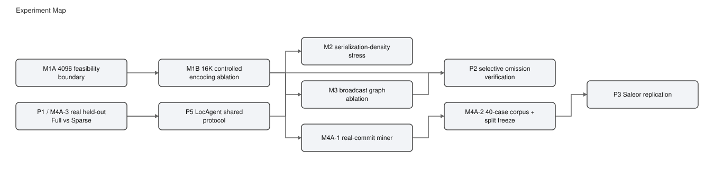
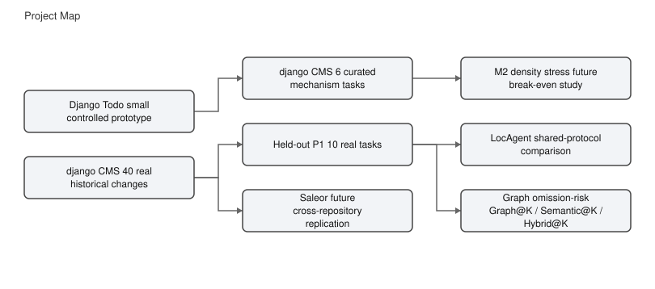
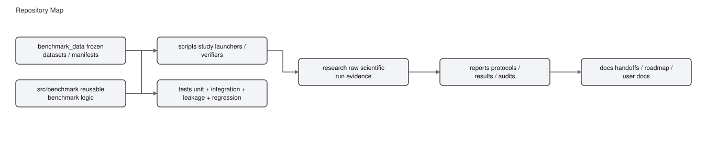

# Repository-Level LLM Impact Selection Benchmark

**Scientific model:** Qwen3-Coder-480B-A35B-Instruct (`qwen/qwen3-coder`) via OpenRouter → DeepInfra
**Last scientific tag:** `saleor-reserve-300-rmcss-final-replication-2026-09-20` (see [Governance](#8-reproducibility--governance))
**Latest WP-1b result tag:** `wp1b-main297-result-2026-09-22` (see [Governance](#8-reproducibility--governance))

> **Start here.** This README is a ~5-minute entry point. Detailed scientific
> truth lives in
> [`00_CURRENT_RESEARCH_STATE.md`](00_CURRENT_RESEARCH_STATE.md), the
> chronological record of what was tried / learned / ruled out is in
> [`docs/RESEARCH_JOURNEY.md`](docs/RESEARCH_JOURNEY.md), and every experiment's
> evidence is in [`reports/`](reports/). Quick answers:
> [FAQ / Q&A](#12-faq--qa).

---

## 1. One-sentence problem

Repository-level LLMs must decide which files a requested change may affect;
exhaustive reasoning over every candidate is costly, while sparse localization
risks missing files the change actually touches.

## 2. Current research idea

```
Change request
  → Sparse Impact Plan (SIP) first pass
  → RM-CSS (Repository-Memory Calibrated Set Selection): Qwen dense ranking +
    parent-only Repository Memory + calibrated ADD/KEEP/DROP
  → final affected-file set
```

- **Localization method selection is CLOSED**
  (`IMPACT_LOCALIZATION_METHOD_SELECTION_CLOSED`): RM-CSS is the frozen method.
  Saleor-300 RM-CSS **PASS** (F1 0.3569 vs SIP 0.2647; Δ +0.0921, CI
  [+0.0691, +0.1156]).
- **Current phase = 5 (End-to-End Selective Regeneration).** The Phase-5
  question: can a cheaper, imperfect scope still produce correct and
  preserving patches? This is **not yet answered** — no E2E Smoke, Pilot or
  Research Run exists.
- **WP-1b (selection-only agent comparison) is COMPLETE**: MAIN_297 is done.
  Primary result = `RMCSS_NONINFERIOR_AT_LOWER_COST` (decision rules v2,
  `NI_SUPPORTED`): RM-CSS is non-inferior to the budget-bounded repository
  Agent at Δ=0.05 pooled micro-F1 and at lower cost. The Agent's pooled-F1
  point estimate is slightly higher (0.3631 vs 0.3568), but RM-CSS satisfies
  the preregistered non-inferiority criterion. This is a **selection-stage
  result, NOT end-to-end correctness**. Next decision = AG16 (budget
  sensitivity), then WP-2. WP-2 / F2P / P2P / Smoke / Pilot / Research Run
  have **NOT** started. See the LIVE STATUS block in §3.
- **Earlier milestones (history):** Route-B omission recovery, oracle-gap /
  bidirectional repair, first-pass recall bottleneck, and the P2 adaptive
  budget results are preserved below as historical record; they are NOT the
  current frontier.

## 3. Current scientific status — at a glance

| Milestone | Status | Main result | Scientific meaning | Evidence |
|---|---|:---|:---|:---|
| Localization method selection | CLOSED (permanent) | RM-CSS frozen as the method | no new localization method will be designed/tuned | [Decision](DECISIONS.md) |
| Saleor-300 RM-CSS replication | **CONFIRMED** | RM-CSS F1 0.3569 vs SIP 0.2647; Δ +0.0921 CI [+0.0691, +0.1156] | RM-CSS > SIP on the untouched Saleor RESERVE sample | [Result](reports/saleor_reserve_300_rmcss_result.json) |
| Stage-5 (earlier confirmatory) | EXECUTION_INVALID → corrected | first run had a finite-sentinel defect; corrected re-execution positive | Stage-5 correction is historical; superseded by Saleor-300 | [Stage-5](docs/STAGE5_EXECUTION_DEFECT_CORRECTION_IMPACT_DECLARATION_2026-09-20.md) |
| WP-1b agent comparison | **COMPLETE** | MAIN_297 scored with decision rules v2 → **RMCSS_NONINFERIOR_AT_LOWER_COST** (`NI_SUPPORTED`); Agent F1 0.3631 vs RM-CSS 0.3568; RM-CSS cheaper | MAIN_297 is the first accuracy comparison of RM-CSS vs a budget-bounded repository Agent under one frozen protocol (v3); selection-stage result, NOT E2E | [result](reports/WP1B_MAIN297_RESULT.md) · [exploratory](reports/WP1B_MAIN297_EXPLORATORY.md) · [3c STOP](docs/WP1B_CALIBRATION_3C_STOP_REPORT_2026-09-22.md) · [loop](docs/WP1B_AGENT_CONTEXT_LOOP_2026-09-22.md) · [addendum](docs/WP1B_MAIN297_EXECUTION_ADDENDUM_2026-09-22.md) |

**End-to-end status:** WP-2 has **not started**; E2E-G6 F2P/P2P oracle has
**not started**; **no** E2E Smoke, Pilot or Research Run exists yet.

<!-- LIVE_STATUS:BEGIN -->

## LIVE STATUS — single current-state source of truth

**Position:** MAIN_297 primary WP-1b result complete and frozen: RMCSS_NONINFERIOR_AT_LOWER_COST (NI_SUPPORTED). WP-2 Oracle Confirmation infrastructure built and validated (zero-API): deterministic harness, per-state test DB, per-file evaluator, failure taxonomy. All 220 changed-test candidates attempted; 8 primary behavioral F2P eligible + 1 symbol-absence eligible confirmed. Environment is the dominant blocker on this host (207/220 ENV_BROKEN: native libs, ? in filenames, Unix-only resource module). WP-2 Design v1 (causal), power/assay-sensitivity planning, and Smoke v2 proposal emitted. NO E2E execution, NO paid calls.

**Research pipeline:**

| Step | Status | Note |
| :---|:---|:---|
| Localization method selection | CLOSED | RM-CSS frozen; Saleor-300 PASS (+0.0921 F1) |
| WP-0 leakage fix (G7) | DONE | ArtifactUniverse built from the parent repository |
| WP-1a preparation | DONE | zero API; frozen predictions, manifests, agent protocol |
| WP-1b preflight freeze | DONE | G1 delta=0.05 · G2 cap 1024 · n=297 · budget v2 · rules v2 |
| WP-1b Calibration-3 | DEFECT | v1 gate PASS, $0.081, 24 calls — 0 successful reads; INSTRUMENT_INVALID |
| Tool-budget fix + gate v2 | DONE | D2: search_text does not consume the 30-file budget; CG-10/CG-11 written; RED on Calibration-3 |
| WP-1b Calibration-3b | PASS | gate v2 PASS · $0.070 · 3 reads · 0 instrument errors · 11/21 calls rejected repeats (loop) |
| G12 agent context hygiene | DONE | D1 APPROVED, zero API: echo, call counter, named rejection, truncation note; gate v3 CG-12 FAILS 3b (runs 1/6/4); protocol v3 |
| WP-1b Calibration-3c | PASS | gate v3 CG-1..CG-12 PASS · $0.063205 · 4 reads · 1/18 rejected (5.6%) · longest run 1 · 0 blocking review-card flags · NOT scored |
| WP-1b MAIN_297 + variance 15x3 | DONE | RMCSS_NONINFERIOR_AT_LOWER_COST (NI_SUPPORTED); main $7.15 + variance $1.19; scored with decision rules v2; X1-X11 exploratory |
| WP-1b post-MAIN_297 docs closure + claim sheet | DONE | claim sheet, robustness/limitations, README/FAQ updated; zero API |
| AG16 budget sensitivity (MAIN_50) | PREREGISTERED, NOT RUNNABLE | brain-built/tested bundle required first (iterative_agent_budget.py + golden parity + dry-run); ceilings $0.80 cal / $12.20 MAIN_50 |
| WP-2 zero-API MAIN_297 census | DONE | 297/297 materializable; 20 STRONG / 200 MODIFIED / 77 no-test-evidence F2P candidates; proposal-only Smoke candidates 8; zero API |
| WP-2 Oracle Confirmation + Design v1 | DONE (zero-API) | harness validated; 220/220 changed-test candidates attempted; 8 primary behavioral F2P + 1 symbol-absence eligible; causal Design v1, power planning, Smoke v2 emitted; environment-dominant blocker on this host |
| WP-2 shared E2E instrument | NOT STARTED | same generator/validator/repair for every arm |
| E2E-G6 F2P/P2P oracle | NOT STARTED | fail-to-pass + pass-to-pass tests per task |
| E2E Smoke → Pilot → Research Run | NOT STARTED | staged; each stage can stop the run |

**LLM-call accounting:**

| Workflow | Calls | Note |
| :---|:---|:---|
| SIP on Saleor-300 | 300 coder calls (1/task) | 315 HTTP attempts incl. retries · 5.09 M tokens · $1.593 |
| RM-CSS on top of SIP | 0 extra coder calls | local logistic regression + repository memory |
| Qwen embeddings (RM-CSS) | 33 batched calls | 2,076 file units + 299 queries · $0.026 |
| WP-1b Calibration-3 agent | 24 calls (8/task) | $0.081 · 7 of 24 were rejected repeats · 0 successful reads (INSTRUMENT_INVALID) |
| WP-1b Calibration-3b agent | 21 calls (5/8/8) | $0.070028 · 3 successful reads · 0 instrument errors · gate v2 PASS · loop: 11/21 rejected repeats |
| WP-1b G12 (zero API) | 0 | agent context hygiene amendment D1 APPROVED: echo, call counter, named rejection, truncation note; gate v3 CG-12 FAILS 3b |
| WP-1b Calibration-3c agent | 18 calls (4/8/6) | $0.063205 · 4 successful reads · 1/18 rejected repeats (5.6%) · longest run 1 · gate v3 CG-1..CG-12 PASS · NOT scored |
| MAIN_297 agent | 2,164 logical / 2,178 HTTP attempts | ledger $7.147 · 23.55M prompt / 81.7K completion tokens · 147 forced finals · 2 EMPTY (parser_failure) · 8 transport retries |
| Variance substudy 15x3 | 331 logical / 341 HTTP attempts | ledger $1.194 · pooled F1 0.389/0.438/0.479 · pairwise exact match 0.444 · 0 EMPTY |
| WP-2 zero-API MAIN_297 census | 0 | deterministic read-only git diff over already-opened case metadata; $0.00 |
| E2E generation + repair | not frozen yet | defined by WP-2 |

**Authorized / not authorized:**

| Item | Status | Note |
| :---|:---|:---|
| Calibration-3c | DONE (CLEAN) | gate v3 CG-1..CG-12 PASS; $0.063205; NOT scored |
| MAIN_297 + variance 15×3 + scoring | DONE (D3 = YES) | RMCSS_NONINFERIOR_AT_LOWER_COST (NI_SUPPORTED); main $7.15 + variance $1.19; predictions frozen/tagged before any label load |
| Agent budget-sensitivity arm (AG16, MAIN_50) | PREREGISTERED, NOT AUTHORIZED; runner NOT built | design frozen before MAIN_297 outputs; needs brain-built/tested bundle + decision D6 |
| WP-2 zero-API MAIN_297 census | DONE | deterministic planning evidence only; no E2E execution; no F2P/P2P oracle |
| WP-2 Oracle Confirmation (zero-API) + Design v1 | DONE | 8 primary behavioral F2P + 1 symbol-absence eligible confirmed; causal Design v1 + power planning + Smoke v2 proposal; NO E2E execution |
| 786 Saleor RESERVE outcomes | SEALED | never opened/read/scored/sampled; guarded by the label-access audit hook |
| Calibration-3 / 3b / 3c F1 claims | NOT PERMITTED | instrument checks only; no labels loaded or scored |

**Next action:** Ahmed/brain review WP-2 Design v1 + Smoke v2 (8 confirmed oracle tasks); build a version-aware Saleor environment bundle to lift the env blocker; in parallel build/review the AG16 executable bundle. Then AG16 sensitivity and WP-2 Smoke can be authorized.

**End-to-end status:** WP-2 has **not started**; E2E-G6 F2P/P2P oracle has **not started**; **no** E2E Smoke, Pilot or Research Run exists yet.

*Source: `docs/LIVE_STATUS.json` (schema `live_status_v1`), rendered by `scripts/render_live_status.py`. As of 2026-09-22 (Africa/Cairo).*
<!-- LIVE_STATUS:END -->

### Earlier milestones (history)

The following rows are the historical Route-B / oracle / recall-bottleneck
record. They are preserved as history, NOT as the current frontier; the current
frontier is the WP-1b agent comparison result above.

| Milestone | Status | Main result | Scientific meaning | Evidence |
|---|---|:---|:---|:---|
| Preserve-by-Omission controlled study (M1A/M1B) | CONFIRMED (development/controlled) | Full-v2 F1 0.571 vs Sparse-v2 F1 0.794; ~90% lower completion output | Representation/cost advantage, not semantic superiority | [M1B](reports/CONTROLLED_ENCODING_16K_RESULT.md) · [M1B JSON](research/controlled-encoding-ablation-16k-01/final_metrics.json) |
| real-commit Full-vs-Sparse (M4A-3 / P1) | CONFIRMED (held-out 10) | ΔF1 (Sparse−Full) −0.009 CI [−0.130, +0.119]; Δcost/task −$0.0235 (CI excludes 0) | Cost effect transfers; semantic superiority does not | [P1 correction](reports/REAL_COMMIT_M4A3_P1_SERIALIZATION_METRIC_CORRECTION.md) |
| LocAgent shared-protocol study (P5) | CONFIRMED (shared protocol) | LocAgent F1 0.333 (5/10 non-empty) vs Full 0.353 / Sparse 0.312; CIs cross zero | Comparable-or-lower F1 at far higher cost; 50% empty rate; NOT a faithful published-config reproduction | [P5C shared comparison](reports/LOCAGENT_P5C_SHARED_COMPARISON.md) |
| Route-B candidate-level recovery | DEVELOPMENT (djangoCMS DEV + Saleor DEV) | CIA/Hybrid beat analytic Random at every B; Oracle headroom large | Cheap evidence can rank some omitted positives above Random | [Route-B V2](reports/ROUTE_B_V2_ROBUSTNESS_REPORT.md) |
| Saleor DEVELOPMENT transfer | DEVELOPMENT | CIA B=5 macro ORR 0.237 vs random 0.006; **REPLICATES** | Cross-repository transfer on DEVELOPMENT | [Saleor transfer](reports/SALEOR_ROUTE_B_TRANSFER_REPORT.md) |
| djangoCMS fixed Route-B confirmatory | CONFIRMED (spent INTERNAL_TEST) | Composite ORR B=5 0.165 vs random 0.028; gate PASS 5/5 folds, 4/4 B-points | Fixed Route-B omission recovery confirmed | [Confirmatory](reports/DJANGOCMS_ROUTE_B_CONFIRMATORY_RESULT.md) |
| P2 adaptive-budget Phase 1 | NEGATIVE (frozen) | All four policies fail the strong-method gate on both repos | Choosing budget B is not the main bottleneck | [P2 final](reports/P2_PHASE1_FINAL_REPORT.md) |
| AI-assisted semantic plausibility audit | DESCRIPTIVE (NOT gold) | Exact agreement 0.698 / κ 0.558; historical-changed 0.847 vs omitted 0.632 | Descriptive assistant reliability; human gold still AWAITING | [AI audit](reports/AI_SEMANTIC_AUDIT_AGREEMENT_REPORT.md) |
| Oracle-gap / bidirectional repair exploration | POST-HOC (DEVELOPMENT) | Oracle-Add ALL F1 0.867/0.829; F1 0.85 NOT add-only-reachable on Saleor | First-pass recall is dominant; simple BBSR negative | [Oracle-gap](reports/ORACLE_GAP_BIDIRECTIONAL_REPAIR_FINAL_REPORT.md) |
| First-Pass Recall Bottleneck | DEVELOPMENT (complete) | S006-like utility misses GENERAL; reverse-1hop carries 55.8%/72.4% of FNs @K=5; **no simple ADD queue beats Route-B at matched budget** → RANKING is the main remaining loss | **RECALL_SIGNAL_HEADROOM_ONLY** — availability is not the gap; next instrument = verifier-ranked expansion under its own budget | [Final report](reports/FIRST_PASS_RECALL_BOTTLENECK_FINAL_REPORT.md) · [taxonomy](reports/FN_TAXONOMY_DEVELOPMENT.md) · [gate](reports/FN_PROGRESSION_GATE.md) |

Labels: **CONFIRMED** = frozen confirmatory evidence · **DEVELOPMENT** = TRAIN/VALIDATION-only design evidence · **NEGATIVE** = valid empirical boundary · **DESCRIPTIVE** = not human gold · **POST-HOC** = labelled characterization · **FUTURE** = not started.

### Experiment map







## 4. What we have learned

The lessons below are the project's accumulated record. Lessons 0–1d are the
current frontier; the Route-B-era lessons (2–11) are historical and kept on
purpose.

0. **Localization method selection is CLOSED; RM-CSS is the frozen method.**
   Saleor-300 RM-CSS **PASS** — F1 0.3569 vs SIP 0.2647, Δ +0.0921 CI
   [+0.0691, +0.1156] (excludes zero). → Method-search phase is over; the
   remaining question is Phase-5 end-to-end regeneration, not localization.
1. **The agent baseline must be instrument-valid before any comparison.**
   Calibration-3 passed its frozen v1 gate but the agent's tools were blind
   (0/3 tasks read a file; `GATE_V1_PASS / INSTRUMENT_INVALID`). → Tool
   function, not just protocol/cost, is a precondition for a MAIN_297 verdict.

   1a. **Calibration must test information flow, not only protocol completion.**
   A gate can pass while the agent sees nothing. → Gate v2 added CG-10/CG-11
   (tool and read validity); gate v3 added CG-12 (no ≥ 3 consecutive rejected
   repeats); every paid run ends with a Review Card.

   1b. **Agent quality cannot be separated from harness quality.** G11 made the
   tools work; G12 (action echo, call counter, named rejection, truncation note)
   removed a deterministic context loop: rejected repeats 11/21 (52.4%) → 1/18
   (5.6%), longest run 6 → 1, successful reads 3 → 4, cost $0.070 → $0.063. →
   Before judging an agent, prove the scaffold is not disabling it.

   1c. **The agent is budget-bounded by design, and the bound is visible.** 8
   calls, 1024-token control cap, 2000-char observation window, substring search,
   no paging. In Calibration-3c one of three tasks reached the forced final at
   call 8 while still searching, and 26–41% of tool-output characters were cut.
   Only 6 of its 7 searches were distinct, and 3 multi-word search calls returned
   nothing (the search is a substring match). → Claims are against a budget-bounded agent, never
   "the best possible agent"; a budget-sensitivity arm is preregistered.

   1d. **A calibration runner is not a production runner.** The 3-task runner did
   not persist predicted sets, wrote records only at the end, deleted its output
   directory on start, and used one immediate transport retry instead of the
   frozen three. → MAIN_297 uses a separate resume-safe runner with a spend
   ledger, the frozen retry rule and instrument-only halting
([addendum](docs/WP1B_MAIN297_EXECUTION_ADDENDUM_2026-09-22.md)). Cost signal
    so far is descriptive only: on the same 3 calibration tasks the agent used
    ≈3.8× SIP's tokens and ≈3.7× its USD.

    1e. **MAIN_297 primary verdict: NI_SUPPORTED — RM-CSS is non-inferior to the
    budget-bounded repository agent, at lower cost.** "RM-CSS was non-inferior to
    the budget-bounded repository agent (margin 0.05 pooled micro-F1), at lower
    cost." P analysis (n=297, fail-closed): D −0.0062, 95% CI [−0.0449, +0.0308],
    Q5 −0.0383 (inside the −0.05 margin). S analysis (n=295; 2 parser-failure
    EMPTY dropped): D −0.0115, CI [−0.0502, +0.0255], Q5 −0.0434. Agent F1 0.363
    vs RM-CSS 0.357 (pooled micro-F1); RM-CSS cheaper (View A: 0.27× agent calls,
    0.21× agent generative tokens per task); EMPTY rate 0.67% (2/297, parser
    failure); run spend $7.15 for 2,164 calls / 23.6M prompt tokens.
    ([result](reports/WP1B_MAIN297_RESULT.md) ·
    [exploratory](reports/WP1B_MAIN297_EXPLORATORY.md)) → The frozen decision
    rules v2 verdict stands mechanically; no "dominance" claim; the agent remains
    a budget-bounded baseline (AG16 budget-sensitivity arm is preregistered).

    1f. **The primary result supports non-inferiority, not superiority, and is
    margin- and aggregation-dependent.** RM-CSS pooled micro-F1 (0.3568) is
    below the Agent's (0.3631); D ≈ −0.00624, Q5 ≈ −0.0383 > −0.05 → NI at
    Δ=0.05 only. Δ=0.03 is `INCONCLUSIVE_AT_THIS_N`. Exploratory macro-F1 favors
    the Agent (≈0.3971 vs ≈0.3427). → Never say RM-CSS is more accurate, never
    call NI equivalence, never hide the Δ=0.03 inconclusive reading or the
    macro-F1 result.

    1g. **Efficiency is large in calls/tokens, but only under normalized/list
    accounting.** View A: RM-CSS 0.27× agent calls, 0.21× agent generative
    tokens/task, 0.22× USD (list price). Actual billed OpenRouter usage differs
    due to provider caching. → Headline the calls/tokens ratios (provider-
    robust), and always label list/normalized vs billed USD; never present the
    billed 4.x ratio as the preregistered normalized cost verdict.

    1h. **Temperature 0 does not make the Agent deterministic, and aggregation
    choice changes the picture.** The 15×3 variance substudy shows execution
    variability (pooled F1 0.389/0.438/0.479; mean per-task F1 range 0.14). →
    Do not describe the replicate F1 values as an increasing trend; the main
    execution is not replicate 1.

    1i. **Preregistered negative exploratory signals stay negative.** X3 =
    `NO_TEACHER_HEADROOM`; X6 = `ESCALATION_NO_GAIN`. X10 dense-only size-matched
    anchor F1 ≈0.278, materially below RM-CSS → dense retrieval alone does not
    reproduce RM-CSS. → These are boundaries, not license to reopen selection.

    1j. **Recall / candidate coverage remains a structural limitation.**
    RM-CSS can never select outside its candidate pool; the Agent also
    recovered relatively few outside-pool gold files. → A limitation, not
    authorization to reopen localization-method shopping.
2. **Sparse representation greatly reduces output/serialization burden, but sparse encoding is not semantic correctness.** M1B: ~90% lower completion output; P1: ΔF1 CI crosses zero. → Report representation cost separately from impact accuracy; never conflate the two.
3. **Real historical evidence did not show universal Sparse semantic superiority.** P1 ΔF1 (Sparse−Full) −0.009, CI [−0.130, +0.119]. → Claim cost/representation effects only; semantic effects are task-heterogeneous.
4. **LocAgent shared-protocol execution was very expensive/fragile in our setup; not a faithful published-config reproduction.** P5: 402 calls, ~32.8M prompt tokens, ~$9.93 normalized, 50% empty/non-usable rate, 900 s timeouts. → Use LocAgent numbers only under a shared protocol with explicit denominators; do not compare to its published headline.
5. **Cheap candidate-level evidence can rank some omitted positives above Random; Route-B transferred on Saleor DEVELOPMENT and confirmed on djangoCMS INTERNAL_TEST.** Route-B V2 + transfer + confirmatory all PASS their gates. → The fixed-B omission-recovery line is the solid anchor.
6. **Current graph-neighbor increment is small; most ranking signal is lexical/BM25.** Graph@K ≈ path_token@K; BM25@K is the strongest cheap baseline. → Do not assume graph evidence is the lever.
7. **Simple adaptive-budget P2 policies failed; choosing B is not the main bottleneck.** P2 Phase-1 NEGATIVE on both repos (strong-method gate FALSE). → Budget adaptation was ruled out as the primary fix.
8. **Add-only Route-B can improve omission recovery while lowering final file-level F1 because of false-positive additions.** Route-B add-only lowers F1 (djangoCMS B=5: 0.226 vs Sparse 0.318). → ORR and file-level F1 are different targets; FP additions must be controlled.
9. **Oracle analysis shows first-pass recall is dominant: 75–79% of proxy positives missed on DEVELOPMENT; Oracle-Add headroom ~+0.55–0.57 F1.** Oracle-gap decomposition. → The next task is FN anatomy / first-pass recall recovery, ZERO-API first.
10. **Cheap DROP/FP-pruning signal is too weak; simple BBSR failed despite oracle headroom.** FP-pruning flagged precision ≈ random; heuristic BBSR fails the progression gate on both repos. → A DROP queue is not yet viable with cheap observable signals.
11. **Therefore the next instrument is FN anatomy-then-recovery; simple binary-flag ADD queues do NOT beat Route-B at matched budget.** First-pass recall is dominant; the measured bottleneck is RANKING, not candidate availability. → Concentrate on the ADD side with verifier-ranked (not binary-flag) expansion under its own frozen budget.

**Why negatives are kept:** every negative above (P2, RiskScorer, graph, BBSR,
LocAgent fragility) is a **search-space reduction under this protocol** — it
saves future researchers/engineers time, API cost, and effort by ruling out an
approach that was already tested. Negatives are empirical boundaries, not
thesis failures. Full per-milestone detail and revisit triggers:
[`docs/RESEARCH_JOURNEY.md`](docs/RESEARCH_JOURNEY.md).

## 5. Current key numbers

Only current headline numbers, each linked to its authoritative report:

- **RM-CSS on Saleor-300 (frozen method):** F1 0.3569 (P 0.4256 / R 0.3073 /
  FNR 0.6927) vs SIP 0.2647; Δ +0.0921 CI [+0.0691, +0.1156]
  ([result](reports/saleor_reserve_300_rmcss_result.json) ·
  [parity gate](reports/saleor_reserve_300_parity_gate.json)).
- **WP-1b MAIN_297 (complete, frozen):** `RMCSS_NONINFERIOR_AT_LOWER_COST`
  (NI_SUPPORTED). P (n=297): D −0.0062 [−0.0449,+0.0308], Q5 −0.0383. S
  (n=295): D −0.0115 [−0.0502,+0.0255], Q5 −0.0434. Agent F1 0.363 vs RM-CSS
  0.357 vs SIP 0.265 (pooled micro-F1); RM-CSS cheaper (View A: 0.27× calls,
  0.21× generative tokens/task). EMPTY 2/297 (parser failure).
  ([result](reports/WP1B_MAIN297_RESULT.md) ·
  [exploratory](reports/WP1B_MAIN297_EXPLORATORY.md))
- **WP-1b Calibration-3c (instrument, CLEAN):** gate v3 CG-1..CG-12 PASS,
  18 calls, 1 rejected repeat (5.6%), 4 successful reads, 0 instrument errors,
  $0.063205 — NOT scored
  ([3c STOP](docs/WP1B_CALIBRATION_3C_STOP_REPORT_2026-09-22.md)). History:
  Calibration-3 blind (0 reads), Calibration-3b loop (11/21 rejected).
- **Sealed outcomes:** 786 Saleor RESERVE outcomes remain unread.
- **Sparse representation cost/serialization (history):** M1B Sparse-v2 vs
  Full-v2: mean completion 809 vs 8,383 tokens; ~90% lower completion output
  ([M1B report](reports/CONTROLLED_ENCODING_16K_RESULT.md)).
- **Fixed Route-B confirmatory (history, djangoCMS INTERNAL_TEST, spent):**
  composite ORR B=5 0.165 vs analytic Random 0.028
  ([confirmatory](reports/DJANGOCMS_ROUTE_B_CONFIRMATORY_RESULT.md)).
- **Oracle-gap (history, DEVELOPMENT):** Sparse F1 0.318 (djangoCMS) / 0.261
  (Saleor); Oracle-Add ALL 0.867 / 0.829
  ([Oracle-gap](reports/ORACLE_GAP_BIDIRECTIONAL_REPAIR_FINAL_REPORT.md)).

## 6. Current bottleneck and next experiment

**Bottleneck (current):** WP-1b MAIN_297 is **complete and frozen**:
`RMCSS_NONINFERIOR_AT_LOWER_COST` (decision rules v2, `NI_SUPPORTED`). The
primary result is a selection-stage file-localization comparison against an
observed change-set proxy — it is **not** end-to-end correctness. The next
scientific decision is **AG16** (budget sensitivity, preregistered, on MAIN_50;
needs a brain-built executable harness), then **WP-2**.

**Next experiment (AG16, then WP-2):**
```
AG16 sensitivity (16 calls / 8000-char window on MAIN_50; brain-built + tested
  bundle required first; ceiling $12.20) -> close WP-1
-> WP-2 (shared E2E executor, zero-API MAIN_297 census already done)
-> E2E-G6 F2P/P2P oracle -> E2E Smoke -> Pilot -> Research Run
```
- **Preregistered before any MAIN_297 output:** exploratory addendum v2 (X6
  confidence-based escalation frontier, X7 heterogeneity, X8 cost per correct
  file, X9 budget binding, X10 zero-generative dense anchor, X11 tool quality)
  and an agent budget-sensitivity arm (16 calls / 8000-char window on MAIN_50;
  runs only with a separate decision, regardless of the MAIN_297 verdict).
- **WP-1b is closed on the scientific side; only AG16 + WP-2 remain** in this
  selection → E2E chain. The Phase-5 question — can cheaper, imperfect scope
  still produce correct and preserving patches? — needs WP-2 (shared E2E
  instrument) and the E2E-G6 F2P/P2P oracle; **neither has started**.
- **Never:** the 786 sealed Saleor RESERVE outcomes stay sealed.

## 7. Evaluation and datasets

| Repository | DEV (design evidence) | Confirmatory | Sealed |
|---|---|---|---|
| djangoCMS | 174 tasks (V1 30 + V2 DEV_TRAIN 117 + DEV_VALIDATION 27) | INTERNAL_TEST 80 — **spent** (Route-B confirmatory) | RESERVE 59 — sealed |
| Saleor | 149 tasks | — | INTERNAL_TEST 80 + RESERVE 1086 — sealed |

- **Observed change-set proxy:** the parent→target changed production-file set
  is an **OBSERVED CHANGE-SET PROXY, not semantic gold**; no P/R/V/H gold is
  fabricated from diffs.
- **Public/hidden boundary:** inference uses parent commit only; target/hidden
  data never enters prompts.
- **HELD_OUT_TEST (10):** permanently exposed after P1/P5 — never tune on it.
- **Semantic audit:** the AI-assisted audit is descriptive; human two-rater +
  adjudicator ratings remain **AWAITING_HUMAN_RATINGS**.
- Definitions: [`reports/DATASET_OPERATIONAL_DEFINITIONS.md`](reports/DATASET_OPERATIONAL_DEFINITIONS.md).

## 8. Reproducibility / governance

- **Scientific truth:** [`00_CURRENT_RESEARCH_STATE.md`](00_CURRENT_RESEARCH_STATE.md)
- **Execution truth:** [`PROGRESS.md`](PROGRESS.md)
- **Append-only decisions:** [`DECISIONS.md`](DECISIONS.md)
- **Protocol v2:** [`docs/EXECUTION_AND_VALIDATION_PROTOCOL_V2.md`](docs/EXECUTION_AND_VALIDATION_PROTOCOL_V2.md)
- **Chronological research history:** [`docs/RESEARCH_JOURNEY.md`](docs/RESEARCH_JOURNEY.md)
- **Experiment evidence:** [`reports/`](reports/)
- **Tags:** scientific milestones are DEV-evidence tags (e.g.
  `oracle-gap-bidirectional-repair-2026-09-18`), NOT stable-tag moves.

**Traceability schema:** scientific closure commit and tag peel are **immutable
scientific facts** embedded in `GIT_STATE.txt`
(`scientific_closure_commit`, `scientific_closure_tag_peel`); **live
HEAD/origin-main are runtime git facts** and are queried with
`git rev-parse HEAD` / `git rev-parse origin/main` — a tracked file cannot
embed its own final live HEAD SHA.

## 9. Repository map

```
benchmark_data/      frozen datasets (real-commit V1/V2, Saleor)
src/benchmark/       source (loaders, execution, impact strategies, evaluation)
scripts/             reproducible experiment launchers + verification
research/            per-milestone evidence (run records, manifests, raw responses)
reports/             authoritative experiment reports + machine-readable JSON
docs/                protocols, runbook, research journey, roadmap, handoffs
msc_proposal/        proposal documents (V1.5 current)
dist/                release/upload bundles
```

Full map: [`docs/PROJECT_STRUCTURE_MAP.md`](docs/PROJECT_STRUCTURE_MAP.md).

## 10. Reproduce / test

```bash
# Deterministic smoke-profile dry run (mock backend — zero model calls)
python seven_arm_benchmark.py --dry-run --profile smoke

# Recompute every headline manuscript metric from frozen evidence
python scripts/verify_paper_claims.py

# Run the test suite
python -m pytest tests/unit tests/integration
```

Detailed: [`docs/BENCHMARK_RUNBOOK.md`](docs/BENCHMARK_RUNBOOK.md),
[`docs/REPRODUCIBILITY_PROTOCOL.md`](docs/REPRODUCIBILITY_PROTOCOL.md).

## 11. Citation / claim status

| Label | Meaning |
|---|---|
| **CONFIRMED** | frozen confirmatory evidence (e.g. djangoCMS INTERNAL_TEST) |
| **DEVELOPMENT** | TRAIN/VALIDATION-only design evidence (not confirmatory) |
| **NEGATIVE** | valid empirical boundary / search-space reduction |
| **POST-HOC** | labelled characterization of frozen evidence (not preregistered) |
| **DESCRIPTIVE** | e.g. AI-assisted semantic audit — NOT human semantic gold |
| **FUTURE** | not started (e.g. First-Pass Recall Bottleneck) |

Citation metadata: [`CITATION.cff`](CITATION.cff). License: MIT
([`LICENSE`](LICENSE)).

## 12. FAQ / Q&A

**What problem does this thesis investigate?** Given a change request and the
repository at its parent commit, which files will the change touch? Exhaustive
reasoning over every file is expensive; sparse selection risks misses. The goal
is a cheaper selector that stays accurate. ([§1](#1-one-sentence-problem))

**What is SIP?** Sparse Impact Plan: one model call that lists only the files it
would change; unlisted files default to "preserve". It cut completion output by
~90% in the controlled study, but sparse encoding is not semantic correctness.
([M1B](reports/CONTROLLED_ENCODING_16K_RESULT.md))

**What is RM-CSS?** Repository-Memory Calibrated Set Selection: SIP + Qwen dense
file ranking + parent-only repository memory + a frozen logistic classifier that
decides ADD/KEEP/DROP. It adds no generative call on top of SIP.
([glossary](docs/GLOSSARY.md))

**What did Saleor-300 establish?** On 300 untouched Saleor RESERVE tasks, RM-CSS
F1 0.3569 vs SIP 0.2647; Δ +0.0921, CI [+0.0691, +0.1156].
([result](reports/saleor_reserve_300_rmcss_result.json))

**Why is recall still a limitation?** RM-CSS recall is 0.307 (FNR 0.693). About
25% of changed files never enter its candidate pool; of its misses, ~64% are
decisions inside the pool and ~36% are files outside it. RM-CSS can never select
outside its candidate pool.
([bottleneck](reports/FIRST_PASS_RECALL_BOTTLENECK_FINAL_REPORT.md))

**What is WP-1b?** A paid, same-model, same-protocol comparison of SIP, RM-CSS and
a budget-bounded iterative repository agent, scored with a preregistered
non-inferiority rule (Δ = 0.05 pooled micro-F1, paired bootstrap, fail-closed
EMPTY). ([decision rules](research/wp1b/wp1b_decision_rules_v2.json))

**What is MAIN_297?** The 300 RESERVE tasks minus the 3 calibration tasks, in
frozen order; the first 50 are the nested MAIN_50 fallback.
([manifest](research/wp1b/wp1b_main_297_manifest.json))

**What does NI / non-inferiority mean here?** It is the preregistered rule used
to compare RM-CSS against the budget-bounded Agent on pooled file-level F1. The
statistic is D = F1(RM-CSS) − F1(Agent); NI is supported if the one-sided 95%
lower bound (Q5) is above −0.05. It is a **selection-stage** claim about file
localization, not about end-to-end correctness. NI is **not** equivalence and
**not** superiority.

**Did RM-CSS beat the Agent in accuracy?** No. The Agent had a slightly higher
pooled-F1 point estimate (0.3631 vs RM-CSS 0.3568). The study supports
**non-inferiority at Δ=0.05**, not RM-CSS superiority.

**Why can NI be supported if the Agent F1 is slightly higher?** Because the
preregistered NI question is whether RM-CSS is not worse than the Agent by more
than a prespecified margin (Δ=0.05). D ≈ −0.0062 with Q5 ≈ −0.0383 is inside the
−0.05 margin, so NI is supported even though the point estimate is slightly
negative. Δ=0.03 is `INCONCLUSIVE_AT_THIS_N`.

**Is RM-CSS cheaper than the Agent?** Yes, on calls/tokens/USD (View A, list
price): RM-CSS ≈0.27× agent calls, ≈0.21× agent generative tokens/task,
≈0.22× USD. Billed OpenRouter usage differs due to provider caching; the
calls/tokens ratios are the most provider-robust quantities.

**Why are list-price USD and billed USD different?** The frozen ledger uses
normalized list prices. Actual billed OpenRouter usage can be lower because of
provider-side caching. Both are reported; never present the billed 4.x ratio as
the preregistered normalized cost verdict.

**Does macro-F1 tell the same story?** No. Exploratory macro-F1 favors the Agent
(≈0.3971 vs RM-CSS ≈0.3427). The pooled primary result supports NI; the
exploratory macro view is different. Both are reported; neither is hidden.

**Are F2P/P2P tests or end-to-end correctness done?** No. WP-2 (shared E2E
instrument) and E2E-G6 (F2P/P2P oracle) have not started; no Smoke, Pilot or
Research Run exists. The WP-2 zero-API MAIN_297 census is planning evidence only.

**Is End-to-End Selective Regeneration proven?** No. MAIN_297 is a
selection-stage file-localization result against an observed change-set proxy.
No end-to-end code-generation correctness claim follows from WP-1b.

**What is AG16 and why might we run it?** AG16 (Agent-Generous) is the
preregistered budget-sensitivity arm: the same frozen Agent with 16 calls
(instead of 8) and an 8000-char observation window (instead of 2000), on MAIN_50.
It tests whether the MAIN_297 NI verdict is an artifact of a budget-starved
agent. It needs a separate decision (D6), a brain-built/tested harness, and is
sensitivity only — it never replaces the MAIN_297 primary.
([prereg](research/wp1b/wp1b_agent_budget_sensitivity_prereg.json))

**What comes after WP-1?** AG16 sensitivity → close WP-1 → WP-2 (shared E2E
executor) → E2E-G6 F2P/P2P oracle → Smoke → Pilot → Research Run. External
validity (JabRef/Java, NestJS/TypeScript, Grafana true-polyglot) comes only
after core E2E evidence.

**Do we claim to beat LocAgent or Ripple or all coding agents?** No. The
LocAgent shared-protocol study is not a faithful published-configuration
reproduction, no head-to-head with Ripple exists, and no universal-agent claim
is made. The competitor here is a specific budget-bounded Agent under one frozen
protocol. ([P5](reports/LOCAGENT_P5C_SHARED_COMPARISON.md))

**When do Java / TypeScript / true-polyglot repositories enter?** Only after the
core E2E evidence exists — first one cross-language replication (JabRef/Java or
NestJS/TypeScript), then a second if useful, then a true-polyglot repository
such as Grafana. These are roadmap candidates, not yet validated datasets.

**What did MAIN_297 show?** "RM-CSS was non-inferior to the budget-bounded
repository agent (margin 0.05 pooled micro-F1), at lower cost." P analysis
(n=297): D −0.0062, 95% CI [−0.0449, +0.0308], Q5 −0.0383; S analysis (n=295):
D −0.0115, CI [−0.0502, +0.0255], Q5 −0.0434. Agent F1 0.363 vs RM-CSS 0.357;
RM-CSS cheaper (View A: 0.27× calls, 0.21× generative tokens per task); EMPTY
2/297 (0.67%); spend $7.15 for 2,164 calls / 23.6M prompt tokens.
([result](reports/WP1B_MAIN297_RESULT.md) ·
[exploratory](reports/WP1B_MAIN297_EXPLORATORY.md))

**Why were Calibration-3, 3b and 3c needed?** Calibration-3 passed its gate with
a blind agent (0 reads); 3b exposed a deterministic repeat loop (52% rejected
calls); 3c confirmed both fixes (5.6% rejected, 0 instrument errors). None of
them is scored. ([3c STOP](docs/WP1B_CALIBRATION_3C_STOP_REPORT_2026-09-22.md))

**What exactly is the agent baseline?** Protocol v3: Qwen3-Coder-480B-A35B via
OpenRouter → DeepInfra turbo (the same route serves SIP), temperature 0, ≤ 8
calls (call 8 forced final), 1024-token control cap, tools list/read/search
(substring), 2000-char observation window, 30-file read budget.
([protocol v3](research/wp1b/wp1b_frozen_agent_protocol_v3.json))

**What happens next?** Ahmed reviews this closure and MAIN_297, then decides D6
(AG16 budget-sensitivity on MAIN_50, ceiling $12.20) and the WP-2 start.
([§6](#6-current-bottleneck-and-next-experiment))

**What was the WP-2 census?** A zero-API, exhaustive structural inspection of
the 297 already-opened MAIN_297 Saleor tasks (parent/target diffs), producing
measured counts of changed-test evidence before any generation.
([census](docs/WP2_MAIN297_ZERO_API_CENSUS_2026-09-22.md))

**Why were 20 called strong candidates?** Because their target commit adds ≥1
test file — the clearest structural signal for a fail-to-pass oracle. They were
candidates, not confirmed: flakiness, environment, and patch-apply issues could
still disqualify them. ([rationale](docs/WP2_CENSUS_TASK_CANDIDATE_SELECTION_RATIONALE_2026-09-22.md))

**Why were 200 only modified-test candidates?** Because they modify test files
without adding one. This is weaker but not bad evidence — some still yield valid
F2P tests. None were called "F2P" before execution.

**Were the other 77 discarded?** No. They have no changed-test path in the
historical diff, so they are outside this automated F2P-extraction path, but
they are not deleted and remain available for manual/external oracles later.

**How is a candidate promoted to confirmed F2P?** By Oracle Confirmation: the
changed target tests must pass 3/3 at the target state and fail 3/3 at the
parent + test-only-patch state, with a compatible environment and stable target.
8 tasks were confirmed primary behavioral F2P.
([report](docs/WP2_ORACLE_CONFIRMATION_REPORT_2026-09-22.md))

**Why are ImportError cases separated rather than silently removed?** Because a
newly-added test importing a target-introduced symbol fails to import at parent
— that is natural pre-change state (FEA-Bench makes the same point), not an
environment failure. They are classified separately as symbol-absence F2P and
reported transparently. ([rationale](docs/WP2_CENSUS_TASK_CANDIDATE_SELECTION_RATIONALE_2026-09-22.md))

**How will the final Smoke tasks be chosen?** From the confirmed oracle pool
(primary behavioral F2P preferred), with size/migration coverage and one
symbol-absence stress case, deterministically and without using any selector or
generator performance. Proposal v2 is ready for brain/Ahmed review.
([Smoke v2](docs/WP2_SMOKE_SELECTION_V2_2026-09-22.md))

---

**Author:** Ahmed Ehab — [AhmedEhabH](https://github.com/AhmedEhabH)