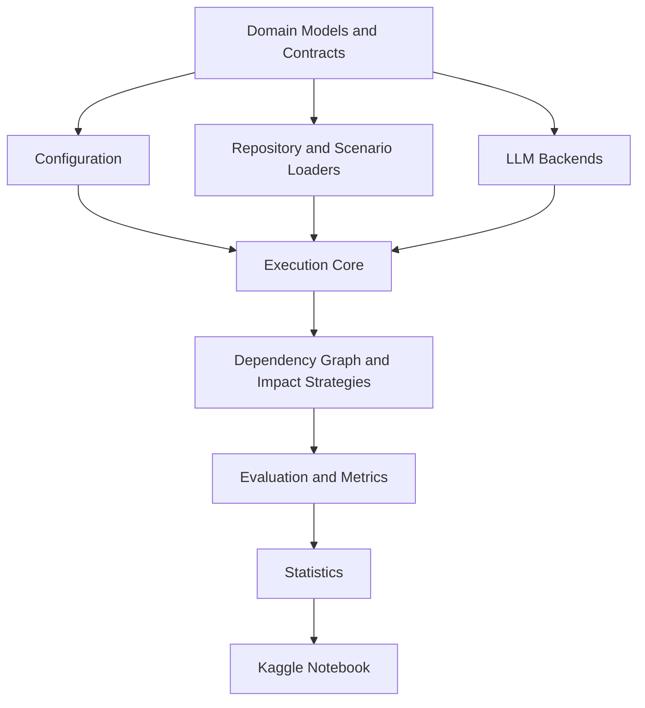

# Dependency-Aware Selective Regeneration Benchmark

> Research infrastructure for the working paper  
> **“Don't Regenerate What Hasn't Changed: Selective Regeneration for Token-Efficient LLM-Driven Software Evolution.”**

[](https://www.python.org/)
[](LICENSE)
[](PROTOCOL_VERSION.md)
[](reports/PROJECT_HEALTH_REPORT.md)
[](https://github.com/AhmedEhabH/dependency-aware-selective-regeneration-benchmark/releases)

## Overview

This repository provides a research-grade benchmark for studying **selective regeneration in LLM-driven software evolution**.

The central idea is simple:

> When a requirement changes, regenerate only the software artifacts that are truly affected—while preserving unchanged behavior and architecture.

The benchmark prioritizes **impact correctness** before efficiency. Token savings are not considered successful if the approach misses affected artifacts, breaks regression behavior, or violates architectural constraints.

The project is designed for:

- repository-level software evolution;
- natural-language requirement changes;
- dependency-aware impact analysis;
- selective artifact regeneration;
- controlled comparison with baseline strategies;
- reproducible execution using open-weight code LLMs;
- Kaggle-based real-model experiments.

## Working Paper

**Title:**  
*Don't Regenerate What Hasn't Changed: Selective Regeneration for Token-Efficient LLM-Driven Software Evolution*

**Status:** Research in progress. The title is frozen as the working title for the current research cycle.

## Research Questions

The frozen protocol studies five dimensions:

1. **Impact identification:** How accurately are affected artifacts identified?
2. **Evolution correctness:** Can changed requirements be implemented while preserving unchanged behavior?
3. **Architecture consistency:** Can architectural constraints be preserved?
4. **Efficiency:** Can regeneration reduce artifacts, tokens, calls, and time under equivalent correctness?
5. **Sensitivity:** How do results vary by repository, change type, and blast radius?

The authoritative protocol is available in [`docs/FINAL_RESEARCH_PROTOCOL.md`](docs/FINAL_RESEARCH_PROTOCOL.md).

## Core Principles

- **Correctness before efficiency**
- **Frozen experimental protocol**
- **No post-hoc scenario or metric changes**
- **Hidden-test and ground-truth isolation**
- **Failed runs remain visible**
- **Equivalent-model and equivalent-budget comparisons**
- **Local engineering validation without local LLM inference**
- **Real Qwen execution only on Kaggle**
- **Complete provenance for publication results**

## Benchmark Scope

### Language and ecosystem

The confirmatory benchmark focuses on **Python**, primarily the **Django ecosystem**, to reduce language and framework confounding.

### Repositories

| Scale | Repository | Role |
|---|---|---|
| Small | Controlled Django Todo | Fully controlled reference repository |
| Medium | django CMS 5.0.0 | Modular CMS with plugin architecture |
| Large | Saleor Core 3.23.0 | Django/GraphQL modular monolith |

The study treats these repositories as examples of increasing scale and architectural complexity. It does not claim that source-code size is the only changing variable.

### Scenarios

The frozen design contains **24 scenarios**:

| Repository | Localized | Moderate | Cross-cutting | Total |
|---|---:|---:|---:|---:|
| Controlled Django Todo | 3 | 3 | 2 | 8 |
| django CMS | 3 | 3 | 2 | 8 |
| Saleor Core | 3 | 3 | 2 | 8 |
| **Total** | **9** | **9** | **6** | **24** |

The scenario taxonomy covers:

- schema and field changes;
- API changes;
- validation and business rules;
- permissions and authorization;
- cross-entity relationships;
- workflow changes;
- architecture-sensitive changes;
- broad cross-cutting changes.

## Architecture



The architecture uses:

- immutable typed domain models;
- `typing.Protocol` interfaces;
- explicit dependency injection;
- instantiated registries rather than global singletons;
- lazy Kaggle-only model imports;
- isolated run workspaces;
- typed failure classification;
- deterministic local mock and dry-run backends.

See [`docs/SOFTWARE_ARCHITECTURE.md`](docs/SOFTWARE_ARCHITECTURE.md) and [`docs/DEPENDENCY_RULES.md`](docs/DEPENDENCY_RULES.md).

## Comparison Arms

### Monolithic / Full-Scope Regeneration
Condition identifier: `monolithic`, `full_scope_reference`
Purpose: Baseline full-scope regeneration — every artifact is regenerated.
Budget semantics: Selection + regeneration tokens count toward `max_tokens`.

### Agent (Single-Shot LLM)
Condition identifier: `agent`
Purpose: Single LLM call for impact analysis; no regeneration.
Budget semantics: Not budget-constrained (no regeneration enabled).

### Selective / Hybrid Selective Regeneration
Condition identifier: `selective`, `hybrid_selective`
Purpose: Selective regeneration using dependency graph and semantic analysis.
Budget semantics: Selection + regeneration tokens count toward `max_tokens`.

### Compiled AI (Static Analysis)
Condition identifier: `compiled_ai`
Purpose: Dependency graph only — no LLM calls.
Budget semantics: Not budget-constrained (no LLM calls).

### Delta MCP (Semantic Analysis)
Condition identifier: `delta_mcp`
Purpose: Repository diff and semantic trace analysis.
Budget semantics: Not budget-constrained (no LLM calls).

### Incremental RTL (Traceability)
Condition identifier: `incr_rtl`
Purpose: Lightweight traceability analysis.
Budget semantics: Not budget-constrained (no LLM calls).

### Code Plan (Full Context)
Condition identifier: `code_plan`
Purpose: Full-repository-context LLM analysis.
Budget semantics: Not budget-constrained (no regeneration enabled).

### Iterative Repository Agent
Condition identifier: `iterative_repository_agent`
Purpose: Plan → regenerate → validate → revise. The agent iteratively analyzes
the repository, selects artifacts for regeneration, regenerates them, validates
the result, and revises its plan based on validation feedback.
Stop conditions: Validation passes, token budget exhausted (`max_tokens`),
attempt budget exhausted (`max_attempts`), timeout, `requires_iteration=false`,
backend error.
Budget semantics: Agent reasoning tokens + regeneration tokens count toward
`max_tokens`. Shared meaning across all regeneration-enabled arms.
Scientific Smoke and Pilot: Not yet authorized for this arm.

## Current Status

| Phase | Status |
|---|---|
| Bootstrap and environment | Complete |
| Input audit | Complete |
| Research protocol and freeze | Complete |
| Repository and scenario preparation | Complete |
| Architecture audit and path remediation | Complete |
| Phase 4A — Domain models and contracts | Complete |
| Phase 4B — Loaders and validation | Complete |
| Phase 4C — Model backends | Complete |
| Phase 4D — Execution core | Complete |
| Phase 4E — Impact strategies and dependency graph | Complete |
| Phase 4F — Evaluation, metrics, and statistics | Complete |
| Phase 4F.1 — Scientific remediation | Complete |
| Kaggle smoke pass | **Passed** (7/7 arms, Qwen confirmed) |
| Checkpoint/resume support | Next |
| Pilot experiment | Planned |
| Research experiment | Planned |

Current stable tag: **`v0.7.0-smoke-passed`** (Kaggle real smoke: 7/7 arms with Qwen2.5-Coder).

The repository is **not yet publication-result complete**. Pilot and research experiments remain pending. Smoke evidence is non-publication.

## Implemented Components

### Domain and configuration

- stable string enums;
- typed exception hierarchy;
- immutable domain records;
- runtime-checkable protocol interfaces;
- generic typed registry;
- controlled execution context;
- Pydantic v2 configuration models;
- YAML configuration loading.

### Repository and scenario infrastructure

- repository manifest loading;
- pinned version validation;
- repository profiles;
- scenario loading and structural validation;
- deterministic scenario sequencing;
- snapshot metadata;
- workspace path safety and isolation.

### Model backends

- `MockLLMBackend`;
- `DryRunLLMBackend`;
- safe `KaggleQwenBackend` skeleton;
- backend factory and registry integration;
- lazy imports preventing local `torch` or `transformers` requirements.

### Execution core

- budget enforcement;
- run state machine;
- repair lifecycle: one initial attempt plus up to two LLM repairs;
- workspace isolation;
- benchmark runner;
- single, batch, and dry-run pipeline modes;
- typed failure preservation in run records.

## Repository Structure

```text
.
├── benchmark_data/       # Public manifests, profiles, and scenario definitions
├── docs/                 # Frozen protocol and architecture documentation
├── notebooks/            # Local/Kaggle notebook adapters
├── reports/              # Phase reports and engineering evidence
├── scripts/              # Validation and packaging utilities
├── src/benchmark/
│   ├── config/
│   ├── core/
│   ├── execution/
│   ├── llm/
│   ├── repositories/
│   └── scenarios/
├── tests/                # Unit, contract, integration, and isolation tests
├── environment.yml
├── pyproject.toml
├── PROTOCOL_VERSION.md
└── SYSTEM_STATE.md
```

The canonical project map is documented in [`docs/PROJECT_STRUCTURE_MAP.md`](docs/PROJECT_STRUCTURE_MAP.md).

## Local Development

### Requirements

- Windows, Linux, or macOS;
- Conda;
- Python 3.11;
- Git.

### Create the environment

```bash
conda env create -f environment.yml
conda activate selective-regen-benchmark
python -m pip install -e .
```

If the environment already exists:

```bash
conda activate selective-regen-benchmark
```

### Install development dependencies

The project environment and locked dependency snapshot are defined by:

- [`environment.yml`](environment.yml)
- [`requirements-dev.txt`](requirements-dev.txt)
- [`requirements-lock.txt`](requirements-lock.txt)

Do not install development dependencies globally or into Conda `base`.

### Efficient local verification

Use OpenCode commands or the standalone script for fast changed-file checks:

```
/check-changed     # Fast mode: changed-file diagnostics + targeted tests
/verify            # Final mode: full validation gate
```

Direct fallback:

```bash
python scripts/check_fast.py
```

- `/check-changed` is for iterative development — runs only on changed files.
- `/verify` is the pre-commit/pre-merge gate — runs the full suite once.
- The full test suite is not rerun after every small edit.
- These commands do not replace final scientific execution on Kaggle.

## Quality Gates

Run the full local validation suite:

```bash
python -m pytest
ruff check src tests
mypy --strict src tests
python -m pip check
```

Current validated state:

- **504/505 tests passing** (1 skipped: torch import on local machine)
- **Ruff: 0 violations**
- **Mypy strict: 0 errors**
- **pip check: no broken requirements** (pre-existing conda issues unrelated)
- **No local import dependency on Qwen, torch, or transformers**

## Local Execution Boundary

Local execution is limited to engineering validation.

Allowed locally:

- unit, contract, integration, and architecture tests;
- mock and dry-run execution;
- manifest and scenario validation;
- packaging and static analysis.

Not allowed locally:

- downloading Qwen model weights;
- running real LLM inference;
- executing publication benchmark runs;
- claiming Kaggle validation without genuine Kaggle evidence.

## Kaggle Execution

Real-model experiments will use the Kaggle-hosted **Qwen2.5-Coder** model.

The intended workflow is:

```text
Local engineering validation
        ↓
Kaggle smoke run
        ↓
Pilot experiment
        ↓
Protocol-calibrated main experiment
        ↓
Evaluation and statistical analysis
        ↓
Publication artifacts
```

The smoke run verifies infrastructure only. Pilot findings are descriptive. Confirmatory claims require the frozen main-study protocol.

See [`reports/KAGGLE_FEASIBILITY_REPORT.md`](reports/KAGGLE_FEASIBILITY_REPORT.md).

## Public and Private Evaluation Data

Public strategy-facing data includes:

- repository manifests;
- repository profiles;
- scenario descriptions;
- permitted acceptance criteria;
- public architecture constraints.

Private evaluation data includes:

- ground-truth action labels;
- hidden-test content;
- scoring oracle;
- restricted adjudication records.

Execution and strategy modules must not access private evaluation assets.

See [`docs/PUBLIC_PRIVATE_DATA_BOUNDARY.md`](docs/PUBLIC_PRIVATE_DATA_BOUNDARY.md) and [`docs/LEAKAGE_PREVENTION_PROTOCOL.md`](docs/LEAKAGE_PREVENTION_PROTOCOL.md).

## Reproducibility

Each research run is designed to preserve:

- protocol version;
- repository and commit;
- scenario and strategy;
- model/backend identity;
- generation parameters;
- random seeds where supported;
- prompt and content hashes;
- token usage;
- model-call counts;
- timing;
- failure classification;
- environment metadata;
- output checksums.

Real GPU inference is treated as best-effort reproducible rather than guaranteed bit-for-bit deterministic.

See [`docs/REPRODUCIBILITY_PROTOCOL.md`](docs/REPRODUCIBILITY_PROTOCOL.md).

## Research Integrity

The project follows a frozen Research Protocol v1.0.

Changes after main-result observation require a documented amendment containing:

- amendment ID and date;
- observed results before the change;
- old and new rules;
- rationale;
- researcher approval;
- affected analyses.

The benchmark must never remove a baseline, scenario, or failed run because it produces an unfavorable result.

## Documentation

Key documents:

| Document | Purpose |
|---|---|
| [`FINAL_RESEARCH_PROTOCOL.md`](docs/FINAL_RESEARCH_PROTOCOL.md) | Frozen scientific protocol |
| [`GROUND_TRUTH_PROTOCOL.md`](docs/GROUND_TRUTH_PROTOCOL.md) | Annotation and adjudication |
| [`SCENARIO_TAXONOMY.md`](docs/SCENARIO_TAXONOMY.md) | Scenario distribution and schema |
| [`STATISTICAL_ANALYSIS_PLAN.md`](docs/STATISTICAL_ANALYSIS_PLAN.md) | Confirmatory and exploratory analysis |
| [`EXECUTION_AND_FAILURE_POLICY.md`](docs/EXECUTION_AND_FAILURE_POLICY.md) | Runs, repairs, and failures |
| [`LEAKAGE_PREVENTION_PROTOCOL.md`](docs/LEAKAGE_PREVENTION_PROTOCOL.md) | Hidden-test and oracle isolation |
| [`SOFTWARE_ARCHITECTURE.md`](docs/SOFTWARE_ARCHITECTURE.md) | Layered design and interfaces |
| [`PROJECT_STRUCTURE_MAP.md`](docs/PROJECT_STRUCTURE_MAP.md) | Canonical repository map |
| [`SYSTEM_STATE.md`](SYSTEM_STATE.md) | Current implementation state |

## OpenRouter API Backend

The benchmark supports an optional OpenRouter API backend for real LLM inference
without requiring a local GPU or model download.

### Usage

```bash
# Set your OpenRouter API key (do not commit this value)
export OPENROUTER_API_KEY="sk-or-v1-YOUR-KEY-HERE"

# Run with OpenRouter backend (default free model):
python seven_arm_benchmark.py --backend openrouter --profile smoke

# Run with a specific model:
python seven_arm_benchmark.py --backend openrouter \
  --openrouter-model "nvidia/nemotron-3-super-120b-a12b:free" \
  --profile smoke

# Custom timeout:
python seven_arm_benchmark.py --backend openrouter \
  --openrouter-timeout 60 \
  --profile smoke
```

### CLI options

| Argument | Default | Description |
|----------|---------|-------------|
| `--backend` | `kaggle-qwen` (non-dry-run) / `mock` (dry-run) | Backend selection: `mock`, `kaggle-qwen`, `openrouter` |
| `--openrouter-model` | `nvidia/nemotron-3-super-120b-a12b:free` | Model identifier for OpenRouter API |
| `--openrouter-timeout` | `120.0` | Request timeout in seconds |

### Requirements

- `OPENROUTER_API_KEY` environment variable
- No GPU or model download required
- Free model availability and rate limits are provider-controlled

### Compatibility

- `--dry-run` continues using `MockLLMBackend` (no API calls)
- Without `--backend`, non-dry-run preserves `KaggleQwenBackend`
- `--backend openrouter` selects `OpenRouterBackend` explicitly

### Security

- API key must come from `OPENROUTER_API_KEY` environment variable only
- No `--api-key` CLI argument exists
- The key is never printed, logged, or included in exceptions
- Scientific Smoke remains blocked until this branch is merged and audited

## Git Workflow

New work is developed on protected phase branches:

```text
phase/<phase-id>-<description>
```

A phase is merged into `main` only after:

1. all tests pass;
2. Ruff passes;
3. strict mypy passes;
4. dependency checks pass;
5. the diff is reviewed;
6. no secret, model file, hidden test, or ground truth is exposed;
7. post-merge tests pass.

Force-pushing to `main` is prohibited.

## Roadmap

Immediate next milestones:

- [x] Phase 4E — dependency graph and impact strategies
- [x] Phase 4F — evaluation, metrics, statistics, and result export
- [x] Phase 4F.1 — scientific remediation (5 gaps closed)
- [x] Kaggle real smoke (7/7 arms, Qwen confirmed)
- [ ] Checkpoint/resume support
- [ ] Pilot experiment
- [ ] Research (main confirmatory) experiment
- [ ] Arm-to-protocol alignment review
- [ ] Reproducibility archive and DOI
- [ ] Paper submission artifacts

## Citation

The paper and benchmark are still under development. Until a formal citation is released, cite the repository URL and the release/tag used in your work.

Working paper:

> **Don't Regenerate What Hasn't Changed: Selective Regeneration for Token-Efficient LLM-Driven Software Evolution**

A formal `CITATION.cff` file will be added when author, institution, and publication metadata are finalized.

## License

Original benchmark source code is licensed under the [MIT License](LICENSE).

Third-party repositories, dependencies, model assets, and derived materials remain governed by their original licenses. This repository does not relicense third-party source code or model weights.

## Author

**Ahmed Ehab H.**

GitHub: [AhmedEhabH](https://github.com/AhmedEhabH)

## Acknowledgements

This project uses open-source software and research infrastructure from the Python, Django, Kaggle, and open-weight code-model communities.

---

**Project status:** Local engineering infrastructure through Phase 4D is complete. Real-model benchmark execution and scientific validation require Kaggle.
