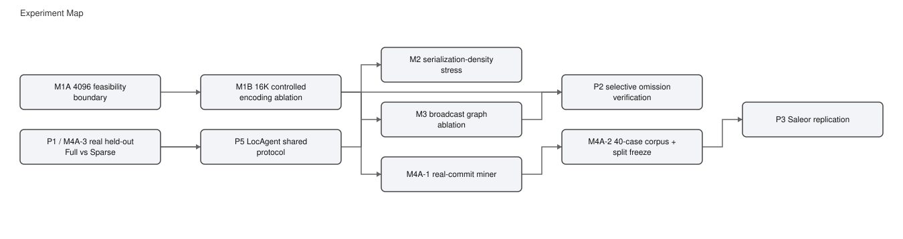
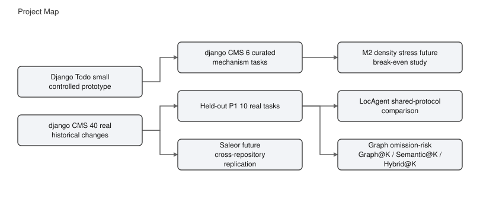
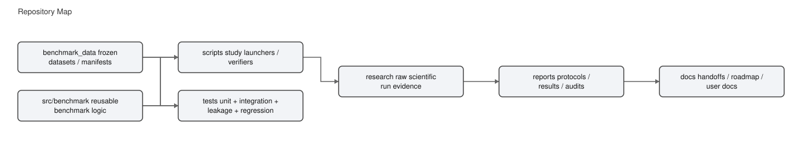

# Repository-Level LLM Impact Selection Benchmark

**Scientific model:** Qwen3-Coder-480B-A35B-Instruct (`qwen/qwen3-coder`) via
OpenRouter → DeepInfra. **Last scientific tag:**
`saleor-reserve-300-rmcss-final-replication-2026-09-20`; **latest WP-1b result
tag:** `wp1b-main297-result-2026-09-22`.

Research landing page for Ahmed's MSc: whether a **cheap, imperfect change-scope
selector** can be as file-correct as a budget-bounded repository agent and cheap
enough to make selective regeneration feasible.

> This README is the entry point. The canonical experiment/result/claim index is
> [`docs/EXPERIMENT_LEDGER.md`](docs/EXPERIMENT_LEDGER.md),
> [`docs/RESULTS_SUMMARY.md`](docs/RESULTS_SUMMARY.md) and
> [`docs/CLAIM_REGISTRY.md`](docs/CLAIM_REGISTRY.md). The chronological journey
> is [`docs/RESEARCH_JOURNEY.md`](docs/RESEARCH_JOURNEY.md). The live current
> state is the LIVE STATUS block below (generated from
> `docs/LIVE_STATUS.json`).

## 1. Research question / motivation

Repository-level LLMs must decide which files a requested change may affect.
Exhaustive reasoning over every candidate is costly; sparse localization risks
missing files the change actually touches. Can a sparse, memory-calibrated
selector reach file-level correctness close to a budget-bounded repository
agent while using a small fraction of the model interactions and tokens — and
are the selected scopes sufficient downstream for behavior-preserving change?

## 2. What RM-CSS / selective regeneration is

```
Change request
  -> Sparse Impact Plan (SIP) first pass
  -> RM-CSS (Repository-Memory Calibrated Set Selection): Qwen dense ranking +
     parent-only Repository Memory + calibrated ADD/KEEP/DROP
  -> final affected-file set
```

- **RM-CSS** is the frozen localization method
  (`IMPACT_LOCALIZATION_METHOD_SELECTION_CLOSED`).
- **Selective regeneration** asks the downstream question: can a cheaper,
  imperfect scope still produce correct and preserving patches?
- **Primary metric:** file-level impact correctness (file-level P/R/F1) of the
  selected editable change scope.

## 3. Scientific scope and primary metric

- **Primary scientific object:** repository-level affected-file / editable
  change-scope correctness.
- **Primary metric:** file-level impact correctness (file-level F1).
- **WP1 (primary evidence):** sparse impact plan representation, graph
  ablation, Saleor RESERVE-300, and the MAIN_297 selection-only comparison
  (RM-CSS vs bounded Agent vs SIP).
- **WP2 (supporting evidence):** oracle/harness development, Smoke v2.2,
  Pilot-A generator floor, M14R capability probe, M15-R OPWS Pilot-B, and the
  closed M16-v1 instrument attempt.
- **WP3 (optional, not started):** cross-language/polyglot generalization.

## 4. Key evidence table

| Evidence | Population | Result | Status |
|---|---:|---|---|
| djangoCMS explicit-v1 vs sparse-v2 | 30 | sparse valid 29/30; P/R/F1 .741/.866/.798; explicit 6/30 | Closed |
| Graph ablation | 144 nodes/562 edges | OFF F1 .7940; Hints .8067; precision +9.2 pp; FP −19; tokens ×2.6 | Closed |
| Oracle-gap bidirectional repair | djangoCMS 174; Saleor 149 | F1 .3177/.2605; gate FAIL | Closed negative |
| Saleor RESERVE-300 | 300 | SIP F1 .2647; RM-CSS F1 .3569; Δ +.0921 CI [.0691,.1156] | Primary |
| MAIN_297 selection | 297 | Agent .3631; RM-CSS .3568; SIP .2652 | Primary |
| MAIN_297 efficiency | 297 | RM-CSS ≈0.2746× calls, ≈0.2134× generation tokens vs Agent | Primary |
| MAIN_297 NI | 297 | 0.05 margin supported; 0.03 inconclusive | Primary |
| Smoke v2.2 | DEV_TRAIN_ENG n=14 | 62 episodes; APPLIED 50; invalid-after-repair 11; no-scope 1 | Supporting |
| Pilot-A | 40 episodes | GOLD RESOLVED 0; PLACEBO RESOLVED 0 | Supporting negative |
| M14R | 13 / 4 variants | robust 8/9/8/8; floor not met | Supporting negative |
| M15-R OPWS | Pilot-B n=10 | GOLD 10/10; RM-CSS 3/10; Agent 2/10,3/10,2/10 | Supporting descriptive |
| M15-R generation | 10 | gold-solvable 1/10; robust 3; S3 skipped | Supporting negative |
| M16-v1 | pre-experiment | adapter preflight failed before R03; no MAIN outcome | Closed / method |

Full rows with artifact paths and allowed interpretation:
[`docs/EXPERIMENT_LEDGER.md`](docs/EXPERIMENT_LEDGER.md) ·
[`docs/RESULTS_SUMMARY.md`](docs/RESULTS_SUMMARY.md).

## 5. Current status

<!-- LIVE_STATUS:BEGIN -->

## LIVE STATUS — single current-state source of truth

**Position:** M17 Phase0B-v2 (2026-10-05): M17 REAL qualification + oracle kit FROZEN (tag wp2-m17-v1-real-oracle-kit-2026-10-03); controller-real harness timing fixed (timeout 1800 -> 5400 s, finite hang protection preserved); M17 110/110, frozen harness 66/66, real-controller fake-world 8/8, KIT manifest + selector/API/autopilot guards PASS. ZERO Docker/WSL/API; qualification NOT run. M16-v1 closed pre-experiment. Primary claim-bearing evidence is WP1 selection correctness/efficiency; WP2 supporting/downstream.

**Research pipeline:**

| Step | Status | Note |
| :---|:---|:---|
| Localization method selection | CLOSED | RM-CSS frozen; Saleor-300 PASS (+0.0921 F1) |
| WP-0 leakage fix (G7) | DONE | ArtifactUniverse built from the parent repository |
| WP-1a preparation | DONE | zero API; frozen predictions, manifests, agent protocol |
| WP-1b preflight freeze | DONE | G1 delta=0.05 · G2 cap 1024 · n=297 · budget v2 · rules v2 |
| WP-1b Calibration-3 | DEFECT | v1 gate PASS, $0.081, 24 calls — 0 successful reads; INSTRUMENT_INVALID |
| Tool-budget fix + gate v2 | DONE | D2: search_text does not consume the 30-file budget; CG-10/CG-11 written; RED on Calibration-3 |
| WP-1b Calibration-3b | PASS | gate v2 PASS · $0.070 · 3 reads · 0 instrument errors · 11/21 calls rejected repeats (loop) |
| G12 agent context hygiene | DONE | D1 APPROVED, zero API: echo, call counter, named rejection, truncation note; gate v3 CG-12 FAILS 3b (runs 1/6/4); protocol v3 |
| WP-1b Calibration-3c | PASS | gate v3 CG-1..CG-12 PASS · $0.063205 · 4 reads · 1/18 rejected (5.6%) · longest run 1 · 0 blocking review-card flags · NOT scored |
| WP-1b MAIN_297 + variance 15x3 | DONE | RMCSS_NONINFERIOR_AT_LOWER_COST (NI_SUPPORTED); main $7.15 + variance $1.19; scored with decision rules v2; X1-X11 exploratory |
| WP-1b post-MAIN_297 docs closure + claim sheet | DONE | claim sheet, robustness/limitations, README/FAQ updated; zero API |
| AG16 budget sensitivity (MAIN_50) | PREREGISTERED, NOT RUNNABLE | brain-built/tested bundle required first (iterative_agent_budget.py + golden parity + dry-run); ceilings $0.80 cal / $12.20 MAIN_50 |
| WP-2 zero-API MAIN_297 census | DONE | 297/297 materializable; 20 STRONG / 200 MODIFIED / 77 no-test-evidence F2P candidates; proposal-only Smoke candidates 8; zero API |
| WP-2 Oracle Confirmation + Design v1 | DONE (zero-API) | harness validated; 220/220 changed-test candidates attempted; 8 primary behavioral F2P + 1 symbol-absence eligible; causal Design v1, power planning, Smoke v2 emitted; environment-dominant blocker on this host |
| WP-2 shared E2E instrument | NOT STARTED | same generator/validator/repair for every arm |
| E2E Smoke → Pilot → Research Run | NOT STARTED | staged; each stage can stop the run |
| WP-2 preservation oracle (P2P-S + P2P-U V2) | FROZEN (Mission-09) | P2P-S 46/47 defined; P2P-U V2 rule+membership frozen; ENG cap200+cap400 executed, repeatability 1.0 |
| Mission-10A environment test-dependency audit | DONE (ENV_AUDIT_INCONCLUSIVE) | proven pytest-django-queries/pytest-mock declared-but-not-installed in V2; 41/41 P2P-U cap200 COLLECTION_ERROR explained; probe recovered 18/18 SET A but SET B non-regression failed (1 V2 node flip, JWT iat clock-skew); STOP probe; no V3 |
| Full DEV-47 P2P-U cap200 execution | NOT STARTED (awaits approval) | est ~4.9-8.1 h serial central 6.7 h; overnight-feasible with resume; zero-node tasks UNDEFINED |
| WP-2 E2E Smoke v2.2 | DONE | 62 generation episodes; APPLIED 50; invalid-after-repair 11; no-scope 1; engineering pipeline only |
| WP-2 Pilot-A / M14R generator probes | DONE (SUPPORTING NEGATIVE) | generator floor not removed; GOLD/PLACEBO RESOLVED 0; robust episodes 8/9/8/8 |
| WP-2 M15-R OPWS Pilot-B | DONE (DESCRIPTIVE) | GOLD 10/10; RM-CSS 3/10; Agent r1/r2/r3 2/10,3/10,2/10; n=10 |
| M16-v1 OPWS-MAIN instrument | CLOSED (PRE-EXPERIMENT) | R02_ADAPTER_VERIFY STOP M16_ADAPTER_FAIL; R00 kit 102/102 PASS; no MAIN outcome |
| C0->C6 documentation/closure | DONE | ledger/results/claims/methods/threats/README landing/research-status/repro-audit/LIGHT convention |
| G0_BRAIN_REVIEW | DONE | brain decision: finalize durable baseline before new science |
| M17 Phase0B-v2 real qualification + oracle kit | KIT_FROZEN (zero-Docker, zero-API) | real-controller harness timing fixed (timeout 1800->5400 s); M17 110/110, frozen harness 66/66, real-controller fake-world 8/8, KIT manifest + selector/API/autopilot guards PASS; tag wp2-m17-v1-real-oracle-kit-2026-10-03; qualification NOT run; next: brain review then real 12-task qualification |

**LLM-call accounting:**

| Workflow | Calls | Note |
| :---|:---|:---|
| SIP on Saleor-300 | 300 coder calls (1/task) | 315 HTTP attempts incl. retries · 5.09 M tokens · $1.593 |
| RM-CSS on top of SIP | 0 extra coder calls | local logistic regression + repository memory |
| Qwen embeddings (RM-CSS) | 33 batched calls | 2,076 file units + 299 queries · $0.026 |
| WP-1b Calibration-3 agent | 24 calls (8/task) | $0.081 · 7 of 24 were rejected repeats · 0 successful reads (INSTRUMENT_INVALID) |
| WP-1b Calibration-3b agent | 21 calls (5/8/8) | $0.070028 · 3 successful reads · 0 instrument errors · gate v2 PASS · loop: 11/21 rejected repeats |
| WP-1b G12 (zero API) | 0 | agent context hygiene amendment D1 APPROVED: echo, call counter, named rejection, truncation note; gate v3 CG-12 FAILS 3b |
| WP-1b Calibration-3c agent | 18 calls (4/8/6) | $0.063205 · 4 successful reads · 1/18 rejected repeats (5.6%) · longest run 1 · gate v3 CG-1..CG-12 PASS · NOT scored |
| MAIN_297 agent | 2,164 logical / 2,178 HTTP attempts | ledger $7.147 · 23.55M prompt / 81.7K completion tokens · 147 forced finals · 2 EMPTY (parser_failure) · 8 transport retries |
| Variance substudy 15x3 | 331 logical / 341 HTTP attempts | ledger $1.194 · pooled F1 0.389/0.438/0.479 · pairwise exact match 0.444 · 0 EMPTY |
| WP-2 zero-API MAIN_297 census | 0 | deterministic read-only git diff over already-opened case metadata; $0.00 |
| E2E generation + repair | not frozen yet | defined by WP-2 |
| M15-R OPWS + generation (Pilot-B n=10) | 228 agent-localization calls (30 runs) | agent localization $0.6448 frozen list price; generation provider-reported $0.2478 / 715,438 tokens; descriptive only |

**Authorized / not authorized:**

| Item | Status | Note |
| :---|:---|:---|
| Calibration-3c | DONE (CLEAN) | gate v3 CG-1..CG-12 PASS; $0.063205; NOT scored |
| MAIN_297 + variance 15×3 + scoring | DONE (D3 = YES) | RMCSS_NONINFERIOR_AT_LOWER_COST (NI_SUPPORTED); main $7.15 + variance $1.19; predictions frozen/tagged before any label load |
| Agent budget-sensitivity arm (AG16, MAIN_50) | PREREGISTERED, NOT AUTHORIZED; runner NOT built | design frozen before MAIN_297 outputs; needs brain-built/tested bundle + decision D6 |
| WP-2 zero-API MAIN_297 census | DONE | deterministic planning evidence only; no E2E execution; no F2P/P2P oracle |
| WP-2 Oracle Confirmation (zero-API) + Design v1 | DONE | 8 primary behavioral F2P + 1 symbol-absence eligible confirmed; causal Design v1 + power planning + Smoke v2 proposal; NO E2E execution |
| 786 Saleor RESERVE outcomes | SEALED | never opened/read/scored/sampled; guarded by the label-access audit hook |
| Calibration-3 / 3b / 3c F1 claims | NOT PERMITTED | instrument checks only; no labels loaded or scored |
| Mission-09 P2P-S + P2P-U V2 freeze | DONE | zero-API; P2P-S (46/47) + P2P-U V2 rule/membership frozen before any V2 outcome execution |
| Mission-09 ENG P2P-U V2 execution (cap200 + cap400) | DONE | 8 executable ENG tasks x 2 caps, workers=1, 3+3 reps, integrity PASS; no Smoke/full-DEV/MAIN execution |
| Mission-10A environment test-dependency audit (zero-API, Tier T3) | DONE (ENV_AUDIT_INCONCLUSIVE) | proven declared-but-not-installed dev/test group in frozen V2; ENG-only scratch probe (task 1) recovered 18/18 SET A; SET B non-regression FAILED (1 V2 BEHAVIORAL_F2P node flip) -> STOP per preregistered S2; no V3 build, no generation, no Smoke |
| Full DEV-47 P2P-U cap200 + Smoke freeze | NOT AUTHORIZED | requires Ahmed decision; estimates ready (DEV ~6.7 h central) |
| C0->C6 closure + G0_BRAIN_REVIEW | DONE | documentation/evidence consolidation only; brain decision: finalize durable baseline before new science |
| M16-v1 MAIN OPWS run | NOT AUTHORIZED / CLOSED | closed pre-experiment adapter failure; no MAIN outcome; a future attempt requires a separately designed, brain-approved M16-v2 |

**Next action:** Await ChatGPT brain review of the M17 qualification kit before the REAL 12-task qualification. Do NOT run the 12 tasks, MAIN, OPWS, Docker, WSL, or any model/API call until then.

**End-to-end status:** M17 real + oracle kit frozen (zero-Docker, zero-API; tag wp2-m17-v1-real-oracle-kit-2026-10-03); harness timing fixed; 110/110 M17, 66/66 frozen harness, 8/8 real-controller PASS; qualification NOT run. WP-2 supporting evidence closed/consolidated; M16-v1 closed pre-experiment; no active scientific run.

*Source: `docs/LIVE_STATUS.json` (schema `live_status_v1`), rendered by `scripts/render_live_status.py`. As of 2026-10-05 (Africa/Cairo).*
<!-- LIVE_STATUS:END -->

> **Closure note (2026-10-02):** the WP-2 instrument trail (Smoke v2.2 →
> Pilot-A → M14R → M15-R → M16-v1) is consolidated in the key-evidence table
> above and the registry; M16-v1 was closed as a pre-experiment adapter failure
> ([`docs/M16_V1_CLOSURE_2026-10-02.md`](docs/M16_V1_CLOSURE_2026-10-02.md)) —
> it produced **no** MAIN OPWS outcome.

## 6. What RM-CSS / selective regeneration does — methods

Concise method overview:
[`docs/METHODS_OVERVIEW.md`](docs/METHODS_OVERVIEW.md). Formal detail lives in
[`docs/STAGEC_FORMAL_MODEL.md`](docs/STAGEC_FORMAL_MODEL.md),
[`docs/RISK_AWARE_SPARSE_IMPACT_SELECTION_MODEL.md`](docs/RISK_AWARE_SPARSE_IMPACT_SELECTION_MODEL.md)
and [`docs/GLOSSARY.md`](docs/GLOSSARY.md).

## 7. Limitations / threats to validity

Concise limitations and threats:
[`docs/THREATS_TO_VALIDITY.md`](docs/THREATS_TO_VALIDITY.md). The per-study
freeze documents are in [`docs/`](docs/) (e.g.
[`docs/WP1B_MAIN297_STOP_REPORT_2026-09-22.md`](docs/WP1B_MAIN297_STOP_REPORT_2026-09-22.md),
[`docs/WP2_M15R_V1_OPWS_RESULT.md`](docs/WP2_M15R_V1_OPWS_RESULT.md)).

## 8. Repository map







```
benchmark_data/      frozen datasets (real-commit V1/V2, Saleor)
src/benchmark/       source (loaders, execution, impact strategies, evaluation)
scripts/             reproducible experiment launchers + verification
research/            per-milestone evidence (run records, manifests, raw responses)
reports/             authoritative experiment reports + machine-readable JSON
docs/                protocols, runbook, research journey, roadmap, handoffs
msc_proposal/        proposal documents
dist/                release/upload bundles
```

Full map: [`docs/PROJECT_STRUCTURE_MAP.md`](docs/PROJECT_STRUCTURE_MAP.md).

## 9. Reproduce / test

```bash
# Deterministic smoke-profile dry run (mock backend — zero model calls)
python seven_arm_benchmark.py --dry-run --profile smoke

# Recompute every headline manuscript metric from frozen evidence
python scripts/verify_paper_claims.py

# Run the test suite
python -m pytest tests/unit tests/integration
```

Detailed: [`docs/BENCHMARK_RUNBOOK.md`](docs/BENCHMARK_RUNBOOK.md),
[`docs/REPRODUCIBILITY_PROTOCOL.md`](docs/REPRODUCIBILITY_PROTOCOL.md).
Research-status snapshot for 2026-10-02:
[`docs/RESEARCH_STATUS_2026-10-02.md`](docs/RESEARCH_STATUS_2026-10-02.md).

## 10. Citation / claim status

The binding claim freeze (supported / descriptive / forbidden wording) is
[`docs/CLAIM_REGISTRY.md`](docs/CLAIM_REGISTRY.md). Citation metadata:
[`CITATION.cff`](CITATION.cff). License: MIT ([`LICENSE`](LICENSE)).

**Status labels:**

| Label | Meaning |
|---|---|
| PRIMARY | Directly answers the primary research question; claim-bearing |
| SUPPORTING | Downstream/supporting evidence |
| SUPPORTING DESCRIPTIVE | Descriptive only; no superiority/equivalence claim |
| SUPPORTING NEGATIVE / CLOSED NEGATIVE | Negative result / ruled-out direction |
| CLOSED PRE-EXPERIMENT / METHOD | Instrument never qualified (e.g. M16-v1) |

## 11. Artifact integrity / LIGHT exports

Frozen experiment evidence is hash-anchored and tagged; historical LIGHT
archives are immutable (their filenames/hashes are already cited). **Future**
LIGHT exports use the convention
`project-light-YYYY-MM-DD-HHMM.zip`
([`docs/LIGHT_EXPORT_CONVENTION.md`](docs/LIGHT_EXPORT_CONVENTION.md)).
An exporter CLI + collision fail-closed + tests:
[`scripts/wp2_export_light.py`](scripts/wp2_export_light.py).

---

**Author:** Ahmed Ehab — [AhmedEhabH](https://github.com/AhmedEhabH)
