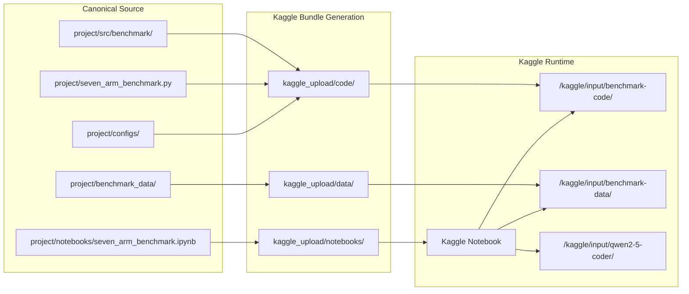
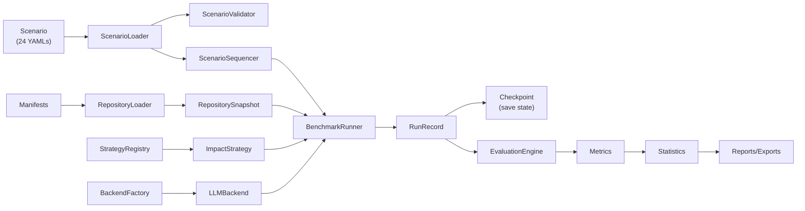
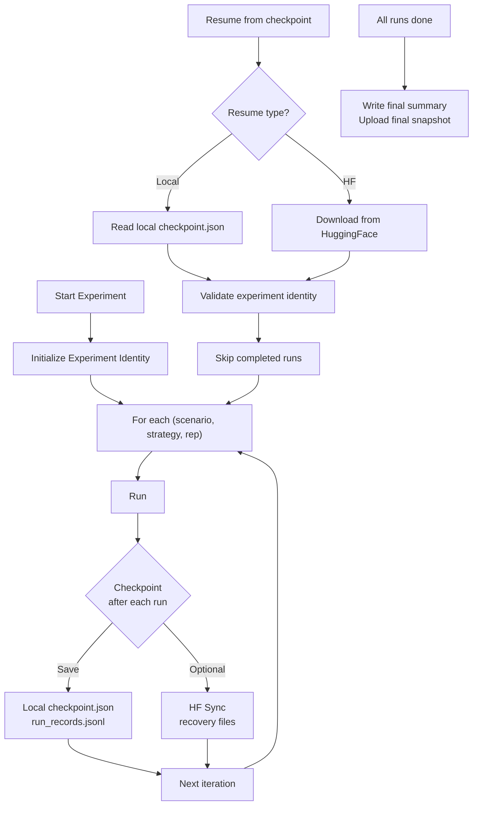
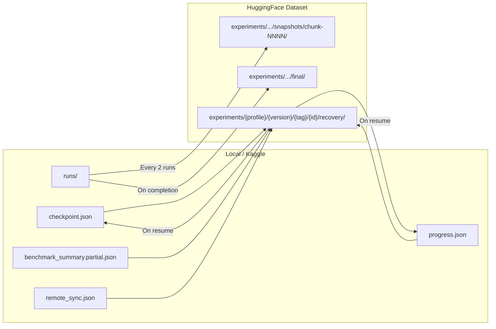
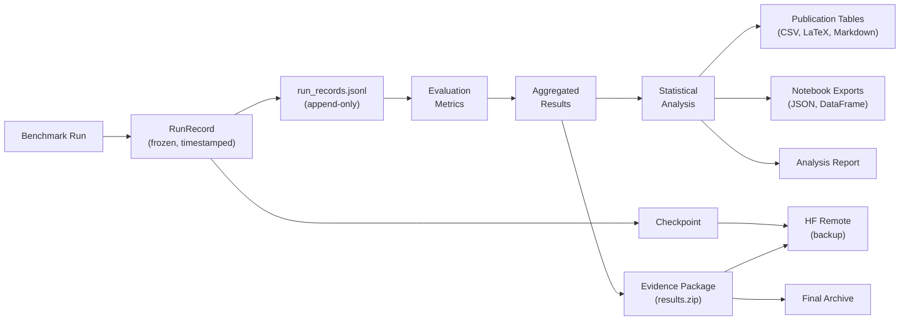

# Project Entities and Data Flows

**Audit Date:** 2026-07-24
**Branch:** `audit/canonical-project-architecture`
**Purpose:** Define all major domain entities and their data flows with Mermaid diagrams.

---

## Entity Catalog

### Repository

| Field | Value |
|-------|-------|
| Canonical definition | `src/benchmark/core/models.py:RepositorySnapshot` |
| Stable identifier | Repository identity (name in manifest) |
| Serialization format | YAML (manifest), in-memory as frozen dataclass |
| Lifecycle | Loaded from manifest → cloned (abstract) → snapshotted → analyzed |
| Producer | `RepositoryLoader` |
| Consumer | `ScenarioProvider`, strategies, graph builder |
| Persistence location | `benchmark_data/manifests/` (metadata only) |
| Mutability | Immutable once loaded |
| Evidence classification | Metadata only |

### RepositoryProfile

| Field | Value |
|-------|-------|
| Canonical definition | `src/benchmark/repositories/manifest.py:RepositoryProfile` |
| Stable identifier | Repository identity |
| Serialization format | YAML (benchmark_data/repository_profiles/) |
| Lifecycle | Loaded from YAML → consumed by ProfileGraphBuilder |
| Producer | Phase 3 design |
| Consumer | ProfileGraphBuilder, strategies |
| Persistence location | `benchmark_data/repository_profiles/` |
| Mutability | Immutable |
| Evidence classification | Scientific input data |

### Scenario

| Field | Value |
|-------|-------|
| Canonical definition | `src/benchmark/core/models.py:Scenario` |
| Stable identifier | Scenario ID (e.g. `todo-loc-001`) |
| Serialization format | YAML (benchmark_data/scenarios/) + in-memory frozen dataclass |
| Lifecycle | Loaded from YAML → validated → sequenced → executed → evaluated |
| Producer | `ScenarioLoader` |
| Consumer | `BenchmarkRunner`, strategies, evaluation |
| Persistence location | `benchmark_data/scenarios/*.yaml` |
| Mutability | Immutable |
| Evidence classification | Scientific input (contains ground truth) |

### RequirementChange

| Field | Value |
|-------|-------|
| Canonical definition | `src/benchmark/core/models.py:RequirementChange` |
| Stable identifier | None (embedded in Scenario) |
| Serialization format | Fields within Scenario YAML |
| Lifecycle | Extracted from Scenario → passed to strategy |
| Producer | Scenario |
| Consumer | ImpactStrategy |
| Persistence location | Embedded in scenario YAMLs |
| Mutability | Immutable |
| Evidence classification | Scientific input |

### ArtifactUniverse

| Field | Value |
|-------|-------|
| Canonical definition | `src/benchmark/core/models.py:ArtifactUniverse` |
| Stable identifier | None (computed per scenario) |
| Serialization format | In-memory frozen dataclass |
| Lifecycle | Constructed from Scenario → passed to strategy |
| Producer | `BenchmarkRunner` (from Scenario) |
| Consumer | ImpactStrategy |
| Persistence location | Transient |
| Mutability | Immutable |
| Evidence classification | Technical |

### DependencyGraph

| Field | Value |
|-------|-------|
| Canonical definition | `src/benchmark/graph/models.py:DependencyGraphModel` |
| Stable identifier | None (computed per snapshot) |
| Serialization format | In-memory dataclass |
| Lifecycle | Built from RepositorySnapshot → used by strategies |
| Producer | `ProfileGraphBuilder`, `PythonImportExtractor` |
| Consumer | Strategies (selective, compiled_ai, code_plan) |
| Persistence location | Transient (in-memory) |
| Mutability | Immutable after construction |
| Evidence classification | Technical |

### StrategyArm

| Field | Value |
|-------|-------|
| Canonical definition | `src/benchmark/strategies/` (7 concrete classes) |
| Stable identifier | Strategy name: monolithic, agent, selective, compiled_ai, delta_mcp, incr_rtl, code_plan |
| Serialization format | Python class implementing `ImpactStrategy` protocol |
| Lifecycle | Registered → configured → instantiated → executed per scenario |
| Producer | Strategy code + registry |
| Consumer | BenchmarkRunner |
| Persistence location | `src/benchmark/strategies/*.py` |
| Mutability | Stateless between calls |
| Evidence classification | Implementation |

### ModelBackend

| Field | Value |
|-------|-------|
| Canonical definition | `src/benchmark/llm/` (base.py + implementations) |
| Stable identifier | Backend type: mock, dry_run, kaggle_qwen, null |
| Serialization format | Python class implementing `LLMBackend` protocol |
| Lifecycle | Created by BackendFactory → injected into strategy → called for inference |
| Producer | `BackendFactory` |
| Consumer | Strategies needing LLM access |
| Persistence location | `src/benchmark/llm/*.py` |
| Mutability | May cache responses |
| Evidence classification | Implementation |

### ExecutionPlan

| Field | Value |
|-------|-------|
| Canonical definition | Implicit in `BenchmarkPipeline` logic |
| Stable identifier | Run identity |
| Serialization format | JSON (run records, checkpoint) |
| Lifecycle | Configured → executed → recorded |
| Producer | `BenchmarkPipeline` |
| Consumer | Evaluation, statistics |
| Persistence location | `runs/` (when created) |
| Mutability | Immutable after execution |
| Evidence classification | Scientific result |

### RunIdentity

| Field | Value |
|-------|-------|
| Canonical definition | `src/benchmark/core/models.py:RunIdentity` |
| Stable identifier | UUID per run |
| Serialization format | Frozen dataclass (ID + timestamps) |
| Lifecycle | Created before run → embedded in RunRecord |
| Producer | `BenchmarkRunner` |
| Consumer | RunRecord, checkpoint |
| Persistence location | `RunRecord.id` |
| Mutability | Immutable |
| Evidence classification | Technical |

### RunRecord

| Field | Value |
|-------|-------|
| Canonical definition | `src/benchmark/core/models.py:RunRecord` |
| Stable identifier | Run identity |
| Serialization format | Frozen dataclass → serialized as JSON |
| Lifecycle | Created by runner → persisted → loaded by evaluation |
| Producer | `BenchmarkRunner` |
| Consumer | Evaluation, statistics, reports |
| Persistence location | `runs/run_records.jsonl` |
| Mutability | Immutable |
| Evidence classification | Primary scientific evidence |

### Checkpoint

| Field | Value |
|-------|-------|
| Canonical definition | `src/benchmark/checkpoint/checkpoint.py` |
| Stable identifier | Experiment identity + run index |
| Serialization format | JSON |
| Lifecycle | Updated after each run → used for resume |
| Producer | Checkpoint manager |
| Consumer | Resume logic |
| Persistence location | `runs/checkpoint.json`, `_auto_resume_temp/` (tests), HF remote |
| Mutability | Mutable (updated per run) |
| Evidence classification | Operational |

### ProgressState

| Field | Value |
|-------|-------|
| Canonical definition | Implicit in progress.json format |
| Stable identifier | Experiment identity |
| Serialization format | JSON |
| Lifecycle | Updated after each run |
| Producer | Checkpoint manager |
| Consumer | Monitoring, resume |
| Persistence location | `runs/progress.json`, HF remote |
| Mutability | Mutable |
| Evidence classification | Operational |

### ExperimentIdentity

| Field | Value |
|-------|-------|
| Canonical definition | `src/benchmark/checkpoint/package.py` |
| Stable identifier | Experiment ID (generated at start) |
| Serialization format | String |
| Lifecycle | Created at experiment start → used for all checkpoint/resume operations |
| Producer | Experiment initialization |
| Consumer | Checkpoint, resume, HF sync |
| Persistence location | Embedded in checkpoint files |
| Mutability | Immutable |
| Evidence classification | Technical |

### ResultSnapshot

| Field | Value |
|-------|-------|
| Canonical definition | `src/benchmark/checkpoint/persistence.py` |
| Stable identifier | Chunk index |
| Serialization format | ZIP archive |
| Lifecycle | Created every N runs → uploaded to HF |
| Producer | HF sync module |
| Consumer | HF remote storage |
| Persistence location | `runs/` (local), HF remote (remote) |
| Mutability | Immutable after creation |
| Evidence classification | Scientific evidence (archived) |

### EvaluationResult

| Field | Value |
|-------|-------|
| Canonical definition | `src/benchmark/evaluation/engine.py` |
| Stable identifier | Scenario + strategy combination |
| Serialization format | In-memory dataclass → JSON |
| Lifecycle | Created by EvaluationEngine from RunRecords |
| Producer | EvaluationEngine |
| Consumer | Statistics, reports |
| Persistence location | Transient (generated from RunRecords) |
| Mutability | Immutable |
| Evidence classification | Derived scientific evidence |

### StatisticalResult

| Field | Value |
|-------|-------|
| Canonical definition | `src/benchmark/statistics/analysis.py` |
| Stable identifier | Analysis run ID |
| Serialization format | In-memory dataclass → notebook exports |
| Lifecycle | Created from EvaluationResults |
| Producer | StatisticalAnalyzer |
| Consumer | Reports, publications |
| Persistence location | Transient |
| Mutability | Immutable |
| Evidence classification | Derived scientific evidence |

### EvidenceArtifact

| Field | Value |
|-------|-------|
| Canonical definition | Implicit (run records + evaluation + statistics) |
| Stable identifier | Chain of: RunRecord → EvaluationResult → StatisticalResult |
| Serialization format | Multiple formats (JSON, CSV, LaTeX, Markdown) |
| Lifecycle | Produced by execution → evaluation → statistics pipeline |
| Producer | Whole pipeline |
| Consumer | Publications, analysis |
| Persistence location | `runs/`, reports, HF remote |
| Mutability | Immutable (append-only) |
| Evidence classification | Scientific evidence chain |

### KaggleBundle

| Field | Value |
|-------|-------|
| Canonical definition | `kaggle_upload/` directory structure |
| Stable identifier | None (bundle version implicit) |
| Serialization format | Directory tree |
| Lifecycle | Generated from source → uploaded to Kaggle → used for execution |
| Producer | Bundle generation process |
| Consumer | Kaggle notebook |
| Persistence location | `project/kaggle_upload/` (inner), `<parent>/kaggle_upload/` (outer) |
| Mutability | Should be regenerated on source changes |
| Evidence classification | Deployment |

### HuggingFaceRemoteExperiment

| Field | Value |
|-------|-------|
| Canonical definition | `src/benchmark/checkpoint/hf_sync.py` |
| Stable identifier | Experiment ID |
| Serialization format | HuggingFace Dataset structure |
| Lifecycle | Created at first sync → updated per run → finalized on completion |
| Producer | HF sync module |
| Consumer | Cross-session resume, result download |
| Persistence location | `NabilDo/selective-regeneration-experiment-results` (remote) |
| Mutability | Append-only |
| Evidence classification | Scientific evidence (remote backup) |

---

## Mermaid Data Flow Diagrams

### Diagram 1: Source-to-Kaggle Deployment

### Diagram 2: Scenario-to-Result Execution

### Diagram 3: Checkpoint and Resume

### Diagram 4: Hugging Face Synchronization

### Diagram 5: Result-to-Publication Evidence Chain

